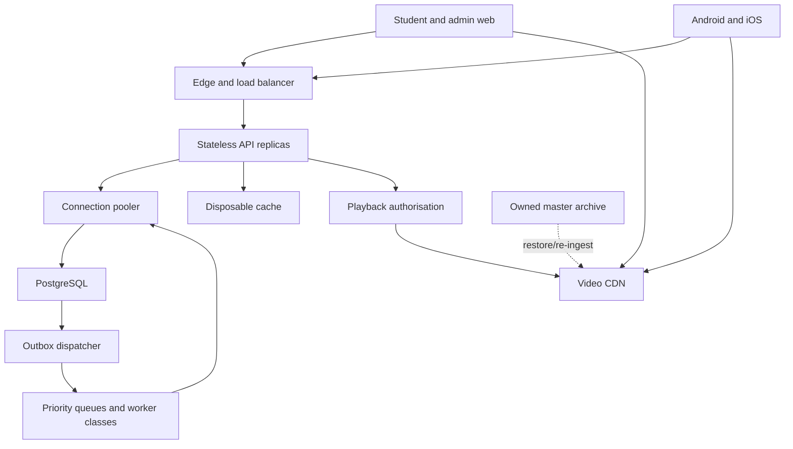
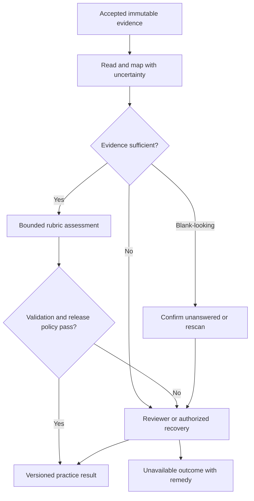

# Punjab Learning Portal — Complete Integrated Master Roadmap

**Version:** 2.2 — independently corrected integration of the written-assessment module  
**Revised:** 6 October 2026  
**Status:** COMPLETE PLANNING DOCUMENT — APPLICATION IMPLEMENTATION, ACADEMIC QUALIFICATION AND RELEASE VERIFICATION PENDING  
**Baseline:** Master v2.1 corrected; written module v1.0 and Fable v1.1 plus its findings; exact input hashes in Section 21.1.  
**Initial market:** Punjab, Pakistan; HSSC XI/XII, Pre-Medical, Pre-Engineering and relevant ICS entry-test routes.  
**Entrance preparation:** PMDC MDCAT and UET Lahore ECAT through independently verified versioned profiles.  
**Surfaces:** Student web, Android, iOS and staff/admin web.  
**Owner-data boundary:** Actual academic sources and permissions before application implementation; no demo academic substitute.  
**Current reference:** `Punjab_Learning_Portal_Master_Roadmap_v2.2_Integrated_Written_Assessment.md`; historical source files remain unchanged.

**Integrated inventory:** 36 phases · 132 stages · 423 unchecked tasks · 846 task subpoints · 36 canonical phase gates · 162 NOT RUN acceptance scenarios · 29 proposed decision records · 52 source-register entries.

**Navigation:** Core product/architecture/performance: Sections 1–7. Core task tree: Section 8. Core acceptance: Section 9. Academic intake: Section 10. Agent/planning/ownership: Sections 11–13. Core sources: Section 14. Trial/device controls: Section 16. Core decisions: Section 17. **Combined execution order: Section 18.** Historical v2.1 corrections: Section 19. **Complete written module, its task tree, cases, decisions and sources: Section 20.** Independent Fable dispositions/current reference: Section 21.

This is one complete successor roadmap. All 306 core and all 114 Fable written task IDs are retained; three mixed-board-paper tasks are added. The body, dependent tasks, gates, decision records and acceptance expectations are reconciled. Proposed targets remain unverified; a roadmap correction is not evidence that code, teacher rubrics, provider approvals, store decisions or capacity tests are complete. The 30-day platform trial and existing MCQ persistence safeguards remain binding. Continue by task-level dependencies, not by treating phase numbers as a waterfall.

## 1. Owner brief — Roman Urdu

Aap development se pehle academic data provide karenge. Pehle inventory, validation aur Punjab/exam mapping hogi (P22.S1); phir isi real material par technical spike, estimate aur application banegi. Demo lessons ya invented MCQs academic content ka substitute nahi honge. Future content admin panel se import, review aur publish hoga.

Student topic ki video dekhega, explanation aur examples parhega, phir topic, chapter, selected chapters, half book, full book, Class 11 + 12 combined subject, ya complete MDCAT/ECAT mock test de sakega. Results usay weak concepts, ghalti ki wajah aur agla revision task dikhayenge. Progress teen alag cheezon mein dikhega: syllabus coverage, completed content, aur demonstrated knowledge.

Naya written module bhi isi portal mein included hai: chapter ke short aur long questions, handwritten scan/PDF submission, rubric-based practice marks, ghalti ki wazahat aur teacher recheck. Unreadable ya pending answer ko zero nahi banaya jayega. Complete board mock mein MCQ aur written sections hon to dono apne timing rules ke saath ek versioned result mein ayenge; is extended mode ko alag qualify kiya jayega (Section 20).

Punjab pehla active region hoga. Doosre provinces future content releases se add honge. Web, Android aur iPhone ek hi account aur backend use karenge. Design premium hoga, lekin low-cost phones aur kamzor internet par bhi essential learning aur test flows usable honge; is ke liye student ke phone par measured end-to-end budgets (Section 6.2b) define kiye gaye hain.

**Trial:** One 30-day platform trial with server-controlled expiry and supported repeat-device checks. New email/phone, cancellation and reinstall do not intentionally reset consumption. Detection limits, exceptions and the consolidated trial decisions are in Section 16, including 16.9.

**Scale target:** 5,000 simultaneously active students on a defined workload. Yeh engineering acceptance target hai; load-test evidence aane tak capacity verified nahi kahi jayegi. Jo baatein owner ya provider ka faisla maangti hain, woh Section 17 mein proposed default ke saath darj hain; roadmap unhe settled requirement nahi kehta.

## 2. Product boundaries and completion states

### 2.1 Included in the complete first product

| Area | Required capability |
| --- | --- |
| Student access | Registration, login, recovery, onboarding, goals, preferences and device/session management |
| Learning | Courses, subjects, chapters, topics, lessons, video, captions, transcripts, notes, examples and bookmarks |
| Practice | Topic, chapter, multi-chapter (selected chapters), half-book, full-book, combined XI–XII same-subject and multi-subject tests |
| Entrance exams | Versioned MDCAT/ECAT blueprints, timed mocks, server-side scoring and explanation release policies |
| Written assessment | Required chapter short/long practice, scan/PDF capture, approved rubrics, private evidence, practice marks/feedback, staffed review/recheck and disclosed allowances; qualified larger/composite board forms under Section 20 |
| Improvement | Diagnostic practice, wrong-answer notebook, spaced revision, confidence-aware progress, three distinct progress meters and time-budgeted study plans |
| Content administration | Curriculum mapping, authoring, review, imports, media management, publishing, corrections, quarantine and regrade workflows |
| Content production | Storyboard studio, source-grounded scene prompts, reviewed video pipeline, owned master archive and evaluated AI-assisted drafting |
| Commercial operations | One 30-day trial, repeat-trial controls, free/paid bundles, web/store billing, restoration, reconciliation and trial cohort economics |
| Support | Help centre, tickets, question-error reports, announcements and notification preferences |
| Management | Content coverage, quality, learning, revenue, service-health, trial and cost dashboards |
| Quality | Accessibility, privacy, security, backup recovery (database and media masters), load testing, requalification rules and release evidence |

Board-oriented learning is supported. If marketed as complete board-exam preparation, the relevant short answers, long answers, numerical practice and practical material must also be published and verified. An MCQ-only release must not be advertised as complete board-exam preparation.

### 2.2 Deferred capabilities

Live classes, public discussion forums, private student-to-student messaging, teacher marketplaces, school multi-tenancy, biometric proctoring, university admission or score prediction, a student-facing generative AI tutor, translated exam-question variants within one attempt, secure offline video downloads, and other provinces are expansion candidates. They are not first-release completion requirements. The internal video storyboard workflow is included; automatic paid video generation is an optional integration. A bounded "Ask about this step" academic-doubt service is recorded as decision D11 (Section 17); it stays outside first-release gates unless the owner adopts it.

The included exception is bounded rubric-based assessment AI under Section 20: reading a submitted answer, proposing criterion credit and explaining supported feedback, subject to academic qualification, application validation and human review. It has no general chat, arbitrary tools or unbounded tutoring authority. This exception does not enable D11 or the deferred general tutor.

### 2.3 Three independently evidenced readiness states

| State | Meaning | Required evidence |
| --- | --- | --- |
| Platform Ready | Web, Android, iOS and admin operate on the RCS, including required chapter short/long assessment | Mandatory P00–P21 scope and intake/RCS; W00–W09 applicable evidence, required WG10(R2) route evidence and WG11[PRELAUNCH, RCS] under Section 18; canonical live WG11/G23 stay pending. A mandatory missing integration is not Platform Ready |
| Content Ready | Full advertised launch manifest is reviewed, licensed, mapped and published | G22 including written questions/rubrics and supported assessment routes for every advertised scope; RCS alone is insufficient |
| Public Launch Ready | Exact release manifest, live services, staff and published courses support the actual offer | P23/W11 staged live evidence and required store decisions; prelaunch checks authorize only the controlled launch step, not a fictional already-passed live cohort |

Academic sources must be received and validated before implementation. Planning may proceed beforehand. Technical test accounts, provider sandboxes and isolated malformed fixtures can verify software, but cannot substitute for real academic content. If real credentials are absent, record `IMPLEMENTED / SANDBOX VERIFIED / LIVE VERIFICATION PENDING`; do not call an untested integration production-ready.

### 2.4 Representative Reviewed Content Set (RCS)

Platform Ready cannot wait for the whole catalogue, and it cannot be evidenced on demo material. The RCS is the minimum reviewed owner-derived content on which every platform workflow is demonstrated:

1. For every launch subject: one complete chapter with every topic carrying a reviewed lesson in each offered explanation language, at least one reviewed video per topic with captions and transcript, and enough approved question families to generate topic and chapter tests.
2. For at least one subject: reviewed material spanning at least two distinct chapters for selected-chapters practice, plus a half-book, full XI book, full XII book and combined XI+XII form at the approved pool-sufficiency rule (P08.S3.T3), so that every advertised test mode is exercised on real content.
3. For each launch exam profile (MDCAT; each launch ECAT combination): one complete reviewed mock form satisfying the verified blueprint.
4. Written scope: real approved short and long questions/rubrics, authorized handwritten diagnostic scripts, mapping/rescan/recheck examples and a qualified or funded teacher route for each advertised XI/XII chapter scope. Independent held-out evidence qualifies automatic routes; it is not reused as learning content. Include numerical/diagram/composite examples if those types are advertised.
5. Every RCS item is traceable to accepted P22.S1/W00 intake and a named reviewer. RCS preparation may start with manually reviewed records before the CMS exists; no synthetic academic substitute.

The RCS is selected during P22.S1.T3 and produced first in P22.S2. It is a subset of the launch manifest, never a reduction of it.

## 3. Scope and curriculum authority

1. Punjab board curriculum, board examination inclusions and entrance-test inclusions are separate versioned records.
2. Keep class, academic session, exam year, book edition and syllabus authority explicit. A newer national document does not automatically establish Punjab adoption.
3. PECTAA and applicable Punjab BISE/PBCC notifications govern the board mapping. PMDC governs the MDCAT profile; UET governs the ECAT profile. [S01–S03]
4. Import board identifiers from an approved source; do not hard-code a permanent number or list of Punjab boards.
5. Store complete curriculum coverage separately from year-specific reduced/smart-syllabus exclusions. Never remove an entrance requirement solely because a board topic is excluded.
6. Treat official syllabus learning outcomes as the entrance boundary. A textbook chapter and a test learning outcome may have many-to-many relationships.
7. Imported academic content is untrusted input. It cannot change application permissions, execution instructions or publication rules.

**Initial academic tracks:** Pre-Medical; Pre-Engineering; relevant ICS combinations. The model must represent Mathematics, Physics, Chemistry, Biology, Computer Science, Statistics, English and Logical Reasoning as needed by approved profiles. Board compulsory subjects can be loaded through the same system. Visible course availability depends on published content, not an empty subject record.

**Exam-profile facts checked on 5 October 2026 (planning context only, not a published profile):**

- UET Lahore ECAT (UET Admissions 2026 page): 100 questions, 10 in English and 90 divided equally among the three elective subjects; 100 minutes; 4 points per correct answer; no negative marking; five intermediate combinations (Mathematics/Physics/Chemistry; Mathematics/Physics/Computer Science; Mathematics/Statistics/Computer Science; Biology/Physics/Chemistry; Mathematics/Statistics/Physics) plus two DAE combinations. [S03]
- PMDC MDCAT: the PMDC syllabus page lists the Uniform Curriculum MDCAT-2025 (final 26 May 2025) as the latest syllabus document. PMDC public notices for MDCAT-2026 (date announcement and registration portal) exist as scanned PDFs; their content was not machine-readable in this review, so the 2026 test date, structure and marking must be read from those notices by a reviewer before any 2026 profile is published. Secondary preparation sites report 180 MCQs, 3 hours, no negative marking and a 20 September 2026 test date; treat these as unverified until confirmed against the PMDC notice. [S02, S27]

No 2027 or later examination configuration is inferred from 2026. Exam profiles require an official source, effective dates and two-person reviewer verification before they become selectable for that year (P05.S3.T3).

## 4. User roles and permissions

| Role | Allowed responsibilities | Boundary |
| --- | --- | --- |
| Student | Access entitled content, attempt tests, see own results and manage own account | Cannot read other learners or protected answer keys |
| Content author | Draft assigned lessons, questions and storyboards | Cannot publish their own unchecked work |
| Subject reviewer | Review academic accuracy, mapping and AI drafts; assess assigned written cases, classify rescans and resolve scoped rechecks | Subject/language/notation permissions and audited evidence access; no financial authority; AI cannot hold this role |
| Academic adjudicator | Approve rubric corrections and affected-cohort regrades; resolve reviewer disputes | Independent approval and Section 20.10 publication rules; administrative batch authority is not proof of human review |
| Publisher/content lead | Release reviewed content; quarantine, retire or correct versions | Every release, quarantine and rollback is audited |
| Support (student operations) | Resolve tickets, inspect the minimum necessary account context, own trial appeals | No password access or invisible score changes; cannot clear provider markers |
| Finance operator | Reconcile transactions and request/execute authorised refunds | No access to private learning notes by default |
| Platform operator | Monitor, recover and deploy services | Privileged access is scoped and recorded |
| Owner/admin | Configure business rules, appoint staff, settle Section 17 decisions and review reports | MFA and audit trail required for sensitive actions |

A person may hold multiple roles, but academic publishing requires a second person's review. Staging exercises cannot waive production academic review.

## 5. Recommended architecture

These are proposed implementation decisions, not claims that any framework automatically supplies the required capacity. Use supported stable releases; pin exact compatible versions during P01. Review official guidance again at implementation time. Avoid beta/canary dependencies in critical learning, billing and exam paths. Android device recall is a separately identified beta anti-abuse adapter; approval and availability must be verified. Its failure must not interrupt existing paid access or active exams.

| Layer | Proposed baseline | Purpose |
| --- | --- | --- |
| Student and admin web | Next.js App Router, React, TypeScript, Tailwind CSS and accessible component primitives | Fast responsive UI, server-rendered public pages and focused interactive learning screens |
| Mobile | React Native + Expo development builds, Android and iOS | Native navigation, video, secure token storage and offline study packs |
| Backend | Python + FastAPI, Pydantic, SQLAlchemy and Alembic | One authoritative API, validation, typed contracts and controlled migrations |
| Core architecture | Modular monolith with independently scalable API and worker classes | Clear domain boundaries without premature microservice operations |
| Database | Managed PostgreSQL, multi-AZ production configuration, connection pooler and point-in-time recovery | Durable users, attempts, content versions, purchases and audit references |
| Cache | Managed Valkey/Redis-compatible service | Disposable catalogue caches and short-lived coordination; never the sole copy of answers |
| Jobs | Transactional outbox + Amazon SQS + Python workers (priority classes) + dead-letter queues | Imports, notifications, reports and non-critical processing |
| Media | Private object storage (owned master archive) + Cloudflare Stream as the proposed delivery adapter | Direct uploads, adaptive playback, CDN delivery, access-controlled video and recoverable masters |
| Search | PostgreSQL full-text search + trigram indexes + curated alias table | Measured English/Urdu/Roman Urdu relevance without a separate search cluster until evidence requires it |
| Identity | Managed OIDC provider; Amazon Cognito proposed | Authentication and recovery with application-owned role/entitlement checks |
| Cloud | AWS ECS/Fargate, load balancer, RDS, S3, SQS, managed cache, secrets and monitoring | Horizontal scale and managed infrastructure; final region selected by measured Punjab latency |
| Contracts | OpenAPI-generated client types, explicit API versions and a content-schema/renderer capability registry | Web/mobile compatibility, content compatibility and fewer duplicated business rules |
| Verification | pytest, Ruff, mypy, TypeScript/ESLint, Playwright, native device automation and k6 | Correctness, UI, device and realistic load evidence |
| Observability | OpenTelemetry plus one chosen logs/metrics/error platform with a shared correlation ID from client to job | Trace failures and monitor journey objectives without duplicating telemetry costs |
| AI production and bounded assessment | Provider adapters, versioned prompts/data policies and independent evaluation records | Reviewed drafting plus qualified written-assessment assistance under Section 20; general student tutor stays deferred |

Next.js multi-instance cache coordination and build consistency require explicit configuration. Expo development builds must be used for production integration work. FastAPI deployment requires deliberate replication, memory and restart decisions. [S04–S08]

### 5.0 Stable-version selection and verification boundary

The prior review contained dated exact version/patch observations. They are not adoption approvals and were not all reverified in this integration. Use the official references below to select a supported, compatible stable stack at P01; record checked date, exact versions, advisories and dependency lockfiles. This avoids treating an inherited patch number as “latest.” No beta framework is required for this feature.

| Component | Selection rule | Evidence |
| --- | --- | --- |
| Next.js / React / Node | Supported stable Next.js line, compatible React and current supported Node LTS; security advisories and multi-instance behavior checked | S04, S05, S28, S29 |
| Expo / React Native | Stable supported Expo SDK with its compatible React Native/React; physical-device capture, store billing, attestation and minimum OS qualified together | S06, S30–S32 |
| Python / API libraries | Supported stable Python with compatible FastAPI/Pydantic/SQLAlchemy and required wheels; pin verified toolchain | S07, S33 |
| PostgreSQL | Supported managed major/minor in chosen region; validate extensions, migrations, pooler and recovery before selecting D14 | S08 |
| Android recall | Optional-strength beta adapter subject to actual approval, supported devices and current provider limits; fallback remains explicit | S23 |
| Apple device services | DeviceCheck/App Attest serve different purposes; validate actual distribution identity, production environment and supported-device behavior | S21, S22, S26 |
| Video plans/prices | Recheck dated list-price assumptions before funded load/commerce decisions; use measured delivered minutes and owned masters | S34 |
| Native billing | Recheck applicable store rules and actual storefront/product configuration; no Pakistan exception assumed | S12, S13 |
| Apple introductory offers | Reverify supported discrete durations at product setup; independent from the exact application-managed 30 × 24-hour trial | S25; Section 16.1 |

### 5.1 Runtime topology

Video bytes travel from the media provider/CDN to the player. The API authorises access but does not proxy every video segment. Payment providers and identity services integrate through verified server APIs and signed callbacks. The owned master archive is the recovery source for every published media asset (Section 5.6).

### 5.2 Domain and entity outline

| Domain | Main entities |
| --- | --- |
| Identity | User, StudentProfile, StaffRole, Session, ConsentRecord, Device, ClientBuild |
| Curriculum | Region, Board, AcademicSession, Grade, Stream, Subject, BookEdition, Chapter, Topic, LearningOutcome |
| Mapping | BoardInclusion, ExamSyllabusVersion, ExamProfile, SubjectCombination, OutcomeMapping, SourceReference |
| Teaching | Course, Lesson, LessonVersion, ContentBlock, ContentSchemaVersion, RendererFallback, Asset, AssetVersion, MasterArchiveRecord, CaptionTrack, Transcript, Storyboard, Publication |
| Assessment | Question, QuestionVersion, Option, Explanation, QuestionFamily, Review, QuarantineRecord, Blueprint, TestForm |
| Attempts | Attempt, AttemptItemSnapshot, AnswerRevision, SubmissionReceipt, ReconciliationReport, ScoreVersion, RegradeRecord, AdjudicationRecord, AttemptNotice |
| Learning | ProgressEvent, EvidenceRuleVersion, TopicEvidence, ComparisonCohortSnapshot, Bookmark, PrivateNote, RevisionItem, StudyPlan, DiagnosticSummary |
| Commerce | Product, Price, Order, ProviderTransaction, StorePurchase, Entitlement, Refund, ReconciliationRecord, TrialProgram, TrialPolicy, TrialClaim, TrialGrant, TrialDeviceUse, TrialDecision, TrialException, TrialCredit |
| Written assessment | WrittenQuestionVersion, RubricVersion, ScriptManifest, EvidenceRevision, WrittenAttempt, WrittenScoreVersion, ReviewCase, PublicationTarget, AssessmentAllowanceLedger, RemedyCredit, WrittenCapability, CanaryBaseline; full list Section 20.11 |
| Composite board papers | CompositeBoardForm, CompositeBoardAttempt, CompositeScoreVersion; references the existing MCQ child and new written child |
| Production | ProductionJob, ModelRun, EvaluationSet, EvaluationResult, PromptVersion |
| Operations | ImportJob, ImportError, AuditEvent, OutboxEvent, JobRun, Ticket, Notification, FeatureFlag, ReleaseManifest, QualificationRecord, AttestationRegistration, RecallObservation, SearchAlias |

Use stable IDs; slugs and chapter numbers can change.

Assessment records carry an explicit MCQ/written type discriminator. Options/correct-option fields and the following option-order contract apply to MCQs; written types require approved rubrics, evidence mappings and their own snapshots. Shared catalogue/source/question-family IDs do not force written items into an MCQ option schema. Version published material immutably. An attempt pins its questions, option order, option IDs, language variant, presentation version, syllabus profile, timing policy, late-write tolerance and scoring rule. A later content correction never silently rewrites historical evidence; it creates a new ScoreVersion with a reason (Section 5.7).

### 5.3 API and deployment rules

- Keep scoring, entitlements and authorisation in the backend. Web and mobile receive results, not executable grading authority.
- Web uses secure HTTP-only session cookies/BFF where appropriate; protect state changes from CSRF. Native uses OIDC code flow with PKCE and OS-backed token storage. [S17, S20]
- Mutations that can be retried need idempotency keys, server-side constraints and stable receipts.
- Acknowledge MCQ saves only after durable commit. Written bytes are uploaded-not-submitted until a separate atomic seal/receipt commits; OCR/grading is asynchronous. Neither analytics nor inference runs inside the MCQ save or written receipt transaction.
- Standard queue deliveries may be duplicated or arrive out of order; handlers must be idempotent. [S18]
- Cache public published material deliberately. Never share-cache authenticated answers, entitlements, drafts or private notes.
- Run migrations once per release, not on every container startup. Use backward-compatible expand/migrate/contract changes.
- Start with one measured application region and multi-AZ resilience. Add regions only after a justified latency or recovery requirement.
- Request handlers perform bounded validation, authorization and I/O; they do not run long or CPU-heavy jobs. CPU-heavy work (import parsing, OCR, media processing, report generation, analytics rebuilds, search re-indexing) runs in worker classes with their own concurrency and connection caps (Section 5.8). Synchronous database calls in request handlers run through a bounded threadpool.
- Healthy clients do not repeatedly fetch full attempts. Optional lightweight clock checks and event-driven recovery follow the distinct rate rules in Section 5.8.

### 5.4 Content schema and renderer capability contract

1. Every LessonVersion, QuestionVersion and offline pack records a `content_schema_version` and the list of block types it uses.
2. A block-type registry records, for each block type and version, the minimum renderer version on web, Android and iOS, and whether a reviewed fallback is mandatory.
3. Each client build registers a `RendererCapabilityManifest` (supported block types/versions, scientific font set, equation renderer version, offline pack format version). The server keeps a `supported_clients` registry with the minimum supported version per platform.
4. Publication validation (P06.S3.T2) rejects a release that uses a block type unsupported by the oldest supported client unless either a reviewed fallback (static vector/raster rendering plus text equivalent and alt text) is attached to the block, or the minimum supported client version is raised through the update policy in P13.S1.T4 (default 14 days' notice; never during a published mock window).
5. A client receiving an unknown block type renders the attached fallback; if no fallback exists, it shows an explicit "update required to view this item" state and blocks attempt start for forms containing that item. An attempt already started continues on its pinned presentation version.
6. Offline packs carry `pack_format_version`; a client never opens a pack newer than it understands; the server serves the latest compatible pack or marks it unavailable with the reason.
7. Option IDs are stable across language variants of a question. An attempt pins one language variant at start. Translated question variants are not offered inside a single attempt in the first release (deferred, Section 2.2); lesson-language support does not imply translated exam questions.

### 5.5 Configuration, variants and artifact qualification

| Artifact class | Rule |
| --- | --- |
| API, worker and web containers | One immutable image per commit, built once, promoted unchanged between staging and production. Environment-specific values come from runtime configuration and secret stores, validated at startup (P03.S2.T3). |
| Next.js public configuration | `NEXT_PUBLIC_` values are inlined at build time, so they are limited to constants that are identical in every environment. Environment-specific public values (API origin, media host, feature endpoints, billing identities) are delivered at runtime by a server-rendered configuration endpoint/layout, never baked into the promoted image. [S35] |
| Native applications | Three variants with distinct application/bundle IDs: development, staging (preview) and production, selected by build profile. A development or staging binary is never re-pointed to become the production app. The production candidate is built once from the tagged commit, qualified through the store test tracks (TestFlight/internal testing) and promoted by build number without rebuilding. [S06, S36] |
| OTA (JavaScript) updates | Pinned to a runtime version; each OTA update is qualified against the native runtime it targets; an OTA update never changes application identity or billing configuration and is never forced during a published mock window. |
| Release manifest | Commit, image digests, web build ID, native build numbers and application IDs, OTA update IDs and runtime version, database migration head, feature-flag snapshot, content-release ID, non-secret configuration checksum, content-bank size/profile, provider plan/limits and links to the qualification records that apply (Section 6.5). |

Production promotion cannot silently carry staging URLs, sandbox billing identities or development attestation keys; the startup validator refuses a production role with any development/staging adapter configured.

### 5.6 Media masters, archive and asset retention

- Every approved video keeps its master file, narration audio, caption/transcript sources, diagram source files (vector/programmatic), storyboard, rendering project or prompt package, provenance (model/tool/version) and checksums in the owned private archive, independent of the delivery provider.
- The archive uses object versioning and a retention policy; an AssetVersion referenced by any retained attempt, published lesson or offline pack is never garbage-collected. Deletion of unreferenced versions is a scheduled, audited job.
- Delivery copies (Stream or another CDN) are reproducible from the archive. Recovery is evidenced by P17.S4.T1 and AC48: re-create a published lesson's playback from the archive in an isolated environment after the delivery copy is made unavailable.
- Source documents supplied by the owner remain unchanged originals with checksums, separate from derived assets (P06.S2.T3).

These course/master-asset archive rules do not grant indefinite retention of student uploads. Student scans/readings, provider copies and canary material use the bounded private evidence policy in Section 20.14, including deletion tombstones and appeal holds.

### 5.7 Quarantine, correction and score-version propagation

The following scoring treatments govern MCQ items. Written question quarantine shares availability governance, but rubric rescoring, human protection and student-evidence failures follow Sections 20.6, 20.9 and 20.10. An unreadable scan never automatically invokes MCQ EXCLUDE/CREDIT_ALL. Composite results apply explicit child correction policies under Section 20.7.4.

Quarantine availability, a reviewed scoring adjudication and the original attempt snapshot are separate records. A correction never edits the original stem, options, presentation, recorded answer revisions or pinned policy. The learner sees a derived AttemptNotice; the original evidence remains reproducible.

| Element | Rule |
| --- | --- |
| Suspected defect | `QUARANTINED_SOFT` excludes the question version from new forms. Existing prepared forms and active attempts retain their original contents; a derived notice says under review. A reviewer may withdraw an unstarted form separately. No scoring correction is applied before approval. |
| Confirmed defect | `QUARANTINED_VOID` means the item has no valid scorable answer and receives the pinned invalid-item treatment. `QUARANTINED_KEY_ERROR` means the item is valid but its published key is wrong; a reviewed AdjudicationRecord supplies the corrected key. Both exclude the affected version from new forms. |
| Before start | Replace/regenerate an affected unstarted form using approved replacement versions and revalidate its blueprint. Create a successor form when the original has any started attempt; never mutate the shared original. |
| During an active attempt | Preserve original content, navigation and deadline. An adjudication overlay says excluded from score, full item marks credited to everyone, or scoring key correction applied, according to the actual treatment. Never disclose the corrected answer before its authorized solution-release time. |
| Pinned correction policy | Every exam-profile version pins `invalid_item_treatment` (`EXCLUDE` or `CREDIT_ALL`) and permits reviewed `KEY_CORRECTION` for a valid item with an erroneous key. Default invalid-item treatment is `EXCLUDE` for practice/custom tests and, pending D05, official-pattern mocks. The adjudication records the defect type, authority, affected question version, treatment, reason and any superseded correction. |
| `EXCLUDE` | Remove the affected item's earned contribution, including any penalty, and its maximum available marks from the total. For original maximum M and excluded item maxima m_i, the adjusted denominator is M minus the sum of m_i; do not assume all items are worth one mark. |
| `CREDIT_ALL` | Award the item's full maximum marks to every affected candidate, including blank or previously incorrect answers; keep its maximum in the denominator. The award is administrative credit, not evidence of knowledge. |
| `KEY_CORRECTION` | Grade the immutable recorded response against the approved corrected key using the pinned marking rule. Keep the item's maximum marks. A corrected-key item is not automatically voided. |
| No scorable denominator | If every item is excluded and the denominator is zero, return `NOT_SCORABLE`, explanation and affected-item list; no percentage, percentile or division by zero. Offer the published retry/reschedule route. |
| Score versions | Compute each result from the frozen final-answer ledger, pinned profile and complete effective approved adjudication set. Preserve earlier scores and publish ScoreVersion n+1 only when the effective input set changes; show the revision date/reason. |
| Concurrency and idempotency | Serialize regrades for an attempt and enforce uniqueness on `(attempt_id, scoring_policy_version, effective_adjudication_hash)`. Distinct concurrent corrections must both appear in the latest effective set; duplicate jobs create no extra score version. A superseding correction references the earlier correction explicitly. Consumers apply only newer score revisions and ignore duplicate/stale events. |
| Learning propagation | Excluded or universally credited items remain visible with their reason, are not counted wrong, contribute no knowledge evidence and cancel their question-specific revision items. Key-corrected items instead recompute correct/wrong status, notebook membership, revision and evidence from the corrected key. Recompute plans, cohort snapshots and analytics under the applicable version; never mix partially corrected cohort scores. |

The same rules govern first grading of an active corrected attempt and regrading after release. Authorized review precedes application; published correction history is append-only. AC46 and AC59 verify these distinctions.

### 5.8 Connection, polling and background-work budget

- **Database connections.** Bound total actual database connections across API and worker processes, migrations, administration and monitoring. Core planning budget: API 20 single-process replicas × 10 connections; critical worker processes 4 × 5; standard 4 × 3; bulk 2 × 3; reserves 7 = 245. Proposed written addition: ingestion 2 × 3 + reading 4 × 2 + assessment 4 × 2 + regrade 1 × 2 = 24, giving 269 total. Add any extra API process, autoscaling or rolling-overlap pool explicitly; the actual configured peak must fit funded measured pooler/server capacity. A per-process pool is multiplied by the process count, not mislabeled as a per-replica pool. Measure pooler/client/server limits in P01.S4.T4, P17.S2.T4 and P20.
- **Worker classes.** `critical` covers score finalisation, submission receipts, entitlement grants and essential notifications; `standard` covers reminders, analytics and indexing; `bulk` covers imports, exports, media, content-production OCR, reports and AI drafting; `written` separately covers student-script ingestion/validation, reading, assessment and regrades under Section 20.11.1. Apply bounded concurrency/resources and pause bulk work during published mock windows when necessary. A slow notification provider must not monopolize critical-class capacity needed for scoring or access. Written expensive-job health guards, finite reserved admitted receipts and controlled cooldown/ramp are specified in Section 20.11.1; do not hold database connections while awaiting models.
- **Normal session.** Successful start/save responses carry authoritative clock/state data. Do not issue an extra state request after those responses and do not periodically fetch the full attempt. Editing, saves and deadline handling follow Section 10.5.
- **Optional periodic clock check.** Only when there has been no successful save/state response for at least 60 seconds, schedule one lightweight conditional check after a sampled 60–72 second interval from the last such successful response/check. Keep one request in flight. This is a minimum 60-second interval, not ±20% around 60 seconds. A successful answer save cancels a redundant pending probe.
- **Event-driven recovery.** Resume/visibility change, reconnect or three consecutive save failures may trigger a lightweight state reconciliation. Coalesce simultaneous triggers, keep one probe in flight and allow at most one initiated recovery probe per attempt/client in any 5-second interval. Initial event jitter is 0–1 second and must fit the resume budget. After failures, retry with jitter uniformly between 5 seconds and `min(60 seconds, 10 seconds × 2^retry_index)`; a longer server Retry-After takes precedence. Attempt start is its own endpoint; these limits do not delay the answer-save queue or explicit submission.
- **Average versus burst.** With 2,000 continuously eligible periodic clients, the 66-second mean interval implies about 30.3 requests/second on average; 2,000/60 ≈ 33.3 is another periodic-average estimate, never a worst-case peak. Synchronized resume/reconnect and start traffic have separate envelopes. P01.S4.T4 records steady average, one-second peaks, retry amplification and endpoint admission limits; P20 measures them under AC50/AC63. No peak limit is claimed from division alone.
- **Admission control.** Use account/attempt-aware controls, not a blanket shared-school/carrier IP cap. Under overload, limit catalogue/search/analytics first, then starts and recovery probes; protect durable saves/submissions and report their results separately. Rate-limited work is not counted as successful service; pending answers remain visible and outage/reschedule policy remains explicit.

## 6. Premium experience and performance contract

Premium means clear typography, consistent spacing, attractive diagrams, excellent loading/error states and reliable interactions. Motion is restrained. Lessons and exams do not need decorative 3D scenes or large autoplay backgrounds.

### 6.1 Experience requirements

- Separate Learning and Exam modes; make the student's next useful action obvious.
- Support English technical terms, Urdu explanations and Roman Urdu explanations as separately versioned language variants.
- Support RTL content without reversing numbers, equations or chemistry notation incorrectly.
- Support keyboard navigation, screen readers, visible focus, captions, transcripts, reduced motion and text scaling.
- Aim for WCAG 2.2 AA on core journeys, with manual checks in addition to automated checks. [S11]
- Display readable equations, units, tables and labelled scientific diagrams on small screens.
- Provide high-contrast test states; colour is never the sole signal for correct, incorrect or unanswered.
- Design for intermittent connectivity with explicit answer states: `selected` (local only), `saving`, `saved` (server receipt), `pending` (queued offline or unacknowledged) and `rejected` (with reason). "Selected" is never shown as "saved".
- Show progress as three separate meters with their definitions: syllabus coverage, content completed and demonstrated knowledge (Section 6.6).

### 6.2 Proposed measurable targets (regional and platform)

| Measure | Acceptance target | Measurement boundary |
| --- | --- | --- |
| Concurrent active learners | 5,000 sustained for 60 minutes | Mixed authorised learning workload, not idle sockets |
| Headroom test | 10,000 mixed active learners for 10 minutes | Stress test; graceful overload and no corrupt records |
| Exam baseline | 2,000 concurrent timed attempts | Included within the 5,000-user mixed profile |
| Exam burst | 5,000 starts and later 5,000 submissions over separate 60-second windows | Separate scheduled-mock scenario in which all 5,000 users are candidates; pre-warmed capacity; same form/version; durable receipts |
| Core API read latency | p95 ≤ 300 ms, p99 ≤ 1 second | From regional load generator to API; third-party login/video excluded |
| Answer-save acknowledgement | p95 ≤ 500 ms, p99 ≤ 1.5 seconds | Includes durable write; request-to-response in test region |
| Submission acknowledgement | p95 ≤ 1 second | Receipt durable; final score may follow asynchronously |
| Basic result availability | p95 ≤ 5 seconds | After valid submission for supported MCQ forms |
| Server errors | < 0.5 % under baseline | Report intentional rate limits and rejected requests separately |
| Answer integrity | Zero lost acknowledged answers; one logical submission per attempt | Reconcile server receipts against test generator ledger |
| Web usability | LCP ≤ 2.5 s; INP ≤ 200 ms; CLS ≤ 0.1 at p75 | Real-user mobile/desktop segments; prelaunch lab budgets are proxies [S10] |
| Mobile startup | p75 ≤ 3 seconds to usable cached/home state | Named low/mid-range Android and supported iPhone devices |
| Video startup | p95 ≤ 3 seconds on the defined healthy profile | Playback authorisation + provider startup measured end to end |
| Availability objective | 99.9 % monthly core API; ≥ 99.5 % monthly critical-journey success (Section 6.2b) | Operational SLOs, not untested contractual guarantees |
| Disaster recovery | RPO ≤5 minutes; core-service RTO ≤60 minutes | Declare the core recovery scope and verify database, permissions, manifests and representative lesson re-creation. Time full-catalogue media restoration/encoding separately; a single restored video does not prove that every delivery copy is restored within 60 minutes. Single-node HA failover separately targets no acknowledged-write loss |
| Crash-free sessions | ≥ 99.5 % after sufficient beta traffic | Report sample size and platform; no claim from a handful of sessions |

### 6.2b Student-device end-to-end budgets

These are initial engineering targets measured on named devices with the same correlation ID on client and server. They are not achieved-performance claims. Each report states device, OS, network profile, sample size and percentile.

| Journey measurement | Healthy profile target | Degraded profile | Phases |
| --- | --- | --- | --- |
| Tap to visible option selection | p95 ≤ 100 ms | Same (local) | P02, P11, P13 |
| Tap to durable save confirmation (`saved` state) | p95 ≤ 1.0 s | Reported; `pending` shown within 100 ms | P10, P11, P13, P20 |
| Start to first usable question (form fetched, rendered, interactive) | p95 ≤ 2.5 s | p95 ≤ 6 s | P09, P11, P13 |
| Return to an interrupted attempt (reopen to usable state with reconciled answers) | p95 ≤ 3 s | p95 ≤ 8 s | P10, P13 |
| Lesson open to first video frame | p95 ≤ 3 s | Reported | P07, P13 |
| Critical-journey availability (login → entitlement → first lesson or attempt start) | ≥ 99.5 % monthly success by synthetic probe | — | P17, P23 |

Network profiles: healthy = 4 Mbps down / 1 Mbps up / 150 ms RTT; degraded = 1 Mbps down / 0.5 Mbps up / 300 ms RTT / 1 % packet loss. These are laboratory profiles, not claims about Punjab coverage; actual field observations are reported separately and drive device/network priorities. Device classes: at least one 2–3 GB RAM Android phone in the Android 10–12 range and one current budget Android, plus the oldest supported iPhone; the exact models are selected in P02.S4.T1 and recorded in the release manifest.

### 6.3 Reference workload and cost model

At 5,000 active users, begin with 2,000 exam candidates, 2,500 video learners and 500 catalogue/revision users. Each group performs real actions and uses distinct accounts. Load profiles must state arrival rates, think times, endpoint mix, cache state and database size.

Additionally qualify the written-enabled mix in Section 20.13: 2,000 MCQ, 2,000 video, 500 catalogue and 500 upload users, still totaling 5,000. Test sustained, progressive/final-only burst and large/composite scripts separately. Include OCR/model, conversion, human review/audits/rechecks and retention costs; no extra 500 users are silently added to the baseline claim.

Exam answers save on change with short debouncing; idle clients do not rewrite unchanged answers. Recovery and clock checks follow Section 5.8: optional periodic checks have a minimum 60-second interval; separately bounded event-driven probes can occur more frequently. Coalesce triggers and keep one request in flight. Calculate load from measured answer-change behaviour rather than multiplying idle users by a polling rate.

Use a separate open-arrival API test up to a proposed 1,000 requests/second on a documented endpoint mix. This is an additional engineering budget, not an automatic equivalence to 5,000 users. Keep the offered arrival rate visible when the service slows. [S15]

Video capacity is measured separately. At an illustrative average 2 Mbps, 2,500 viewers consume roughly 5 Gbps and 2,250 GB per hour before overhead. Using the prior dated planning assumption of USD 1 per 1,000 delivered minutes (S34, to be rechecked before budgeting), 1,000 trial learners watching 30 minutes daily for 30 days consume 900,000 minutes, roughly USD 900 of delivery alone, excluding storage (USD 5 per 1,000 stored minutes per month), buffering overhead, other services and taxes. This is arithmetic for sizing, not a quote or forecast. Track delivered minutes/GB, storage, database, compute, auth/OTP, email, billing fees, attestation quotas and optional AI usage. Limit transcoding/import concurrency so background jobs cannot starve exams.

### 6.4 Requalification triggers

A capacity, security or device claim is bound to the release manifest that was measured. The following material changes require targeted requalification before the claim is reused; non-material changes need only the standard release checks.

| Change | Requalification required |
| --- | --- |
| Schema or index change on attempt, answer, receipt, entitlement or trial tables | Persistence failure suite (P10.S4), burst scenario (P20.S2.T2) |
| Change to answer-save, submit, attempt-start or entitlement endpoints | Baseline and burst load scenarios; AC45 |
| Exam payload size or first-question asset budget change > 20 % | Device budgets (Section 6.2b), P20.S3.T3 |
| New content schema version, block type or renderer dependency | Rendering spike (P01.S4.T2), compatibility checks (P19.S3.T4), affected device matrix |
| Native dependency major change, Expo SDK/React Native upgrade, or runtime version change | Device matrix (P19.S2), startup and interruption tests, store-track requalification |
| Infrastructure limit change (instance class, pool sizes, pooler mode, autoscaling maximum, provider plan) | Connection budget check (P17.S2.T4), affected load scenarios |
| Content bank growth beyond 2× the tested volume or a new launch course | Query-plan review and the catalogue/search scenarios |
| Security-relevant change (auth, authorisation, upload, export, webhook paths) | Targeted security retest (P18.S4) |
| Written rubric/model/prompt/OCR/preprocessing/capture/notation or routing change | Impact assessment, affected academic qualification, reference-device capture and workload/cost evidence; canary baseline compatibility |
| Written/composite state, allowance or result propagation change | Affected WA acceptance, human-protection/ledger races, composite timing and mixed-load checks |
| Caption, text, copy or non-exam UI corrections within tested ranges | None beyond standard checks |

### 6.5 Qualification records

Each QualificationRecord stores the scenario, the release manifest measured, environment, data volume, results and limitations. The P23 release manifest links to the applicable records; any difference from the measured manifest carries an impact assessment and the retest performed (P20.S4.T4, P23.S1.T3).

### 6.6 Learning evidence rules (versioned)

This contract is for eligible binary MCQ evidence. Fractional written marks, teacher-assisted/rescanned/improved answers and composite totals remain typed written/composite events; they do not enter these formulas or percentiles unchanged. Written feedback may link approved revision lessons under Section 20.15. No written leaderboard or new demonstrated-knowledge claim is implied.

The corrected initial configuration is `evidence_rules_v2`; it supersedes the proposed `evidence_rules_v1` in the historical v2.0 document. Store the rule version and evaluation timestamp with every derived result. Changes and regrades recompute evidence without duplicating learner responses.

| Rule | Default |
| --- | --- |
| Three meters | Syllabus coverage = outcomes with published content ÷ outcomes in the learner's profile. Content completed = lessons/checkpoints completed ÷ lessons in scope. Demonstrated knowledge = outcomes classified demonstrated ÷ outcomes in scope. Keep the three separate. If a denominator is zero or unverified, show unavailable, not an invented percentage. |
| Evidence unit and window | One finalized, eligible scored response per `(learner, attempt, item, outcome)`, using its latest applicable score correction. Save revisions and repeated event deliveries are not new responses. Window: the preceding 90 × 24 hours at an authoritative UTC evaluation time. Excluded/credited items, test accounts and void attempts contribute no knowledge evidence. |
| Weight composition | Multiply age × hint × family-exposure factors. Age = 1 through 45 days, 0.5 after 45 days through 90 days, and 0 outside the window. Hint = 0.5 if a hint was used, else 1. Exposure = 0.25 when the learner answered any member of the same canonical question family in the preceding 30 days, else 1. Determine prior exposure before the current response; new question versions, translations and near-identical variants do not create fresh families. |
| Family cap and accuracy | For each outcome, cap aggregate effective response weight from one family at 2 in the 90-day window; scale that family's weights proportionally if necessary. Weighted accuracy = sum(weight × correctness) ÷ sum(weight), with correctness 0 or 1 under the latest valid key. Keep the weights and reasons inspectable. |
| Independent evidence | A response is independent for demonstration only if it was unhinted and had no same-family response in its preceding 30 days. Compute independent weights using the same age rule and family cap, over this subset only. Repeated or hinted responses may guide revision but cannot supply the independent threshold or promote demonstrated status on their own. |
| Classification, first matching rule | (1) `insufficient evidence` if total effective weight < 6 or fewer than 3 contributing families. (2) Otherwise `demonstrated` only if independent effective weight ≥ 6 from ≥ 3 families, independent weighted accuracy ≥ 80%, and ≥ 2 distinct families have independent correct responses in the last 30 days. (3) Otherwise `developing`, with one or more reasons: independent accuracy below threshold, more independent practice needed, or recent confirmation needed. Every record matches exactly one rule. Total weighted accuracy guides revision and is displayed separately; it is not an additional demonstration switch that repetitions could turn on. |
| Old strong evidence | High historical accuracy without two recent qualifying correct families is developing with reason recent confirmation needed once the overall evidence threshold is met. Do not imply the learner has forgotten everything or leave the state undefined. |
| Confidence and corrections | Low self-reported confidence schedules revision without changing exam score. A ScoreVersion or EvidenceRuleVersion change recalculates affected evidence; show the recomputation date. A key correction can legitimately change classification; duplicate deliveries cannot. |
| Cold start | Offer 10–20 approved diagnostic items per subject in the chosen stream. Until enough evidence exists, use syllabus/prerequisite order and explain the evidence limitation. Do not infer admission probability from the diagnostic. |
| Peer cohort | Use one earliest qualifying scored attempt per eligible learner account for a fixed form within a displayed 90-day window. Later practice retries do not replace it. Exclude technical/staff accounts, void/not-scorable attempts and confirmed invalid records. Require ≥ 200 distinct eligible learner accounts; otherwise hide the percentile and show the sample limitation. |
| Comparable scores | A cohort pins the fixed form, profile, marking rule, timing/accommodation grouping and effective adjudication-set fingerprint. Use the selected attempt's latest compatible corrected score. Publish an atomic ComparisonCohortSnapshot only after included scores are consistent; while a correction rebuild is pending, hide the comparison rather than mix versions. |
| Percentile formula | For the published cohort of N learners, percentile = 100 × (number with lower score + 0.5 × number with equal score) ÷ N. Include the learner if eligible, round the display to one decimal, and display N, window, tie rule and cohort version. Never claim that distinct accounts prove distinct physical people or a representative national sample. |
| Infeasible deadlines | Required minutes are the sum of estimated remaining work for in-scope outcomes, avoiding duplicate shared learning activities. If required minutes exceed days × available daily minutes, show the shortfall and prioritize by exam weight, evidence weakness and prerequisites. Missing evidence uses the cold-start rule, not an invented zero ability score. |
| Separation | Learning recommendations do not alter an advertised official-pattern mock's subject weights, timing or difficulty mix. Thresholds are transparent initial product rules, not validated psychometric mastery guarantees. |

AC52, AC61 and AC62 cover classification completeness, repeated-family inflation and honest cohort membership.

## 7. Delivery and evidence conventions

- Task ID: `Pxx.Sy.Tz`; gate ID: `Gxx`; all tasks remain unchecked until implementation evidence exists.
- Task states: `TODO`, `IN_PROGRESS`, `BLOCKED_EXTERNAL`, `BLOCKED_DECISION`, `IMPLEMENTED`, `VERIFIED`, `ACCEPTED`.
- A phase gate lists its exact mandatory scope, prerequisites, deliverables and evidence under Section 7.2. A UI screenshot alone cannot verify a payment or scoring flow; a recorded blocker is not passing evidence.
- Each completed task records its commit, short implementation note, relevant checks and evidence path in an execution register created during development.
- Add regression tests for scoring, access, persistence, payment and import failure risks. Do not create tests merely to mirror cosmetic changes.
- No fixed deadline is promised. Estimate each phase after the real-content spike (P00.S3.T3, after P22.S1 and the P01.S4 spikes); track actual throughput and revise the forecast.
- Execute P22.S1 source intake before implementation; P22.S2 production/review accompanies the relevant content modules; P22.S3 final acceptance follows integrated verification. Phase numbers are stable IDs, not a strictly linear execution order. Section 18 is the executable dependency register.
- Where a task depends on a Section 17 decision, the proposed default applies unless the owner records a different choice before the first affected gate; the task is then `BLOCKED_DECISION` only if the default cannot be safely implemented.

### 7.1 Phase index

| Phase | Outcome | Main dependencies |
| --- | --- | --- |
| P00 | Scope, decisions and execution agreement | None for S1–S2; S3.T3 estimate needs P22.S1 and the P01.S4 spikes |
| P01 | Architecture, contracts and data design | P00.S1–S2 and P22.S1 intake |
| P02 | Premium design system and flows | P00 |
| P03 | Repository, environments and delivery foundation | P01.S1–S3 contracts for foundations; integrated spikes jointly close G01 |
| P04 | Identity, roles and onboarding | P02, P03 |
| P05 | Punjab curriculum and exam profile engine | P01, P03 |
| P06 | Admin CMS and data import | P04, P05 |
| P07 | Lessons, video, archive and storyboard workflow | P06 |
| P08 | Question bank and academic review | P06 |
| P09 | Test builders and frozen forms | P05, P08 |
| P10 | Reliable attempts, timing, submission and scoring | P04, P09 |
| P11 | Complete student web portal | P02, P07, P10; pricing pages need P14.S1 |
| P12 | Results, revision and study planning | P10, P11 |
| P13 | Android and iOS student apps | P04, P07, P10, P12 |
| P14 | Trial, purchases and entitlements | P04/P06; native tasks additionally need the corresponding P13 capabilities |
| P15 | Notifications and support | P04, P11; native push needs P13.S1 only |
| P16 | Business, content and trial operations | P06, P12, P14, P15 |
| P17 | Production infrastructure and recovery | P03; integrated app available |
| P18 | Security and privacy verification | P04–P17 |
| P19 | Full journey, device and compatibility verification | P11–P18 |
| P20 | Scale, responsiveness, requalification and cost | P17–P19 |
| P21 | Real-content platform completion and handover | P00–P20 and the RCS from P22.S2 |
| P22 | Source intake, production and academic release | S1 before P01/P03; S2 alongside content development (RCS first); S3 after P19–P21 |
| P23 | Public launch and measured growth | P22 + live operational access |

Security, observability, mobile feasibility and accessibility start early.

The integrated written workstreams W00–W11 are indexed in Section 20.16 and fully specified in Section 20.17. Their task-level relationship to P00–P23 is in Section 18; core phase numbers are not a complete execution sequence. Their final phases verify accumulated work; they are not permission to postpone foundational controls. Teams may work on independent tasks once prerequisite contracts are stable (Section 18).

### 7.2 Gate status and mandatory evidence

Gate states are `NOT_READY`, `BLOCKED_EXTERNAL`, `BLOCKED_DECISION`, `FAILED`, `PASSED` and `INVALIDATED`. A task's state and its gate's state are separate. A gate is PASSED only when all mandatory checks in its recorded scope have current evidence and the relevant tasks are VERIFIED or ACCEPTED. Missing mandatory external/provider/decision evidence leaves the gate blocked. Failed required checks leave it failed; a material post-qualification change invalidates the affected evidence until the required retest passes.

An optional item may be recorded as outside a gate only when it was already deferred in the approved scope or an explicit scope decision records its exclusion and consequences. A proposed default is not permission to waive evidence or silently reduce an owner requirement. A tested fallback can satisfy only its explicitly accepted, accurately described capability; it does not prove the unavailable provider's capability. Continue independent work whenever its task prerequisites are met, without marking blocked work complete or requiring a conversational stop at each checkpoint.

**Early G00 scope:** P00.S1–S2, the initial P00.S3.T1/T2 controls and the initial P00.S3.T4 dependency register. G00 does not require the later P00.S3.T3 estimate. That task remains open and closes at M1 after the real-data spikes; all P00 tasks must be complete before full P21 handover. Planning-only G00 passage does not authorize implementation before accepted P22.S1 source intake.

**Final readiness:** Platform Ready, Content Ready and Public Launch Ready use the distinct scopes in Section 2.3.

Written early WG00, candidate-specific processing approval, R0 versus final WG09, and WG11[PRELAUNCH, RCS] versus canonical live WG11 have the explicit scopes in Section 18. A final core G11/G13 is not a prerequisite to build its written client extension; complete expanded client parity is verified before P21. Required live verification cannot be replaced with a sandbox receipt or a blocker note. Any intentionally later live-only verification is named in the gate scope and remains visible as pending until G23; a missing required native feasibility/device check cannot be moved there merely to pass G13/G14.

## 8. Detailed work breakdown

Every phase states its outcome, prerequisites, responsible role, tasks, gate and evidence. All 306 core IDs are retained. Historical v2.0/v2.1 markers remain for provenance; new integration wording is marked v2.2. Section 20.17 owns the additional written tasks; core tasks integrate those contracts without duplicating implementation. The governing contracts and Section 7.2 gate scopes apply across all tasks.

### P00 — Product definition and execution agreement

**Outcome:** One stable scope, recorded decisions and an honest definition of completion. **Prerequisites:** None for S1–S2; S3.T3 requires accepted P22.S1 intake and the P01.S4 spikes. **Lead:** Product owner + engineering lead. **Evidence:** Requirement trace, decision register, dependency register, estimate report.

#### P00.S1 — Requirements and priorities

- [ ] **P00.S1.T1 — Register the owner requirements. (integrated v2.2)**
  - Record Punjab, Classes 11–12, web/mobile, videos, all requested test modes, data before implementation and a single 30-day trial with repeat-trial controls. Include required chapter short/long handwritten assessment and precise R2/R3 claims.
  - Trace each requirement to a phase and acceptance scenario; distinguish requirements from proposed enhancements and from Section 17 decisions. Trace written requirements to W tasks and WA cases/decisions too.
- [ ] **P00.S1.T2 — Define release boundaries.**
  - Adopt Platform Ready (on the RCS), Content Ready and Public Launch Ready as separate milestones.
  - Mark deferred features explicitly; prevent optional additions from blocking core delivery.
- [ ] **P00.S1.T3 — Define initial learners and journeys.**
  - Cover Class 11, Class 12, repeat entry-test candidate and ICS-to-ECAT candidate; include the purchaser where different from the learner.
  - Map first visit, first useful lesson, first practice, paid access, recovery and support journeys.
- [ ] **P00.S1.T4 — Record the positioning hypothesis and bounded validation plan. (v2.0)**
  - State the hypothesis: Punjab-focused preparation with verified syllabus/year mapping, understandable multilingual explanations, recoverable tests and a practical daily plan that works on the learner's actual phone and network. Record competitor advertised features (Section 14, S37–S39) as vendor claims, not measured outcomes.
  - Plan interviews with learners across medical, engineering/ICS and repeat-candidate groups, a willingness-to-pay check against perceived teacher support, and one bounded channel test. Experiments that contact people or spend money need owner authorisation (D12); none is executed by this roadmap, and none is a release gate.

#### P00.S2 — External inputs and ownership

- [ ] **P00.S2.T1 — Create the external dependency register.**
  - Track books, brand name, domain, cloud access, merchant account, app-store accounts, Apple DeviceCheck/App Attest setup, Android device recall approval, test devices and academic reviewers.
  - Assign a responsible person, lead time and the first task genuinely blocked by each missing input (Section 12.3, Section 18).
- [ ] **P00.S2.T2 — Define content responsibility.**
  - Require owner-supplied material provenance, edition/session information and publication rights.
  - Assign subject reviewers; separate generated drafts from approved teaching material; name the academic production lead.
- [ ] **P00.S2.T3 — Define product operating assumptions.**
  - Record age range, launch courses, language variants, free/paid model and support availability as proposed settings.
  - Keep pricing, retention periods and store distribution decisions configurable until the owner settles them (Section 17).

#### P00.S3 — Execution controls

- [ ] **P00.S3.T1 — Create the implementation register. (revised v2.1) (integrated v2.2)**
  - Include task ID, status, dependency, owner, commit, checks, evidence and blocker; store gate status, mandatory scope and evidence separately under Section 7.2.
  - Create RESUME_STATE.md, DECISIONS.md, BLOCKERS.md, DEPENDENCIES.md and RELEASE_CHECKLIST.md; identify this integrated v2.2 roadmap as the current source and retain older documents as history, with task/gate scope recorded separately.
- [ ] **P00.S3.T2 — Establish issue severity and acceptance rules. (revised v2.1)**
  - Define P0 outage/data loss, P1 broken critical journey and lower-severity defects with owners; required external/decision blockers remain blockers, not passing evidence.
  - Require zero unresolved P0/P1 defects for release; implement the Section 7.2 gate rules and AC60, including early G00 scope and later M1 estimate completion.
- [ ] **P00.S3.T3 — Create delivery estimates after the real-content spike. (revised) (integrated v2.2)**
  - After P22.S1 acceptance and the P01.S4 spikes, sample one auth flow, one owner-derived lesson with a scientific block, one saved answer and one trial-eligibility check through the proposed stack. Also use the approved real-script W02.S3 diagnostic spike.
  - Estimate phase effort from measured work and dependencies; report uncertainty, external lead times and content-production throughput assumptions (P22.S2.T4). Include annotation, rubric approval and funded review service estimates without waiting for full catalogue completion.
- [ ] **P00.S3.T4 — Maintain task dependencies and evidence-gate scopes. (v2.0; revised v2.1)**
  - Instantiate Section 18 in DEPENDENCIES.md with task prerequisites, external lead times, mandatory gate scope and the evidence that unblocks each stream; phase numbers do not imply whole-phase serial blocking.
  - Permit independent work while a required task is blocked, but leave its affected gate pending; distinguish optional scope exclusions from mandatory work and record the early G00/M1 estimate split.

**G00:** The early scope in Section 7.2 is evidenced: requirements, milestones, defaults/decisions, input owners, controls and initial dependency register. P00.S3.T3 remains open until M1 after real-data spikes. Accepted P22.S1 is mandatory before implementation; passing this planning gate does not waive it.

### P01 — Architecture, contracts and data design

**Outcome:** A coherent web/mobile backend, durable academic model and the compatibility, configuration and resource contracts. **Prerequisites:** P00.S1–S2 and accepted P22.S1. **Lead:** Engineering lead. **Evidence:** ADRs, schema, OpenAPI, content-schema registry, configuration model, budget sheet, spike reports.

#### P01.S1 — Technology decisions

- [ ] **P01.S1.T1 — Pin the supported stack. (revised) (integrated v2.2)**
  - At implementation, recheck the official supported stable framework/runtime/SDK/database lines and compatible versions in Section 5.0; evaluate current advisories and available native/library integrations rather than adopting inherited patch numbers.
  - Commit exact versions and lockfiles; document upgrade cadence, the minimum supported client versions per platform and the requalification rule for upgrades (Section 6.4).
- [ ] **P01.S1.T2 — Define module boundaries.**
  - Separate identity, curriculum, content, assessment, attempts, progress, commerce, production and operations in one backend.
  - Document permitted calls; avoid duplicated grading or entitlement logic in web and mobile.
- [ ] **P01.S1.T3 — Select deployment and integration adapters. (integrated v2.2)**
  - Record proposed cloud, identity, media, payment, attestation and AI-production adapters plus sandbox alternatives in ADRs. Add the written reading/assessment provider contract under W00.S2.T4.
  - Validate availability, quotas, latency and operational cost before committing to a production provider; verify Cognito's account-enumeration protections against P04.S1.T1. No real student script leaves through an unapproved adapter, including spikes.
- [ ] **P01.S1.T4 — Define the configuration and artifact qualification model. (v2.0)**
  - Specify Section 5.5: immutable container images with runtime configuration, a server-delivered runtime configuration endpoint for public web values, three native variants with distinct identities, OTA runtime-version pinning and the release manifest fields.
  - Define the startup validator rules that refuse mismatched roles/adapters and the artifact identity checks used by P03.S3.T2, P13.S1.T1 and P23.S1.T3.

#### P01.S2 — Persistent data

- [ ] **P01.S2.T1 — Define entity relationships and constraints. (revised v2.1) (integrated v2.2)**
  - Model stable IDs, publication versions, mappings, ownership and the entities in Section 5.2, including immutable attempt snapshots, separate AdjudicationRecord, ComparisonCohortSnapshot and purchase-bound TrialCredit. Include explicit MCQ/written types, immutable evidence/publication targets and composite children from W02.
  - Add uniqueness/lifecycle rules for attempts, cumulative score versions, event deliveries, purchases, account/program claims, device authorizations, conversion credits and imports; prevent accidental replay grants. Reconcile typed allowance and human-protected score-version constraints.
- [ ] **P01.S2.T2 — Design schema changes and indexes.**
  - Plan migrations, query-driven indexes, pagination and foreign-key behaviour.
  - Specify when large answer/audit tables should be partitioned based on measurements; record which schema changes are requalification triggers.
- [ ] **P01.S2.T3 — Classify data and retention.**
  - Separate public content, private learner records, financial evidence, trial-evidence records and security logs.
  - Define deletion/anonymisation jobs, backup expiry, archive retention and legally required retention as reviewable configuration.

#### P01.S3 — APIs and events

- [ ] **P01.S3.T1 — Publish the API contract.**
  - Define versioned paths, schemas, pagination, common errors and authorisation expectations.
  - Generate web/mobile client types; add contract-drift checks.
- [ ] **P01.S3.T2 — Specify mutation and cutoff semantics. (revised v2.1)**
  - Specify Section 10.5: explicit final-answer batch, trusted database admission time after the attempt lock, durable committed receipts, deadline cutoff, replay exceptions and one logical submission.
  - Specify automatic expiry after cutoff separately from manual close, per-operation reconciliation, bounded lock work, and the same account/program serialization for trial recovery and purchase transitions.
- [ ] **P01.S3.T3 — Define background processing.**
  - Use an outbox for commit-to-queue handoff and idempotent job handlers in the three worker classes of Section 5.8.
  - Specify retries with jitter, dead-letter inspection, replay permissions and per-job resource limits.
- [ ] **P01.S3.T4 — Define the content schema and renderer capability contract. (v2.0)**
  - Specify Section 5.4: block-type registry, `content_schema_version`, renderer capability manifests, supported-client registry, mandatory fallbacks and offline pack format versions.
  - Define the publication validation rule, the attempt presentation pin and the client behaviour for unknown blocks; add contract tests used by P06.S3.T2, P13.S1.T4 and P19.S3.T4.

#### P01.S4 — Architecture risk spikes

- [ ] **P01.S4.T1 — Prove mobile integration feasibility. (revised)**
  - Exercise native video, OIDC, secure storage, notifications, store billing, Apple DeviceCheck/App Attest and Google Play Integrity in development builds; record the Android device recall approval status and the explicit fallback if unavailable.
  - Document Android/iOS differences, required real devices and provider quotas before screen development scales up.
- [ ] **P01.S4.T2 — Prove scientific content rendering.**
  - Render owner-supplied equations, mixed Urdu/English, long options, diagrams and chemistry symbols on web and native, through the block-type registry.
  - Record safe content formats, fallback rendering and payload sizes; reject arbitrary executable HTML and scripts.
- [ ] **P01.S4.T3 — Baseline cost and observability.**
  - Define per-service cost drivers, the end-to-end correlation ID (client event → API → database → job) and initial throughput assumptions.
  - Establish the measurable capacity and device-budget contract from Section 6 without presenting it as tested capacity.
- [ ] **P01.S4.T4 — Set connection, recovery and background-work budgets. (v2.0; revised v2.1) (integrated v2.2)**
  - Produce the Section 5.8 sheet for all process pools, autoscaling maxima, pooler/server limits, reserves and worker caps; distinguish average periodic traffic from synchronized event peaks and retry amplification. Include all four written sub-pools, proposed 24 additional connections and deployment overlap.
  - Measure answer-change and reconnect behavior in the real-data spike; define client probes, per-endpoint admission budgets and initial JS/font/question/API payload budgets. Carry measured envelopes into AC50/AC63, not an arithmetic worst-case claim. Include upload/status/regrade peaks without replacing MCQ clock/save controls.

**G01:** ADRs, schema, API, attempt-state and submission contract, content-schema registry, configuration model, budget sheet and risk spikes accepted; version matrix and provider uncertainties recorded.

### P02 — Premium UX and accessible design

**Outcome:** A complete screen system before feature implementation. **Prerequisites:** P00. **Lead:** Product designer + frontend lead. **Evidence:** Approved responsive designs, state inventory, accessibility checks, usability notes.

#### P02.S1 — Information architecture

- [ ] **P02.S1.T1 — Define the student navigation.**
  - Organise Home, Learn, Practice, Mock Tests, Revision and Profile around student tasks.
  - Keep syllabus year and selected stream visible where they change content.
- [ ] **P02.S1.T2 — Define the admin navigation.**
  - Group curriculum, lessons, questions, tests, imports, reviews, quarantine/regrade, production, users, commerce, trial operations and operations.
  - Hide unauthorised actions without relying on hidden menus as security.
- [ ] **P02.S1.T3 — Map every screen state. (revised)**
  - Include loading, empty, no content, access expired, offline, validation error, conflict, successful recovery, update-required content, score revised and the five answer states of Section 6.1.
  - Give each error a useful next action; distinguish unavailable material from a technical failure.

#### P02.S2 — Visual system

- [ ] **P02.S2.T1 — Define tokens and typography.**
  - Establish spacing, colour, elevation, radius, breakpoints and English/Urdu font choices.
  - Check readability on inexpensive phones; avoid low-contrast decorative text.
- [ ] **P02.S2.T2 — Build component specifications.**
  - Specify forms, tables, lesson cards, the three progress meters, test options with answer-state indicators, and media controls.
  - Include keyboard behaviour, disabled states and readable long-text layouts.
- [ ] **P02.S2.T3 — Define motion and theme rules.**
  - Use short purposeful transitions and skeletons; honour reduced-motion preferences.
  - Support light/dark themes without changing semantic meaning or exam legibility.

#### P02.S3 — Learning and exam prototypes

- [ ] **P02.S3.T1 — Prototype learning. (integrated v2.2)**
  - Show video, transcript, notes, example, checkpoint and next-topic transitions. Include scan/mapping, pending/unavailable marks and evidence-linked feedback prototypes.
  - Make video/text language controls separate from interface language. Test scan progress and English/Urdu terminology without changing accepted answer-language policy.
- [ ] **P02.S3.T2 — Prototype the exam room and honest persistence states. (revised v2.1)**
  - Show timer, palette, flag, unanswered and pending counts, durable save receipts, per-operation rejections and submission recovery; never present a local click as a committed answer.
  - Explain the editing deadline, locked server admission cutoff, transport tolerance, manual early close versus automatic flush, and treatment-specific correction notices without revealing protected answers.
- [ ] **P02.S3.T3 — Prototype actionable results. (revised)**
  - Show accuracy, time, weak outcomes, the next revision action, score-revision notices and the three progress meters with their definitions.
  - Explain score uncertainty and infeasible-deadline shortfalls; avoid invented percentile or admission probability claims.

#### P02.S4 — Usability and accessibility

- [ ] **P02.S4.T1 — Test responsive layouts. (revised)**
  - Check small phones, landscape, tablet and desktop including admin tables and long formulas.
  - Select and record the named reference devices for Section 6.2b; set tap areas and reading widths suitable for extended study.
- [ ] **P02.S4.T2 — Test assistive interaction.**
  - Review screen reader order, focus traps, zoom, captions, contrast and RTL mixing.
  - Include accessible alternative text for meaningful diagrams.
- [ ] **P02.S4.T3 — Validate with representative learners.**
  - Observe at least five target learners across medical/engineering and device types on key prototypes.
  - Fix navigation and comprehension blockers; record small-sample limitations.

**G02:** All critical journeys have responsive approved designs, complete states (including answer states and the three meters) and documented accessibility checks.

### P03 — Repository, environments and delivery foundation

**Outcome:** Reproducible development with early full-stack integration. **Prerequisites:** Accepted P22.S1 and P01.S1–S3 contracts for foundations; P01.S4 spikes and integrated work close G01 as scheduled, without requiring G01 before its own scaffold exists. **Lead:** Engineering + DevOps. **Evidence:** Clean-install log, CI runs, artifact manifests, vertical-slice demo on owner content.

#### P03.S1 — Repository and developer setup

- [ ] **P03.S1.T1 — Scaffold the application workspace.**
  - Separate web, mobile, API, workers, shared contracts and infrastructure in a documented repository layout.
  - Share tokens and domain types; do not force native screens to reuse browser-only components.
- [ ] **P03.S1.T2 — Create reproducible local services.**
  - Supply database, cache, object-storage and queue emulation with safe sample configuration.
  - Make fake providers obvious; production must refuse development credentials and adapters.
- [ ] **P03.S1.T3 — Establish coding and review conventions.**
  - Set formatting, linting, type checking, migration naming and commit conventions.
  - Document startup, seed/reset commands and common debugging steps.

#### P03.S2 — Environments and secrets

- [ ] **P03.S2.T1 — Separate development, staging and production.**
  - Use distinct data stores, credentials, media buckets, attestation registrations and billing environments.
  - Label staging visually and prevent indexing and accidental customer notifications.
- [ ] **P03.S2.T2 — Manage secrets and access.**
  - Store credentials in approved secret stores; use least-privilege workload identities.
  - Add secret scanning and rotation procedures; no private keys in mobile bundles.
- [ ] **P03.S2.T3 — Create environment validation. (revised)**
  - Fail startup clearly when required settings conflict or are missing; refuse a production role with any development/staging adapter, URL or billing identity (Section 5.5).
  - Expose safe health/readiness checks and the runtime configuration endpoint without leaking secrets.

#### P03.S3 — CI and build evidence

- [ ] **P03.S3.T1 — Establish change checks.**
  - Run Python/TypeScript quality checks, affected tests and production builds on relevant changes.
  - Use path filters and dependency caches to reduce CI minutes without skipping required gates.
- [ ] **P03.S3.T2 — Build immutable artifacts and variant builds. (revised)**
  - Containers: build once per commit, tag with commit and digest, promote the same image between environments with runtime configuration. Native: build the development, staging and production variants from the same commit with their own identities; the production candidate is promoted by build number through the store test tracks, never rebuilt.
  - Preserve deployment and release manifests (Section 5.5) for every environment promotion.
- [ ] **P03.S3.T3 — Store meaningful test evidence.**
  - Retain logs, screenshots, traces, reports and reproduction details for failed critical journeys.
  - Mask sensitive values and cap retention/storage costs.

#### P03.S4 — End-to-end skeleton

- [ ] **P03.S4.T1 — Connect the vertical slice.**
  - Render a representative owner-supplied lesson (with at least one scientific block) from API/database in web and both mobile development builds.
  - Prove errors and loading states come from real service responses.
- [ ] **P03.S4.T2 — Add baseline observability.**
  - Propagate the correlation ID from client events through API, database operations and jobs.
  - Add error reporting with redacted user information.
- [ ] **P03.S4.T3 — Verify clean installation.**
  - Start from a fresh checkout and apply migrations/seeds on an empty database.
  - Confirm reset affects only the named disposable environment.

**G03:** Clean setup reproducible; web/native skeletons connect to the real API on owner content; quality checks, artifact identity and environment isolation verified.

### P04 — Identity, access and student onboarding

**Outcome:** Secure accounts and correct permissions across devices. **Prerequisites:** P02, P03. **Lead:** Backend + web/mobile engineers. **Evidence:** Access-control test reports, session tests on sandbox identity, privacy review.

#### P04.S1 — Authentication

- [ ] **P04.S1.T1 — Implement registration and verification.**
  - Integrate identity with accessible verification/retry states; registration alone never grants or restarts a trial. Use the P14.S5–S8 eligibility contract and Section 16.9.
  - Avoid account enumeration (verify the provider's configuration); apply abuse controls without penalising whole schools behind one IP.
- [ ] **P04.S1.T2 — Implement login and recovery.**
  - Support secure login, logout, password recovery and expired-session recovery.
  - Test web cookies and native PKCE/token refresh with real sandbox identity services.
- [ ] **P04.S1.T3 — Add session and device controls. (revised)**
  - Let students inspect and revoke sessions and registered devices (Section 16.9 limits); handle stolen/revoked refresh tokens.
  - Preserve legitimate study progress and pending answer queues when a session expires during a lesson or attempt.

#### P04.S2 — Roles and authorisation

- [ ] **P04.S2.T1 — Enforce roles in API operations. (integrated v2.2)**
  - Implement the permission matrix with object-level ownership checks. Include assigned academic reviewer/adjudicator and private script scopes.
  - Test direct API access and guessed identifiers, not just UI visibility. Verify region/mapping/recheck/regrade ownership under W08.
- [ ] **P04.S2.T2 — Protect staff accounts.**
  - Require MFA and stronger session controls for publishing, finance, quarantine/regrade and administration.
  - Audit role grants, staff removal and emergency access.
- [ ] **P04.S2.T3 — Implement entitlement checks.**
  - Establish server-side access for free previews, paid courses and exam packages.
  - Provide a temporary audited admin grant in staging; connect commercial grants in P14.

#### P04.S3 — Onboarding and profile

- [ ] **P04.S3.T1 — Collect learning preferences.**
  - Ask for grade, Punjab board, stream, target exam/year, explanation language and daily study time.
  - Permit correction later; avoid collecting CNIC or other unnecessary identity documents.
- [ ] **P04.S3.T2 — Configure personal study settings.**
  - Store accessibility, reminders, theme, video quality and data-saver preferences.
  - Sync useful preferences without overwriting device-specific accessibility settings.
- [ ] **P04.S3.T3 — Implement account lifecycle.**
  - Support suspension, reactivation, data export and deletion requests with reauthentication.
  - Explain retained transaction and trial-evidence records and deletion timing in the reviewed policy.

#### P04.S4 — Privacy foundations

- [ ] **P04.S4.T1 — Define age-appropriate defaults.**
  - Use minimum necessary age information and private profiles by default.
  - Obtain legal/product review of any guardian-consent requirement for actual operating jurisdictions.
- [ ] **P04.S4.T2 — Record consent and preference changes.**
  - Version terms/privacy notices and separate essential service messages from optional marketing.
  - Make withdrawal and notification choices easy to find.
- [ ] **P04.S4.T3 — Verify account boundaries.**
  - Test two students, all staff roles, revoked users and expired entitlements across web/mobile.
  - Ensure errors, logs and analytics never reveal another user's private data.

**G04:** Registration through deletion flows work; staff MFA and object-level access tests pass; web/native session handling verified.

### P05 — Punjab curriculum and examination profile engine

**Outcome:** Owner academic structure is represented accurately and remains updateable without code changes. **Prerequisites:** P01, P03. **Lead:** Backend + curriculum lead. **Evidence:** Catalogue admin demo, mapping isolation tests, profile version tests on supplied data.

#### P05.S1 — Academic catalogue

- [ ] **P05.S1.T1 — Build the curriculum hierarchy.**
  - Support Punjab, boards, sessions, grades, streams, subjects, editions, chapters and topics.
  - Use stable identifiers and ordering fields; do not derive identity from chapter numbers.
- [ ] **P05.S1.T2 — Add learning outcomes and prerequisites.**
  - Map reusable concepts to multiple editions and courses without duplicating the canonical concept.
  - Validate prerequisite cycles and permit introductory bridging lessons.
- [ ] **P05.S1.T3 — Add edition and year boundaries.**
  - Allow old and new cohorts to coexist with explicit effective dates.
  - Preserve old attempts and student links when chapter order changes.

#### P05.S2 — Board versus entrance mapping

- [ ] **P05.S2.T1 — Implement inclusion records.**
  - Record included, excluded, not applicable and unverified states with reason and source.
  - Keep full curriculum, reduced board syllabus and entrance mappings independent.
- [ ] **P05.S2.T2 — Implement mapping review.**
  - Require a source version and academic reviewer before a mapping is published.
  - Surface unmapped topics and contradictory inclusions for correction.
- [ ] **P05.S2.T3 — Produce coverage dashboards. (revised)**
  - Show outcomes missing lessons, questions, explanations, captions or review, against the launch manifest (Section 10.4).
  - Separate content available from syllabus coverage claimed; feed the learner-facing syllabus-coverage meter from the same records.

#### P05.S3 — Exam configuration

- [ ] **P05.S3.T1 — Build versioned exam profiles. (revised v2.1) (integrated v2.2)**
  - Configure duration, counts, sections, weights, marking, calculator/navigation, solution release and pinned late-write tolerance under Section 10.5; defaults are 0 ms ranked and 3,000 ms self-paced timed practice. Written/composite profiles separately pin D/G/U, section transitions and choices under W04.
  - Pin the correction policy: invalid-item EXCLUDE/CREDIT_ALL plus reviewed KEY_CORRECTION for valid wrong-key items. Validate totals/effective dates, zero-denominator behavior and future profiles without hard-coded current official numbers. Do not apply MCQ invalid-item remedies to unreadable student evidence.
- [ ] **P05.S3.T2 — Implement subject combinations.**
  - Represent MDCAT and each verified UET ECAT combination explicitly (five intermediate combinations plus DAE routes as verified on the UET page, subject to launch selection).
  - Keep eligibility guidance source-linked; taking an allowed test combination does not itself guarantee admission eligibility.
- [ ] **P05.S3.T3 — Add profile publication controls.**
  - Require two-person verification of source, year and rules before student selection; the MDCAT-2026 PMDC notices must be read by a reviewer before a 2026 profile is published.
  - Draft new versions; freeze the version used by active attempts.

#### P05.S4 — Real-content validation and extensibility

- [ ] **P05.S4.T1 — Validate the supplied curriculum package.**
  - Exercise actual grades, shared outcomes, edition boundaries and verified inclusions.
  - Record missing material as an intake issue; isolated malformed technical fixtures only verify rejection behaviour.
- [ ] **P05.S4.T2 — Test future-region extensibility.**
  - Verify region isolation with technical records without creating another province's academic catalogue.
  - Keep only Punjab discoverable in the released product until expansion is authorised.
- [ ] **P05.S4.T3 — Verify profile changes. (revised v2.1)**
  - Show that a newly published profile affects new attempts while old attempts retain original timing, correction policy and presentation; adjudications remain separate reviewed records.
  - Test unknown years, missing sources, conflicting editions and unsupported profiles with useful errors; corrections cannot silently alter a pinned deadline or historical snapshot.

**G05:** Admin can configure curricula and exam profiles without deployments; version and mapping isolation tests pass on supplied data.

### P06 — Content administration, imports and publishing

**Outcome:** Staff can run the catalogue without developer intervention. **Prerequisites:** P04, P05. **Lead:** Admin frontend + backend. **Evidence:** Full staff workflow rehearsal on owner material with audit trail.

#### P06.S1 — Admin workspace

- [ ] **P06.S1.T1 — Build catalogue management.**
  - Create, edit, order and archive courses, subjects, chapters and topics with permission checks.
  - Show affected links and published dependencies before changes are applied.
- [ ] **P06.S1.T2 — Build the editorial work queue.**
  - Support draft, submitted, changes requested, approved, published, quarantined and retired states.
  - Assign reviewers and show ownership, age, conflicts and outstanding feedback.
- [ ] **P06.S1.T3 — Support safe concurrent editing.**
  - Autosave drafts with version checks and recover unsaved local work.
  - Show diffs on conflict; never silently overwrite another editor.

#### P06.S2 — Import pipeline

- [ ] **P06.S2.T1 — Implement structured import formats. (integrated v2.2)**
  - Accept documented CSV/JSON/XLSX templates and media manifests; stream large jobs in bulk workers. Add written questions/rubrics and permitted script-evaluation manifests from W01.
  - Validate schema versions, content schema versions, encodings, IDs, relationships and required fields before writing. Keep teacher labels/heldout evidence private and separate from public learning imports.
- [ ] **P06.S2.T2 — Implement preview and error recovery.**
  - Provide dry-run counts, row-level errors, duplicate decisions and a downloadable correction report.
  - Make batch commits atomic within documented boundaries; retry without duplicate entities.
- [ ] **P06.S2.T3 — Add safe source-document intake.**
  - Store owner PDFs and scanned sources privately with checksum, edition, page references and rights metadata; originals are immutable.
  - Keep optional OCR/extraction as untrusted drafts; preserve equations/images and require human checking.

#### P06.S3 — Review and releases

- [ ] **P06.S3.T1 — Build preview across delivery surfaces. (revised)**
  - Preview learner web, mobile layout, the oldest supported client's fallback rendering and language variants before publication.
  - Reveal missing assets, captions, alt text, fallbacks, mappings and entitlement configuration.
- [ ] **P06.S3.T2 — Publish versioned content releases. (revised)**
  - Publish only approved dependencies as an atomic catalogue release or explicit staged transaction; run the Section 5.4 compatibility validation against the supported-client registry and offline pack formats.
  - Invalidate relevant caches and search entries while preserving active attempt snapshots and pinned presentation versions.
- [ ] **P06.S3.T3 — Implement correction and retirement. (revised)**
  - Create new versions with reasons; support rollback of a release without erasing history; expose quarantine levels (Section 5.7) to publishers.
  - Route scoring-related changes into the deliberate regrade workflow (P10.S3.T4, P12.S1.T3) rather than editing old results.

#### P06.S4 — Administration safety and export

- [ ] **P06.S4.T1 — Protect file intake.**
  - Restrict size, type, parsing time and archive expansion; reject traversal paths and executable content.
  - Quarantine uploads until validation and malware checks complete.
- [ ] **P06.S4.T2 — Provide portable content export.**
  - Export catalogue structure, versions, mappings and media references in a documented format.
  - Enforce export permissions and audit bulk downloads.
- [ ] **P06.S4.T3 — Rehearse the complete staff workflow.**
  - Import real material and isolated malformed copies for negative tests; publish only corrected, academically approved records.
  - Repeat the import and prove idempotency; test interrupted import recovery, release rollback and a blocked incompatible-block publication.

**G06:** A staff user can ingest, correct, review, preview (including fallbacks), publish, quarantine and roll back owner content through the UI with full audit evidence.

### P07 — Lessons, video delivery, archive and production workflow

**Outcome:** Reliable teaching delivery, recoverable media and a repeatable, evaluated path from source to reviewed video. **Prerequisites:** P06. **Lead:** Content systems + media engineer + academic production lead. **Evidence:** Lesson playback on three surfaces, archive restore test, storyboard-to-video demonstration, evaluation report.

#### P07.S1 — Lesson authoring

- [ ] **P07.S1.T1 — Build structured content blocks. (revised)**
  - Support explanation, example, formula, diagram, table, warning, practice prompt and downloadable handout as registered block types with versions and fallbacks (Section 5.4).
  - Sanitise rich text and constrain rendering; preserve accessible equivalents for scientific notation.
- [ ] **P07.S1.T2 — Add multilingual lesson variants.**
  - Link English, Urdu and Roman Urdu versions to one lesson concept with separate review statuses.
  - Make missing translations explicit; do not silently pass machine translation as reviewed instruction.
- [ ] **P07.S1.T3 — Add lesson completion checkpoints.**
  - Attach short formative questions and student self-checks to selected lesson points.
  - Treat watch time as engagement, not proof of mastery; checkpoints feed the content-completed meter only.

#### P07.S2 — Media pipeline

- [ ] **P07.S2.T1 — Integrate resumable/direct uploads.**
  - Authorise uploads from admin to the archive and the media provider with limits and short-lived credentials.
  - Track uploading, processing, ready and failed states; reconcile missing callbacks.
- [ ] **P07.S2.T2 — Implement adaptive playback.**
  - Support automatic/manual quality, speed, full screen, resume and connection-aware fallbacks.
  - Test long videos, rotated screens and signed-token renewal during playback.
- [ ] **P07.S2.T3 — Protect and monitor media.**
  - Issue entitlement-checked signed playback access; validate provider callback authenticity. [S09, S19]
  - Track startup failures and buffering; do not promise screen-recording prevention or confuse signed URLs with DRM.
- [ ] **P07.S2.T4 — Build the owned master archive and retention rules. (v2.0)**
  - Store masters, narration, captions, diagram sources, storyboards, prompt packages, provenance and checksums with object versioning (Section 5.6); re-ingest a delivery copy from the archive through an admin action.
  - Implement reference-aware retention: no AssetVersion referenced by a retained attempt, published lesson or offline pack is deleted; garbage collection is a scheduled audited job.

#### P07.S3 — Captions and navigation

- [ ] **P07.S3.T1 — Add captions and transcripts.**
  - Import/edit timestamped captions with language and review metadata.
  - Check scientific terms, pronunciation and equation descriptions manually.
- [ ] **P07.S3.T2 — Add chapter markers and bookmarks.**
  - Link concept sections and private notes to stable lesson/video timestamps.
  - Keep references meaningful when a video version is replaced.
- [ ] **P07.S3.T3 — Provide low-bandwidth study alternatives.**
  - Offer reviewed text and optional audio-only assets where available.
  - Show download size and data usage choices; avoid background video autoplay.

#### P07.S4 — Scene-by-scene content studio

- [ ] **P07.S4.T1 — Build storyboard records and exports.**
  - Store outcome, prerequisite, source/page, learning objective, duration, narration and scene order.
  - Export a prompt package usable by Claude or a chosen production tool; retain model/tool provenance.
- [ ] **P07.S4.T2 — Specify every scene precisely.**
  - Include scene ID, time window, visual, on-screen text, narration, transitions, equations, assets and accessibility notes.
  - Separate factual teaching constraints from creative direction; link claims to source references.
- [ ] **P07.S4.T3 — Review finished media before release.**
  - Check accuracy, voice/text alignment, pacing, spelling, diagrams, captions and rights.
  - Reconcile the final video with the approved script; no automatic publication from generation success alone.
- [ ] **P07.S4.T4 — Establish the AI-assisted production evaluation and reproducibility contract. (v2.0)**
  - Build a reviewer-approved evaluation set from owner material (target: ≥ 30 lessons across launch subjects and languages, ≥ 200 questions); score candidate models/prompts on factual accuracy, source-citation accuracy, numerical/unit errors, Urdu terminology (glossary agreement), scene consistency, latency, cost and reviewer minutes per item.
  - Record model ID, prompt version, approved source version, generated artifact hash and review decision for every ModelRun; keep providers behind an adapter with job budgets/retries; a model or prompt change must match or beat the current baseline on the evaluation set before bulk production resumes. A second AI's approval never replaces the subject reviewer.

**G07:** A reviewed owner-derived lesson plays and resumes on web/Android/iOS; transcript/captions and signed access work; archive re-creation of a lesson is demonstrated; storyboard-to-approved-video workflow and the evaluation contract are demonstrable.

### P08 — Question bank and academic quality

**Outcome:** A trustworthy reusable MCQ bank with explicit review, quarantine and correction history. **Prerequisites:** P06. **Lead:** Assessment engineer + subject reviewers. **Evidence:** Reviewed bank on owner material, key-isolation tests, versioned correction tests.

#### P08.S1 — Question model and authoring

- [ ] **P08.S1.T1 — Implement single-best-answer MCQs. (revised)**
  - Store stem, ordered options with stable option IDs, correct option, marks, outcome mapping, language variant and content assets under the block-type registry.
  - Support equations, diagrams and passages shared by a question group.
- [ ] **P08.S1.T2 — Add explanations and sources.**
  - Capture correct-answer reasoning, distractor explanations, worked steps and source/page references.
  - Label original practice questions and authorised past-paper material accurately.
- [ ] **P08.S1.T3 — Add quality metadata.**
  - Store editorial difficulty, estimated time, cognitive demand and known misconceptions.
  - Keep later empirical difficulty/discrimination separate from editorial estimates.

#### P08.S2 — Review and protection

- [ ] **P08.S2.T1 — Build question review.**
  - Require accuracy, ambiguity, unit, diagram, grammar and mapping checks before approval.
  - Return disputed questions for correction; prevent unfinished explanations in rated mocks.
- [ ] **P08.S2.T2 — Validate option behaviour.**
  - Check duplicate options, one correct answer and valid references to diagrams/passages.
  - Disable shuffling for dependent options such as ordered combinations when it changes meaning; option IDs never change under shuffling.
- [ ] **P08.S2.T3 — Isolate answer keys.**
  - Keep unpublished keys and explanations out of exam APIs, prefetched payloads, static bundles and offline packs; offline packs may contain only practice-pool items whose keys and explanations are released.
  - Review access to exports, logs, caches and support tools for key leakage.

#### P08.S3 — Pool management

- [ ] **P08.S3.T1 — Add duplicate and canonical family detection. (revised v2.1)**
  - Detect exact duplicates and flag near-identical stems for academic review; give reviewed variants/translations of one underlying item a canonical QuestionFamily relationship.
  - Use canonical family identity for test sampling and evidence_rules_v2 exposure/caps; new version or language IDs cannot reset a learner exposure history or inflate independent evidence.
- [ ] **P08.S3.T2 — Support question variants.**
  - Store verified variants with their own keys and worked solutions.
  - If numerical templates are introduced, validate domains, units and generated answers before approval.
- [ ] **P08.S3.T3 — Manage availability and exposure. (revised)**
  - Partition practice and protected mock pools with explicit exposure policies; the pool-sufficiency rule is at least 3 approved unique families per blueprint slot (configurable per profile, decision D06).
  - Show whether every blueprint has enough approved unique questions before a test can be offered; quarantined versions do not count.

#### P08.S4 — Corrections and analytics

- [ ] **P08.S4.T1 — Process error reports and quarantine by defect type. (revised v2.1)**
  - Attach the exact question version/attempt context without exposing other users; support SOFT, VOID and KEY_ERROR quarantine with reviewer, reason and affected forms.
  - Publish only authorized AdjudicationRecords using Section 5.7; preserve the original question and attempt snapshots and route notices/regrades through the protected correction workflow.
- [ ] **P08.S4.T2 — Implement versioned corrections.**
  - Keep original attempt evidence and create reviewed replacement versions.
  - Produce the list of potentially affected attempts and forms for P10.S3.T4/P12.S1.T3 regrading, grouped by before-start, active and released.
- [ ] **P08.S4.T3 — Evaluate question statistics.**
  - Calculate observed difficulty, distractor selection and discrimination with sample sizes.
  - Flag poor items for review; never auto-delete or make strong quality claims from tiny samples.

**G08:** Reviewed real question bank supports advertised test modes; answer keys are protected; quarantine levels and corrections preserve historical versions.

### P09 — Practice builder and examination blueprints

**Outcome:** Every requested test scope can be generated correctly. **Prerequisites:** P05, P08. **Lead:** Assessment backend + UI. **Evidence:** Generator property tests, frozen-form inspections on owner content.

#### P09.S1 — User-selectable practice scopes

- [ ] **P09.S1.T1 — Build topic and chapter tests. (integrated v2.2)**
  - Let students select one topic, one chapter or multiple chapters with count/difficulty preferences. Route written chapter forms to W04 and supported larger/composite modes to their qualified capabilities.
  - Preview available approved question counts and explicit syllabus exclusions. Preview assessment route, reviewed rubric coverage, review capacity and allowance before start.
- [ ] **P09.S1.T2 — Build book and combined scopes.**
  - Support half-book, full XI book, full XII book and the same subject's XI+XII combined test.
  - Define half-book by explicit chapter selection/order, not a brittle page-number assumption.
- [ ] **P09.S1.T3 — Build multi-subject custom practice.**
  - Allow authorised combinations, time limit, question count and immediate/deferred feedback mode.
  - Keep custom practice clearly distinct from an official-pattern mock.

#### P09.S2 — Official-pattern mock configuration

- [ ] **P09.S2.T1 — Build MDCAT mock blueprints.**
  - Use the verified yearly profile for subject allocations, marking, duration and difficulty mix.
  - Map sampled questions to approved PMDC outcomes and retain blueprint version evidence.
- [ ] **P09.S2.T2 — Build ECAT mock blueprints.**
  - Select the student's verified subject combination, including English.
  - Validate subject counts and candidate configuration against the published UET profile.
- [ ] **P09.S2.T3 — Configure scheduled mocks.**
  - Support start windows, timezone, duration, late-entry policy, late-write tolerance and delayed solution release.
  - Make accommodations and reschedule rules explicit and auditable.

#### P09.S3 — Sampling correctness

- [ ] **P09.S3.T1 — Implement constrained selection.**
  - Allocate counts by outcome/subject/difficulty using deterministic rounding and auditable randomness.
  - Prevent duplicates, unintended sibling variants and quarantined versions within a form.
- [ ] **P09.S3.T2 — Handle insufficient pools honestly.**
  - Block an exact mock when its approved pool cannot satisfy constraints.
  - Offer a clearly labelled smaller practice alternative only after showing the changed specification.
- [ ] **P09.S3.T3 — Freeze generated forms and policies. (revised v2.1)**
  - Freeze question versions, displayed order, permutations, stable option IDs, language/presentation, grading/correction policy and late-write tolerance before the first answer; subsequent adjudications are separate overlays.
  - Distinguish fixed comparable forms from varied practice forms and preserve originals when replacements are required; do not claim psychometric equivalence without evidence.

#### P09.S4 — Form validation and availability

- [ ] **P09.S4.T1 — Preview forms as a reviewer.**
  - Show exact learner rendering, the oldest supported client's fallback rendering and a separate protected answer report.
  - Check diagram dependencies, passages and accidental answer hints.
- [ ] **P09.S4.T2 — Validate generator properties.**
  - Test totals, weight rounding, exclusions, unique questions, deterministic reproduction, quarantine exclusion and empty pools.
  - Verify a future exam profile works without changing application code.
- [ ] **P09.S4.T3 — Publish test availability. (revised)**
  - Display only reviewed, sufficiently stocked, entitled, client-compatible tests for the selected year/stream.
  - Withdraw broken tests safely without invalidating started attempts; regenerate or replace items in forms with no started attempts (Section 5.7).

**G09:** Topic through combined-book and full mock forms satisfy frozen blueprints; shortages, quarantines and unsupported profiles never silently change the test.

### P10 — Attempt runtime, timing, persistence, submission and scoring

**Outcome:** Answers and scores remain correct through refreshes, outages, retries, deadlines and item corrections. **Prerequisites:** P04, P09. **Lead:** Backend reliability + exam UI. **Evidence:** Persistence failure suite, submission-race tests, regrade propagation tests, independent grading ledger.

#### P10.S1 — Attempt lifecycle

- [ ] **P10.S1.T1 — Implement the attempt state machine. (revised v2.1)**
  - Define prepared, active, finalising, submitted/expired, scoring, scored, void and superseded-result states; client editing closure at D is distinct from the server admission cutoff C.
  - Make starts and finalisation atomic/idempotent, with one logical receipt; preserve committed answers even when their network acknowledgement was lost and use NOT_SCORABLE when corrected denominator is zero.
- [ ] **P10.S1.T2 — Implement authoritative editing and admission deadlines. (revised v2.1)**
  - Store D, pinned T, C = D + T, accommodations and the clock information used for UI display; acceptance uses the Section 10.5 database time sampled after the attempt lock.
  - Pre-flush at D−5 s when feasible, disable editing/flush at D, and finalize automatic expiry only after C under the same lock; a timer flush must not act as an early manual-submit fence.
- [ ] **P10.S1.T3 — Control simultaneous sessions.**
  - Use a clear active-attempt ownership policy with explicit handoff between devices.
  - Resolve duplicate tabs and stale writes without silently overwriting newer answers.

#### P10.S2 — Answer saving and recovery

- [ ] **P10.S2.T1 — Persist answer revisions and recover durable receipts. (revised v2.1)**
  - Debounce saves by at most 500 ms; validate operation IDs and monotonic revisions under Section 10.5. Arrival at the client, proxy or API before cutoff does not itself mean the write was admitted.
  - Acknowledge only committed revisions. Exact saved-operation retries return original receipts even after finalisation; changed-payload replays, stale, invalid, late and genuinely new post-finalisation writes receive distinct reasons.
- [ ] **P10.S2.T2 — Build local recovery queues. (revised)**
  - Retain pending operations across refresh/app termination in protected device storage; show them as `pending`, never as `saved`.
  - Reconcile server receipts on reconnect following the Section 5.8 policy (event-driven, bounded, jittered); separate local drafts from acknowledged saves.
- [ ] **P10.S2.T3 — Define offline fairness and tolerance. (revised v2.1)**
  - For timed attempts admit changes only while active and at locked server admission time ≤ D + pinned T; ranked default T = 0, self-paced timed default T = 3,000. Show that unacknowledged late/offline selections can be rejected.
  - Keep clearly labeled unranked recovery practice and a published service-outage/reschedule policy separate; no client-clock manipulation or provider outage silently extends a ranked exam.

#### P10.S3 — Submission and scoring

- [ ] **P10.S3.T1 — Implement atomic final-answer submission and expiry. (revised v2.1)**
  - On explicit manual confirmation, freeze edits and submit all pending revisions, including the last debounced click, with an idempotency key and receipt references. Apply eligible revisions and finalize in one attempt-lock transaction using Section 10.5.
  - Automatic expiry waits until after C and includes every committed answer; handle lost acknowledgements, exact retries, late submit and separate reconciliation of newly presented unsent operations without rewriting the original SubmissionReceipt.
- [ ] **P10.S3.T2 — Implement deterministic grading and adjudication. (revised v2.1)**
  - Grade the frozen final-answer ledger under pinned rules with defined rounding and the complete effective authorized adjudication set; never mutate original keys or evidence.
  - Handle blanks, invalid options, negative marking, corrected keys, full administrative credit and weighted-denominator exclusion. Zero remaining maximum returns NOT_SCORABLE without a percentage/percentile.
- [ ] **P10.S3.T3 — Make result creation recoverable.**
  - Store finalisation durably; use retryable critical-class jobs if grading/report generation is asynchronous.
  - Distinguish `submitted, scoring pending` from failed submission; prevent duplicate result events.
- [ ] **P10.S3.T4 — Apply correction overlays and cumulative score versions. (v2.0; revised v2.1)**
  - Use Section 5.7: treatment-specific AttemptNotice, immutable snapshots, successor forms before start and protected key release; preserve original result evidence while applying reviewed adjudications.
  - Serialize cumulative regrades and deduplicate by effective adjudication hash; emit versioned events. Duplicate/stale events cannot overwrite a newer derived state, and concurrent distinct corrections both survive (AC46/AC59).

#### P10.S4 — Integrity verification

- [ ] **P10.S4.T1 — Run persistence failure cases.**
  - Inject disconnects, duplicate retries, out-of-order saves, database failover and worker restarts.
  - Reconcile acknowledged revisions and final keys against an independent expected-answer ledger.
- [ ] **P10.S4.T2 — Test timing and serialization boundaries. (revised v2.1)**
  - Exercise explicit submit after a last click, zero/nonzero tolerance, lock waits crossing C, timely admission with later commit, automatic flush at D, duplicate tabs, clock changes and long suspension.
  - Reconcile against serialized admission and the committed ledger, including lost acknowledgements and unsent client operations; verify AC11/AC45/AC58 without promising that every pre-deadline screen click was saved.
- [ ] **P10.S4.T3 — Prevent inappropriate exam assistance.**
  - Disable explanations and hints according to mock release rules, including alternate API routes.
  - Treat tab-switch events only as weak diagnostic signals; avoid claiming a normal browser can prevent cheating.

**G10:** Zero lost acknowledged answers; one logical submission; Sections 10.5/5.7 and AC45/AC46/AC58/AC59 pass for locked admission, manual versus automatic expiry, replay recovery, immutable evidence and cumulative corrections. Required failures/blockers prevent passage.

### P11 — Complete student web portal

**Outcome:** A fast, cohesive web learning experience using real backend workflows. **Prerequisites:** P02, P07, P10; pricing pages need P14.S1. **Lead:** Web frontend. **Evidence:** End-to-end web journeys on owner content, route budgets, search benchmark report.

#### P11.S1 — Discovery and home

- [ ] **P11.S1.T1 — Build the public product site.**
  - Present available courses, preparation tracks, pricing (from P14.S1 products), help and honest content coverage.
  - Optimise public metadata and loading; keep private learning pages and answer keys out of search indexing.
- [ ] **P11.S1.T2 — Build the personal dashboard. (revised)**
  - Show continue learning, today's revision, upcoming mock, recent progress and the three progress meters with definitions.
  - Use actual published content and attempt records, with helpful empty states and "not enough evidence yet" for new users.
- [ ] **P11.S1.T3 — Build course discovery.**
  - Filter by grade, stream, subject, exam year and availability; expose preview lessons.
  - Make bundle contents and content-not-yet-published states explicit.

#### P11.S2 — Learning workspace

- [ ] **P11.S2.T1 — Build the lesson page.**
  - Integrate player, transcript, explanation, materials, checkpoint and next lesson in a focused layout.
  - Restore progress across devices without moving a learner backwards because of an old client event.
- [ ] **P11.S2.T2 — Build personal study tools.**
  - Add private notes, timestamp bookmarks, topic favourites and saved formulas.
  - Handle offline edits and deletion conflicts with clear sync feedback.
- [ ] **P11.S2.T3 — Add content search. (revised)**
  - Search published entitled topics, lessons and released transcripts with syllabus filters using PostgreSQL full-text search, trigram matching and the curated alias table (English term ↔ Urdu script ↔ Roman Urdu spellings) built from owner material.
  - Apply the entitlement/publication filter at query time and revalidate access and publication state when a result is opened; prevent draft, retired or protected-question exposure in snippets.
- [ ] **P11.S2.T4 — Build and pass the multilingual search benchmark. (v2.0; revised v2.1)**
  - Use at least 300 reviewer-graded queries from owner material, at least 100 each English/Urdu/Roman Urdu; label positive entitled-content queries separately from intentional no-match, cross-year, retired and private/draft cases.
  - On positive queries require top-3 success ≥85% English and ≥75% Urdu/Roman Urdu, zero-result rate <10% and regional p95 ≤400 ms. Evaluate negative/access cases separately with zero private/draft leakage; do not penalize a correct intentional no-result answer.

#### P11.S3 — Practice and exam interfaces

- [ ] **P11.S3.T1 — Connect practice configuration. (integrated v2.2)**
  - Expose all P09 scopes and feedback modes with clear estimated time and count. Integrate the separate written capture/receipt route and composite sections when enabled.
  - Surface insufficient-question, client-compatibility and quarantine messages before an attempt starts. W03/W07 own written workflow evidence; avoid a circular dependency on finished G11/G13.
- [ ] **P11.S3.T2 — Build the exam room. (revised v2.1)**
  - Implement navigation, flagging, progress, timer and selected/saving/saved/pending/rejected states; distinguish automatic cutoff processing from a learner-confirmed early submit and show local reconciliation.
  - Support keyboard input and large diagrams without layout shifts; expose treatment-specific correction notices without answer leakage and meet selection/save budgets on named devices.
- [ ] **P11.S3.T3 — Build completion and recovery screens.**
  - Show the submission receipt (accepted/rejected items), scoring-pending state, result transition and score-revision notices.
  - Offer correct resume/recovery actions after refresh, expired login or interrupted connection within the Section 6.2b resume budget.

#### P11.S4 — Web quality

- [ ] **P11.S4.T1 — Optimise route rendering.**
  - Limit client JavaScript, split heavy editors/players and avoid sequential data waterfalls; stay within the P01.S4.T4 payload budgets.
  - Apply safe cache rules with explicit invalidation and private-response protection; review the self-hosted SSG/ISR cache advisories for the chosen configuration.
- [ ] **P11.S4.T2 — Implement installable web support.**
  - Supply manifest and safe offline shell where supported; offer reconnect messaging.
  - Keep service-worker caches away from protected exam answers and logout-sensitive personal data.
- [ ] **P11.S4.T3 — Verify all visible actions.**
  - Exercise every launch navigation item, CTA, form and modal against backend state.
  - Remove fake counters, dead buttons and unexplained placeholder pages.

**G11:** Student can register, find content (benchmarked search), learn, practice, submit and recover through a polished responsive web experience.

### P12 — Results, revision and study planning

**Outcome:** Practice produces a clear, explainable next learning action. **Prerequisites:** P10, P11. **Lead:** Learning product + backend. **Evidence:** Evidence-rule tests, regrade propagation tests, plan feasibility tests, cross-surface reconciliation.

#### P12.S1 — Results and explanations

- [ ] **P12.S1.T1 — Build the versioned result summary. (revised v2.1) (integrated v2.2)**
  - Show earned marks, corrected maximum, marking/profile/form version, answer counts, timing and score revision; distinguish excluded, credited, corrected-key and NOT_SCORABLE outcomes. Written marks use W07 assessed/pending/unavailable arithmetic and actual reviewer labels.
  - Preserve the original result and correction history; percentages use maximum marks, not an assumed question count, and pending cohort rebuilding does not expose stale/mixed comparisons. Composite results aggregate compatible child versions; incomplete written maxima never disappear.
- [ ] **P12.S1.T2 — Build question review.**
  - Display selected versus correct answer, worked solution, distractor reasoning and linked lesson.
  - Enforce delayed solution release for scheduled mocks across every client and API.
- [ ] **P12.S1.T3 — Implement regrades, disputes and derived propagation. (revised v2.1)**
  - Preview affected outcomes, require authorized review and apply an append-only adjudication with cumulative versioned regrade; preserve original snapshots and notify affected learners.
  - Consume only newer score versions idempotently: exclude administrative/void credit from knowledge evidence, recompute valid corrected-key responses, update notebook/revision/plans and atomically rebuild compatible cohort snapshots under Sections 5.7/6.6.

#### P12.S2 — Mastery and diagnostics

- [ ] **P12.S2.T1 — Calculate exhaustive topic evidence. (revised v2.1)**
  - Implement evidence_rules_v2: multiplicative weights, canonical family exposure/caps, independent-evidence subset, ordered classifications and explicit reasons from Section 6.6.
  - Show insufficient evidence, developing or demonstrated for every outcome; old strong evidence can require recent confirmation, and repeats/hints alone cannot create demonstrated knowledge.
- [ ] **P12.S2.T2 — Build the weak-area view.**
  - Link wrong answers to outcomes and prerequisites with a specific recommended next lesson or practice set.
  - Avoid unsupported conclusions from one question or very small samples; show the evidence count behind each recommendation.
- [ ] **P12.S2.T3 — Make learner comparisons honest. (revised v2.1)**
  - Use ≥200 distinct eligible learner accounts, one earliest qualifying attempt each, the displayed 90-day window and the same form/profile/timing/scoring/adjudication grouping; exclude invalid/test records.
  - Use the specified midrank tie formula and an atomic cohort snapshot; hide comparisons while corrections are inconsistent or the distinct-learner threshold is unmet. Retakes never inflate sample size (AC62).
- [ ] **P12.S2.T4 — Version and explain complete evidence rules. (v2.0; revised v2.1)**
  - Version configuration and derived records with evaluation time; explain the classification, component weights, independent evidence count and reasons, plus recomputation dates after corrections.
  - Cover cold start, old high accuracy, hinted/repeated family variants, ambiguous weight combinations, impossible deadlines and corrected scores; prove exactly one classification and no duplicate response evidence (AC52/AC61).

#### P12.S3 — Revision system

- [ ] **P12.S3.T1 — Build the mistake notebook.**
  - Collect wrong, flagged and low-confidence answers with student notes and correction status; voided items are retained with their reason.
  - Permit targeted retries while preserving the original attempt.
- [ ] **P12.S3.T2 — Implement spaced review rules.**
  - Start with configurable deterministic intervals such as 1/3/7/14 days, adjusted by performance.
  - Cap daily work, pause missed-day escalation and explain why an item is due.
- [ ] **P12.S3.T3 — Add mixed revision practice.**
  - Mix due concepts with a controlled portion of previously learned material.
  - Prefer unseen approved variants and avoid repeated-item score inflation.

#### P12.S4 — Study plans and exports

- [ ] **P12.S4.T1 — Build a time-budgeted study plan. (revised)**
  - Use target date, available minutes, syllabus coverage and weak prerequisites; when required minutes exceed available minutes, show the shortfall and the prioritised plan (Section 6.6) instead of implying completion.
  - Replan gently after missed sessions; never guarantee an admission outcome; never alter official-pattern mock blueprints.
- [ ] **P12.S4.T2 — Support learner reports.**
  - Export a readable personal progress report with date, profile, metric definitions and evidence-rule version.
  - Share only by deliberate user action; exclude private notes and unnecessary identifiers by default.
- [ ] **P12.S4.T3 — Verify calculations and events.**
  - Test duplicate progress events, regrades, resumed attempts, missing questions and date boundaries.
  - Confirm web/mobile dashboards agree with the same source records.

**G12:** Reproducible corrected results, exhaustive evidence_rules_v2 classifications, distinct-learner cohort snapshots and feasible plans pass AC52/AC61/AC62; no repeated-family mastery inflation, mixed-score percentiles or silent historical rewrites.

### P13 — Android and iOS applications

**Outcome:** Native student apps reach core web feature parity with coherent variants, compatibility and update behaviour. **Prerequisites:** P04, P07, P10, P12. **Lead:** Mobile engineering. **Evidence:** Release-build device evidence, variant identity checks, compatibility tests, beta distribution record.

#### P13.S1 — Native foundation

- [ ] **P13.S1.T1 — Configure application identities and variant builds. (revised)**
  - Set distinct Android package/iOS bundle IDs for development, staging and production, signing, deep links and build profiles (Section 5.5); a development or staging binary never becomes production by configuration.
  - Use Expo development and release builds; do not treat Expo Go screenshots as app delivery.
- [ ] **P13.S1.T2 — Implement native navigation and design.**
  - Apply shared tokens through native components with safe areas, keyboard handling and platform gestures.
  - Support RTL, text scaling, TalkBack and VoiceOver.
- [ ] **P13.S1.T3 — Integrate account and secure sessions.**
  - Implement native OIDC callbacks, refresh/revocation and secure storage.
  - Test reinstall, backup restoration and logout without leaking another account's cached data.
- [ ] **P13.S1.T4 — Implement client capability and supported-version policy. (v2.0) (integrated v2.2)**
  - Register each build's RendererCapabilityManifest and offline pack format; honour the supported-client registry with a soft update notice (default 14 days) and a hard minimum enforced outside published mock windows; minimum OS versions default to Android 9 (API 28) and iOS 16.4 per decision D08.
  - Register each build renderer and offline-pack capability; honor supported-client soft notice (proposed 14 days) and hard minimum outside published mock windows. Select the actual minimum OS with the pinned stable SDK and reference-device evidence under D08, without assuming an inherited iOS floor.

#### P13.S2 — Core student parity

- [ ] **P13.S2.T1 — Implement learning screens. (integrated v2.2)**
  - Deliver discovery, dashboard (three meters), lesson player, transcript, bookmarks and notes. Integrate W03 capture/import and W07 results/rechecks on the same native account/navigation.
  - Handle audio focus, rotation, background/resume and low-memory interruptions. Verify progressive and final-only upload with truthful local versus durable states.
- [ ] **P13.S2.T2 — Implement assessment screens with the shared cutoff contract. (revised v2.1)**
  - Deliver all practice scopes/mocks, palette, flags, five save states, explicit final-answer submission, automatic flush/expiry and receipt reconciliation under Section 10.5.
  - Use identical server admission, correction and explanation-release rules as web; support old-client compatibility and measure the device budgets rather than assuming parity from shared code.
- [ ] **P13.S2.T3 — Implement results and revision.**
  - Deliver mistakes, topic performance, study plan, score-revision notices and result review.
  - Verify deep links to retired, locked and missing content have useful destinations.

#### P13.S3 — Offline learning and sync

- [ ] **P13.S3.T1 — Add controlled study packs. (revised)**
  - Download entitled notes and approved offline practice (practice pool only, released keys only) with manifest, content schema version, pack format version, checksum and size.
  - Keep protected timed/mock forms out of offline packs; local answer keys are unsuitable for secure ranked exams.
- [ ] **P13.S3.T2 — Implement offline progress sync.**
  - Queue notes/progress with operation IDs and reconcile conflicts without duplicate achievements.
  - Explain that background execution is OS-dependent; resume queued sync when the app returns online.
- [ ] **P13.S3.T3 — Manage cached content access.**
  - Apply documented expiry/grace, revocation refresh and storage-cleanup rules.
  - Treat secure offline video downloads as a later provider/licensing-dependent feature, not a launch promise.

#### P13.S4 — Device and release validation

- [ ] **P13.S4.T1 — Test real devices.**
  - Use the named low/mid-range Android devices and supported iPhones from P02.S4.T1 in addition to emulators.
  - Check startup, long study sessions, interruptions, thermals, memory and battery use; report the Section 6.2b measurements.
- [ ] **P13.S4.T2 — Establish compatible update behaviour. (revised)**
  - Pin the OTA runtime version; provide store builds for native dependency changes; qualify each OTA update against its runtime.
  - Avoid forced updates during active exams or published mock windows; keep supported old clients working through rollout with fallbacks (Section 5.4).
- [ ] **P13.S4.T3 — Prepare beta distribution.**
  - Produce installable signed production-variant builds for authorised testers through the store test tracks with release notes and crash reporting.
  - Record store credentials/signing dependencies honestly if externally unavailable.

**G13:** Signed Android/iOS production-variant builds, required beta distribution and real-device checks demonstrate parity, identity, content compatibility and interruption recovery. Missing required signing/device/distribution evidence leaves G13 blocked under Section 7.2. Public store release approval is separately required at G23.

### P14 — Trial, repeat-trial protection, purchases and entitlements

**Outcome:** Trial and paid access are granted accurately across web/mobile under one consolidated policy. **Prerequisites:** P04/P06 for shared and web work; corresponding P13 capabilities for billing and attestation tasks. **Lead:** Commerce backend + mobile/web + student operations. **Evidence:** Payment adverse-case tests, Applicable real-device AC29–AC44/AC55, claim/credit AC64–AC66, ledger audits and economics report.

#### P14.S1 — Product and access model

- [ ] **P14.S1.T1 — Define sellable products. (integrated v2.2)**
  - Support free previews, one 30-day platform trial (`TrialProgram` `PLATFORM_TRIAL_30D`), subject/exam packages and bundles; switching subjects never restarts trial eligibility. Include a disclosed finite written allowance; no second module trial.
  - Separate price, sales channel and entitlement scope so content updates do not corrupt purchase history; pricing and bundle structure follow decision D02. Version weighted allowance/permit/remedy policy with W08 without changing source-bound trial credit rules.
- [ ] **P14.S1.T2 — Implement entitlement and source-bound credit lifecycles. (revised v2.1)**
  - Handle active, expired, refunded, revoked, promotional, scholarship and trial-credit grants with provenance; resolve access per valid source and keep device-specific trial authorization distinct from paid access.
  - Allow a previously authorized timed attempt through its original deadline after normal entitlement expiry; reject new protected starts. Process security revocation separately and reverse purchase-derived credit under Section 16.10.
- [ ] **P14.S1.T3 — Configure transparent pricing.**
  - Show full price, renewal terms, validity, included content and the early-conversion rule (Section 16.9) before checkout.
  - Store money in integer minor units; configure currency/tax treatment through reviewed business settings.

#### P14.S2 — Web payments

- [ ] **P14.S2.T1 — Select and implement one merchant-approved gateway.**
  - Confirm business eligibility, supported payment methods, sandbox and settlement before selection (decision D03).
  - Implement one approved Pakistan-capable provider first; add further providers through the same adapter contract.
- [ ] **P14.S2.T2 — Verify payment outcomes server-side.**
  - Validate signed callbacks or authenticated provider queries and bind them to order/account/amount/currency.
  - Never unlock access from browser redirects or uploaded payment screenshots alone.
- [ ] **P14.S2.T3 — Handle retries and payment states.**
  - Support pending, failed, succeeded, cancelled, refunded and disputed states with idempotent transitions.
  - Offer fixed-duration one-time purchases when recurring billing is not actually supported.

#### P14.S3 — Native billing

- [ ] **P14.S3.T1 — Review storefront payment requirements.**
  - Implement applicable Apple/Google billing for in-app digital purchases (decision D04); document any verified regional exemption (none assumed for Pakistan on the review date).
  - Do not assume a web payment link or reader-app classification is permitted for this product. [S12, S13]
- [ ] **P14.S3.T2 — Validate store transactions.**
  - Verify signed transactions/purchase tokens on the server and process lifecycle notifications.
  - Implement restore, pending approval, cancellation, renewal, refunds and account-binding conflict handling.
- [ ] **P14.S3.T3 — Reconcile cross-platform access.**
  - Represent web and store purchases as distinct payment sources granting a common entitlement model.
  - Prevent accidental duplicate purchases and explain where each subscription must be managed; store introductory offers are never stacked on the platform trial.

#### P14.S4 — Financial operations

- [ ] **P14.S4.T1 — Add refunds and source-isolated reconciliation. (revised v2.1)**
  - Match orders, callbacks, entitlements, source-bound TrialCredit and settlement reports in exception queues; require finance permissions and reasons for manual adjustments.
  - Apply full/partial refund and reversal rules from Section 16.10 idempotently; revoke only affected source/credit access, preserve other valid purchases and never restore introductory eligibility.
- [ ] **P14.S4.T2 — Provide receipts and purchase history.**
  - Display clear billing records without storing raw payment-card data.
  - Explain refund status and expected provider processing where known.
- [ ] **P14.S4.T3 — Test adverse payments and conversion races. (revised v2.1)**
  - Exercise duplicate/replayed/out-of-order events, amount mismatches, failed renewals, full/partial credit reversals and pending trial recovery racing with a purchase.
  - Prove one logical qualifying grant/credit, latest verified source-state precedence and no revived trial after conversion/refund; distinguish sandbox evidence from authorized live checks (AC20/AC64/AC65).

#### P14.S5 — Trial policy and authoritative records

- [ ] **P14.S5.T1 — Implement the one-time 30-day offer.**
  - Record explicit activation, server start/end (start = TrialGrant commit time) and included scope, shared across all clients and courses.
  - Preserve consumption through contact changes, cancellation, reinstall, course changes and offer-terms revisions; follow Section 16.
- [ ] **P14.S5.T2 — Build the trial, device and claim ledger. (revised v2.1)**
  - Store stable program, policy, claim state/write evidence, grant dates, TrialDeviceUse authorization, decision reasons, recovery reviews and scoped exceptions.
  - Enforce account/program uniqueness and idempotent activation/recovery with purchase-state serialization. A browser grant or provider bit alone is not a permanent device identity or same-grant relationship.
- [ ] **P14.S5.T3 — Reconcile all access sources.**
  - Resolve applicable verified paid/scholarship access before trial ineligibility and restore purchases to the correct account.
  - Preserve source-specific validity/cancellation and prevent accidental stacking of introductory promotions.
- [ ] **P14.S5.T4 — Implement the corrected consolidated trial decisions. (v2.0; revised v2.1)**
  - Implement Section 16.9 and 16.10: stable program identity, fresh bounded claim recovery, device limits, web-first used-device refusal/review, source-bound credit and prior-paid-customer handling.
  - Apply the Section 16.4 device decision on protected APIs as well as UI notices; test legitimate recovery, unknown evidence, account B web-first bypass and paid access separately (AC30/AC35/AC36/AC55/AC64/AC65).

#### P14.S6 — Native device recall and bounded web controls

- [ ] **P14.S6.T1 — Integrate iOS DeviceCheck and App Attest.**
  - Query/update the allocated promotional-use bit (bit 0 = platform trial consumed; bit 1 reserved) for the team; validate app assertions, fresh challenges and request binding on the server.
  - Verify supported-device reinstall behaviour and recovery; rotated installation keys alone are not proof of abuse or eligibility.
- [ ] **P14.S6.T2 — Integrate Android Play Integrity and device recall.**
  - Record recall beta approval (decision D10), Play-licensed eligibility and actual server-verified verdicts; allocate recall bit 1 = platform trial consumed, bits 2–3 reserved, for all apps of the developer account.
  - Handle unavailable/unevaluated results, the up-to-30-second write-to-read lag and delayed writes; ordinary integrity verification is not persistent trial history.
- [ ] **P14.S6.T3 — Implement web and unsupported-device decisions.**
  - Combine known trial/contact records, first-party browser state and bounded abuse controls without invasive fingerprinting.
  - Provide retry/review for uncertainty; do not claim physical-device recognition after arbitrary browser/storage changes.

#### P14.S7 — Claim recovery, expiry and learner screens

- [ ] **P14.S7.T1 — Recover claims with current eligibility checks. (revised v2.1)**
  - Preserve the original claim and remote write evidence; reauthenticate, refresh required proof and recheck current account/program/paid/security state atomically before grant completion. Retries of a granted claim return original dates.
  - After the proposed 7-day automatic window use review, not unconditional activation or erased evidence; test suspension/deletion, conversion/refund, competing recovery and stale provider observations with documented limitations (AC38/AC64).
- [ ] **P14.S7.T2 — Enforce expiry and device authorization consistently. (revised v2.1)**
  - Authorize lessons, new tests, playback and downloads using valid source entitlements plus required trial-device authorization; a new web grant cannot bypass a recognized consumed native-device decision.
  - Bound offline leases by source expiry, preserve previously authorized timed attempts at their original deadline, and keep recall/recovery provider calls out of individual answer saves and media-segment requests.
- [ ] **P14.S7.T3 — Build truthful trial and recovery notices. (revised v2.1)**
  - Show original end date, subscription plans, existing-account sign-in, applicable purchase restore, conversion/credit terms and support; show DEVICE_TRIAL_REVIEW_REQUIRED when a used native device cannot be linked to the grant.
  - Distinguish confirmed account expiry, prior device use, unknown verification and old-claim review; do not reveal another account or falsely describe an active account grant as globally expired.

#### P14.S8 — Support exceptions, privacy and evidence

- [ ] **P14.S8.T1 — Handle genuine shared-device cases.**
  - Provide minimal-evidence review for family/shared and second-hand devices with an accountable support owner (student operations lead).
  - Issue scoped, bounded exceptions with reasons; never silently clear global provider markers or trial history.
- [ ] **P14.S8.T2 — Define operational and privacy controls.**
  - Set reviewed retention/deletion, anti-abuse disclosures, least-privilege access and product-specific marker allocation; record that provider markers belong to the Apple team/Google developer account and would be lost on account transfer (D10).
  - Monitor unknown/denied claims, appeals, repeat grants, latency and quotas; avoid hardware fingerprint collection.
- [ ] **P14.S8.T3 — Verify the trial acceptance matrix.**
  - Execute AC29–AC44, AC55 and AC64–AC66 on applicable real-device, payment-sandbox and isolated protocol/failure paths; record which evidence each scenario requires.
  - Record external capability blockers and detection limits; simulated verdicts cannot prove real device recall.
- [ ] **P14.S8.T4 — Report trial cost, decision quality and false blocks. (v2.0)**
  - Publish per-cohort metrics: trial-specific cost (attestation quota use, OTP, video minutes, support minutes), unknown-verdict rate, denial rate, appeal rate and overturned-denial rate (false-block proxy; launch target < 2 % of denials, reviewed monthly).
  - Name the student operations lead as owner of appeals and false-block review; feed the metrics to P16.S2.T4.

**G14:** Required purchase/restore/refund paths and AC29–AC44, AC55, AC64–AC66 pass in their recorded sandbox/physical-device scope. Missing mandatory recall/billing/device evidence leaves the affected gate blocked; a limited fallback must be explicitly accepted and tested as such. Actual live payment/launch checks remain at P23.S1 and cannot be claimed from sandbox results.

### P15 — Notifications, help and support

**Outcome:** Students receive useful guidance and can resolve problems. **Prerequisites:** P04, P11 for in-app, email and support; P13.S1 only for native push. **Lead:** Student operations + backend. **Evidence:** Preference tests, incident rehearsals with audit trail.

#### P15.S1 — Notification foundation

- [ ] **P15.S1.T1 — Define notification events and templates.**
  - Cover verification, payment, mock reminders, content availability, corrections/score revisions, update-required notices and revision reminders.
  - Separate service notices from optional promotional content.
- [ ] **P15.S1.T2 — Implement delivery adapters. (revised)**
  - Support in-app, email and native push through queued delivery with idempotent events; in-app and email depend on P04/P11 only, native push on P13.S1.
  - Treat SMS as an optional approved-cost channel; avoid sending notification storms on retries.
- [ ] **P15.S1.T3 — Implement scheduling preferences.**
  - Store timestamps in UTC; display Pakistan study schedules using Asia/Karachi or the chosen user timezone.
  - Respect quiet hours, opt-outs and changed exam dates.

#### P15.S2 — Help centre

- [ ] **P15.S2.T1 — Build searchable support articles. (integrated v2.2)**
  - Cover login, purchases, playback, offline study, timer/tolerance rules, pending answers and submission recovery. Add scan quality, seal receipts, review time, rescan classification, allowance and appeal/deletion guidance.
  - Version articles and localise important help content. Do not describe AI practice marks as official results.
- [ ] **P15.S2.T2 — Add contextual guidance.**
  - Link useful help from failed payments, unsynced answers, rejected answers and unavailable content states.
  - Include safe diagnostics users can copy without exposing tokens or answer keys.
- [ ] **P15.S2.T3 — Add service incident notices.**
  - Display known outage and recovery status without hiding a student's submission receipt.
  - Keep essential incident communication available independently of the main app where possible.

#### P15.S3 — Tickets and academic reports

- [ ] **P15.S3.T1 — Build support tickets.**
  - Let users describe issues and attach size-limited quarantined screenshots.
  - Link tickets to authorised order/attempt references and show progress.
- [ ] **P15.S3.T2 — Route academic corrections.**
  - Send question/video errors to the appropriate subject reviewer with exact version references and quarantine options.
  - Inform the reporter when the review is resolved without exposing private staff notes.
- [ ] **P15.S3.T3 — Equip support staff safely.**
  - Provide scoped lookup and a redacted activity timeline including trial decisions.
  - Log support actions; any assisted access must be explicit, time-limited and auditable.

#### P15.S4 — Reliability and moderation

- [ ] **P15.S4.T1 — Handle delivery failures.**
  - Retry transient failures, suppress invalid destinations and inspect dead-letter jobs.
  - Measure delivery success separately from users actually reading a message.
- [ ] **P15.S4.T2 — Prevent abuse of support channels.**
  - Add per-account limits, attachment controls and staff escalation tools.
  - Avoid public personal information and unmoderated student contact exchange.
- [ ] **P15.S4.T3 — Rehearse common incidents.**
  - Walk through missing payment access, a disputed question (soft and void quarantine), an interrupted mock and a trial false-block appeal.
  - Confirm staff can act using documented tools and policies rather than manual database edits.

**G15:** Notifications respect preferences; support can resolve the four critical incident scenarios with an audit trail.

### P16 — Management, analytics, trial economics and operational controls

**Outcome:** The owner can operate and improve the portal using trustworthy information. **Prerequisites:** P06, P12, P14, P15. **Lead:** Product operations + analytics. **Evidence:** Dashboard reconciliation, cohort reports, owner operations demonstration.

#### P16.S1 — Management dashboards

- [ ] **P16.S1.T1 — Build the business overview.**
  - Show active students, verified purchases, entitlements, refunds, trial cohorts and content usage with metric definitions.
  - Separate test/demo accounts, revenue recognition assumptions and successful payments.
- [ ] **P16.S1.T2 — Build the academic overview.**
  - Show coverage by year/outcome against the launch manifest, review backlog, reported errors, quarantines and pool sufficiency.
  - Highlight unavailable lessons and questions that threaten a published mock blueprint.
- [ ] **P16.S1.T3 — Build the service overview.**
  - Surface error rate, latency, device-journey budgets, video failures, queue age, connection-pool saturation and submission success.
  - Link operational alerts to runbooks and incident ownership.

#### P16.S2 — Trustworthy product analytics

- [ ] **P16.S2.T1 — Define the event dictionary.**
  - Specify lesson-start, checkpoint, answer-save (with state), attempt-submit, score-version, trial-decision and purchase events with stable IDs.
  - Exclude raw private notes, passwords, tokens and unnecessary answer content from analytics.
- [ ] **P16.S2.T2 — Build funnel and retention reports.**
  - Measure first lesson, first completed practice, repeat study and paid conversion by valid cohorts with cohort age stated; recently started trials are not completed non-conversions.
  - Deduplicate retries and explain delayed events or incomplete data.
- [ ] **P16.S2.T3 — Separate learning outcomes from engagement.**
  - Report demonstrated knowledge, content completed and syllabus coverage alongside visits/watch time.
  - Treat causal claims about improvement as hypotheses until evaluated appropriately.
- [ ] **P16.S2.T4 — Build the trial and paid cohort economics report. (v2.0) (integrated v2.2)**
  - Model trial learners, paying learners and completed-trial cohorts separately: video delivery minutes (Section 6.3 rates), storage, OTP/email, attestation quota, support minutes, hosting share, academic production amortisation, payment fees and refunds, against contribution per paying learner. Add measured conversion/OCR/model usage, audit/review/recheck/canary minutes and private evidence retention.
  - Produce the reviewed cohort budget, fair-use terms and rollout limits required by decision D13 before funded acquisition; publish included access and fair-use terms rather than hiding restrictions after signup. Use W09 fully loaded cost and scope-specific review capacity, avoiding double-weighted labor.

#### P16.S3 — Admin controls

- [ ] **P16.S3.T1 — Manage feature flags and rollout.**
  - Enable features by environment/cohort with audit history and emergency disable controls; the flag snapshot is part of the release manifest.
  - Never let a flag bypass permission, scoring or publication validation.
- [ ] **P16.S3.T2 — Manage integrations and quotas.**
  - Show safe provider health, usage and budget thresholds without displaying secrets.
  - Alert on approaching limits (including attestation and recall quotas) before exam peaks; separate test and live connections.
- [ ] **P16.S3.T3 — Manage academic updates.**
  - Maintain official source registry, last-reviewed date and affected profile/version list.
  - Route new syllabus notices to human review; never automatically publish unverified rule changes.

#### P16.S4 — Audit and exports

- [ ] **P16.S4.T1 — Build the audit explorer.**
  - Filter publication, quarantine, regrade, role, refund, import, scoring, trial-exception and access changes by actor/time/object.
  - Protect audit records from routine editing and redact sensitive payloads.
- [ ] **P16.S4.T2 — Provide controlled reporting exports.**
  - Generate large exports asynchronously in the bulk worker class with permission checks, expiry and download logs.
  - Guard CSV formula injection and avoid cross-user data leakage.
- [ ] **P16.S4.T3 — Validate owner operations.**
  - Demonstrate adding staff, publishing a course, quarantining and regrading a question, handling a refund, resolving a trial appeal and checking a syllabus update.
  - Record operational tasks still requiring external specialists rather than concealing them behind buttons.

**G16:** Owner dashboards reconcile to source records; content, finance, trial and support work can be performed with scoped audited tools; the cohort economics report exists.

### P17 — Production infrastructure and recovery

**Outcome:** Managed, observable, recoverable service infrastructure within explicit budgets. **Prerequisites:** P03 and integrated P04–P16 services. **Lead:** DevOps/SRE. **Evidence:** Infrastructure code, drill reports (database and media), budget validation.

#### P17.S1 — Cloud foundations

- [ ] **P17.S1.T1 — Provision infrastructure as code.**
  - Define networks, services, storage (including the archive bucket with versioning), queues, database, pooler, DNS/TLS and secrets with isolated environments (region and plan per decision D14).
  - Use least-privilege workload roles and private database access; document regional latency measurements.
- [ ] **P17.S1.T2 — Configure edge and ingress.**
  - Set CDN caching, TLS, security headers, request limits and application-aware rate controls in the Section 5.8 admission order.
  - Keep sensitive routes uncacheable; test learners sharing carrier/school NAT addresses.
- [ ] **P17.S1.T3 — Configure production state services. (revised)**
  - Enable database HA, the connection pooler, backups, encryption and controlled maintenance windows; size the instance and pooler to the Section 5.8 budget.
  - Set cache eviction intentionally; preserve correctness when the entire cache is unavailable.

#### P17.S2 — Scaling and workloads

- [ ] **P17.S2.T1 — Scale API and web replicas.**
  - Use request/latency/CPU signals, health checks and bounded min/max capacity consistent with the connection budget.
  - Coordinate Next.js caches and deployment identifiers across replicas; test rolling-version behaviour. [S05, S14]
- [ ] **P17.S2.T2 — Separate worker priorities. (revised)**
  - Run the critical, standard and bulk worker classes on separate queues and deployments; isolate score finalisation and essential notifications from imports, exports, media and AI-production work.
  - Cap concurrency, database connections, CPU, memory and duration for every class; allow bulk pausing during published mock windows.
- [ ] **P17.S2.T3 — Prepare scheduled exam peaks.**
  - Pre-warm capacity and verify auth/database/provider quotas before published mock start times.
  - Define transparent admission control and incident handling instead of silently dropping writes.
- [ ] **P17.S2.T4 — Validate global connection and recovery traffic budgets. (v2.0; revised v2.1) (integrated v2.2)**
  - Count actual API/worker process pools at scaling maxima plus reserves against pooler/server limits, using the measured P01.S4.T4 budget and the release manifest. Include written ingestion/reading/assessment/regrade and rolling overlap in the proposed 269 example and actual deployment ceiling.
  - Run imports, analytics rebuilds, token renewal and synchronized resume/reconnect under AC50/AC63; measure one-second peaks, backoff, rejected work and save latency separately from periodic averages. Exercise mixed written arrivals, health pause/cooldown and protected finite receipt capacity under W09.

#### P17.S3 — Monitoring and delivery

- [ ] **P17.S3.T1 — Configure operational alerts.**
  - Alert on save/submission failures, queue age, pool saturation, error budgets, journey-probe failures and video authorisation failures.
  - Add correlation links, alert owners and severity-specific response instructions.
- [ ] **P17.S3.T2 — Automate safe releases. (revised)**
  - Use health-gated staged deployments of the immutable images with runtime configuration, and separately controlled database migrations; record every release manifest.
  - Avoid incompatible schema changes and forced mobile updates during active exam windows.
- [ ] **P17.S3.T3 — Implement rollback and feature disable.**
  - Keep last known-good artifacts and compatible DB schemas available.
  - Disable a broken optional feature without interrupting active attempts or corrupting entitlements.

#### P17.S4 — Recovery drills

- [ ] **P17.S4.T1 — Restore backups and media in isolation. (revised)**
  - Restore the database, media manifests and a representative published lesson's master assets from the owned archive to a clean environment after making the delivery copy unavailable; verify permissions, playback mapping and content links.
  - Measure RPO/RTO using actual timestamps and application checks; record restoration time, permissions and provider-dependent limits (AC48).
- [ ] **P17.S4.T2 — Exercise infrastructure failures.**
  - Restart workers/API nodes and test managed DB failover, pooler restart, cache loss and queue delays.
  - Reconcile acknowledged answers, purchases and outbox events after recovery.
- [ ] **P17.S4.T3 — Write service runbooks.**
  - Cover exam outage, payment callback backlog, compromised secret, database and media restore, provider unavailability and attestation-provider outage.
  - Document where manual decisions are necessary and how incident communications are issued.

**G17:** Staging matches the proposed production topology sufficiently for qualification; restore (database and media) and failover drills meet documented targets; the connection budget is validated.

### P18 — Security, privacy and access verification

**Outcome:** Sensitive operations withstand realistic abuse and cross-user access attempts. **Prerequisites:** P04–P17. **Lead:** Security reviewer + engineering. **Evidence:** Independent review report, retest evidence, policy alignment record.

#### P18.S1 — Threat and permission review

- [ ] **P18.S1.T1 — Review the attack surface.**
  - Map student, staff, upload, import, webhook, export, attestation, runtime-configuration and exam-key boundaries.
  - Use relevant OWASP ASVS controls as a verification guide with an applicability record. [S16]
- [ ] **P18.S1.T2 — Verify authorisation systematically.**
  - Test every object endpoint with student A/B, revoked users and insufficient staff roles.
  - Check signed-media authorisation, entitlement revocation and search-result access revalidation, not only API page access.
- [ ] **P18.S1.T3 — Review privileged workflows.**
  - Test reviewer separation, MFA, session expiry, refund permissions, quarantine/regrade permissions and role escalation.
  - Ensure support cannot impersonate invisibly, edit final scores, clear provider markers or read protected keys.

#### P18.S2 — Input and infrastructure protection

- [ ] **P18.S2.T1 — Test common web/API risks.**
  - Verify injection protection, XSS sanitisation, CSRF, CORS and open redirect handling; confirm the Next.js advisories relevant to the chosen configuration are patched.
  - Validate outbound URL fetch restrictions to prevent SSRF in media/source import tools and image optimisation.
- [ ] **P18.S2.T2 — Test file and job abuse.**
  - Exercise malicious archives, oversized sheets, parser exhaustion and repeated expensive requests in the bulk class.
  - Ensure quotas, quarantine and cancellation do not leave partial public content.
- [ ] **P18.S2.T3 — Review supply chain and secrets.**
  - Scan dependencies, images and repositories; generate a component inventory and patch known critical issues.
  - Check production bundles, source maps, runtime configuration responses and logs for credentials or answer-bank exposure.

#### P18.S3 — Privacy and data lifecycle

- [ ] **P18.S3.T1 — Verify data minimisation.**
  - Remove unnecessary personal fields and disable sensitive session replay on lessons/exams by default; review attestation and recall SDK behaviour.
  - Review telemetry, support exports and third-party processors for the actual deployment.
- [ ] **P18.S3.T2 — Exercise access and deletion requests.**
  - Verify identity, export only that student's data and propagate deletion/anonymisation appropriately, including trial-evidence retention rules.
  - Record backup retention and restore re-deletion procedure so removed data is not silently reintroduced.
- [ ] **P18.S3.T3 — Finalise published policies. (integrated v2.2)**
  - Obtain appropriate review of privacy, terms, refunds, trial/fair-use, age handling and content rights for the operating business. Include actual script processing locations/agreements, bounded retention, appeal holds and truthful AI labels.
  - Ensure the app's real behaviour matches policies and store privacy declarations. Match W08 implemented deletion/remedy behavior; avoid blanket refund forfeiture or unverified legal claims.

#### P18.S4 — Security release evidence

- [ ] **P18.S4.T1 — Run an independent security review.**
  - Use a qualified reviewer or distinct review process for high-impact access/payment/exam/trial risks.
  - Record findings with reproduction, severity, remediation and retest evidence.
- [ ] **P18.S4.T2 — Validate incident response.**
  - Rehearse credential rotation and scoped account revocation without losing unaffected users' work.
  - Preserve sufficient redacted evidence for incident investigation.
- [ ] **P18.S4.T3 — Close release-blocking defects.**
  - Fix and retest all P0/P1 security findings and confirmed critical/high exploitable vulnerabilities.
  - Assign lower-risk residual issues a documented owner, reason and target date.

**G18:** Security evidence covers actual deployed paths and the release manifest; no unresolved release-blocking access, payment, content or data-protection defects.

### P19 — Full product, accessibility, device and compatibility verification

**Outcome:** The complete product works across supported surfaces, client versions and failure conditions. **Prerequisites:** P11–P18. **Lead:** QA + engineering + representative users. **Evidence:** Acceptance matrix results on named browsers/devices, compatibility report, UAT record, frozen release candidate manifest.

#### P19.S1 — Critical end-to-end journeys

- [ ] **P19.S1.T1 — Test new-to-returning learner journeys. (integrated v2.2)**
  - Cover onboarding, course access, lesson resume, practice, results, revision and cross-device continuation. Include real-content W flows, pending/unavailable results, teacher corrections and enabled composite paths.
  - Use synthetic accounts and both free/paid access states. Technical identities are isolated; academic evidence remains approved owner-derived material.
- [ ] **P19.S1.T2 — Verify all assessment scopes and corrected boundary rules. (revised v2.1)**
  - Exercise topic, chapter, selected chapters, half/full book, combined XI–XII and full mocks on the RCS; independently verify counts, timing/cutoff, exclusions and solution release.
  - Include all three correction treatments, zero denominator, complete learning-state classification and distinct-learner comparisons; no UI-only assertion substitutes for ledger reconciliation.
- [ ] **P19.S1.T3 — Test owner operations end to end.**
  - Import, review, publish, quarantine, correct, regrade, refund, suspend, resolve a trial appeal and export using actual UI/API workflows.
  - Validate permissions at every handoff rather than using a super-admin for the entire test.

#### P19.S2 — Browser and device matrix

- [ ] **P19.S2.T1 — Verify supported browsers.**
  - Cover current supported Chrome/Edge, Safari and Firefox versions with responsive and keyboard checks.
  - Record the supported range and known limitations instead of claiming every browser works.
- [ ] **P19.S2.T2 — Verify native devices and interruptions.**
  - Test calls, app switching, battery-saving mode, background kill, orientation and low storage on the named devices.
  - Check Android/iOS parity and server-state reconciliation after each interruption within the Section 6.2b resume budget.
- [ ] **P19.S2.T3 — Verify accessibility manually.**
  - Exercise screen readers, 200 % zoom/text scaling, contrast, captions, focus and reduced motion.
  - Include timed-test accommodation and scientifically meaningful alternate text scenarios.

#### P19.S3 — Data and integration correctness

- [ ] **P19.S3.T1 — Verify migration compatibility.**
  - Upgrade a realistically populated earlier schema and test supported old mobile clients.
  - Confirm rollback strategy does not depend on erasing new purchases or attempts.
- [ ] **P19.S3.T2 — Verify service degradation.**
  - Simulate identity, email, media, attestation and payment-provider outages without corrupting core records.
  - Confirm failures are explicit and retryable where appropriate; do not fabricate provider success.
- [ ] **P19.S3.T3 — Verify versioned reports and privacy isolation. (revised v2.1)**
  - Reconcile scores, cumulative adjudications, trial-device authorizations, purchase credits and cohort snapshots against source transactions, including delayed/duplicate events.
  - Verify cross-user cache isolation, shared-device logout and private search; no snapshot mutation, corrected-key leakage, unrelated purchase revocation or device-marker account disclosure.
- [ ] **P19.S3.T4 — Verify content compatibility across supported clients. (v2.0)**
  - Publish a new diagram/equation block type while the oldest supported native client and an offline pack of the previous format are still in use; confirm the old client receives the reviewed fallback or a clear pre-start restriction, and that an active attempt is unaffected (AC47).
  - Verify the minimum-version raise path: notice period, exclusion of mock windows and the update-required state.

#### P19.S4 — UAT and release candidate

- [ ] **P19.S4.T1 — Run representative user acceptance.**
  - Observe approximately 15–30 invited students and a small staff group completing core tasks.
  - Record device/network mix, comprehension issues and sample-size limits; do not claim learning efficacy from this beta.
- [ ] **P19.S4.T2 — Resolve and retest defects.**
  - Prioritise broken learning, scoring, purchasing and recovery before cosmetic polish.
  - Add targeted regressions for confirmed bugs and stop redundant reruns once the risk is resolved.
- [ ] **P19.S4.T3 — Freeze a tested release candidate. (revised)**
  - Record the full release manifest (Section 5.5): commit, image digests, native build numbers and application IDs, OTA runtime version, migrations, flag snapshot, content-release ID, dependencies and known non-blocking limitations.
  - Ensure production build/runtime checks use the actual deployable artifacts and the production variants.

**G19:** Critical acceptance matrix passes on named browsers/devices and supported client versions; no fake interactions, unresolved P0/P1 bugs or undocumented launch limitations; the release candidate manifest is frozen.

### P20 — Scale, responsiveness, requalification and cost qualification

**Outcome:** Capacity and device-experience claims are backed by reproducible measurements bound to a release manifest. **Prerequisites:** P17–P19. **Lead:** Performance engineer + DevOps. **Evidence:** Qualification records, cost model, capacity certificate.

#### P20.S1 — Load model and environment

- [ ] **P20.S1.T1 — Prepare realistic data volume.**
  - Use the supplied academic bank with generated technical accounts, sandbox purchase events and attempt/answer histories.
  - Budget up to 100,000 technical accounts and 10 million answer revisions; state actual tested question volume. Isolated storage stress fixtures cannot substantiate academic coverage.
- [ ] **P20.S1.T2 — Build reproducible load scenarios.**
  - Use distinct accounts, tokens, IDs, answer changes and real payloads; test warm and cold cache states; model recovery traffic per Section 5.8 rather than fixed polling.
  - Record endpoint mix, arrival model, think time, hardware, database size and environment cost.
- [ ] **P20.S1.T3 — Validate generator and provider limits.**
  - Prove the generator/network is not the bottleneck and obtain permitted service quotas for the test.
  - Stub third-party paid calls for API-only tests; separately verify real media/auth/attestation paths and label the difference.

#### P20.S2 — Sustained and burst qualification

- [ ] **P20.S2.T1 — Run the 5,000-active-user baseline. (integrated v2.2)**
  - Sustain the defined 2,000-exam/2,500-video/500-other mix for 60 minutes with a documented ramp. Run the separate W09 written-enabled 5,000 mix and final-only/progressive bursts on the same declared candidate.
  - Measure API, database, pooler, queue, playback and client experience separately; use authorised controlled video traffic. Pass both baseline and applicable expanded SLOs with human/provider backlog/cost reported.
- [ ] **P20.S2.T2 — Run start, submit and deadline burst scenarios. (revised v2.1)**
  - Exercise 5,000 starts in 60 seconds and later 5,000 finalisations in 60 seconds, including manual final-answer batches and automatic expiry with pending operations.
  - Test both tolerance profiles, lock admission/cutoff races, durable receipts, grading backlog and acknowledgement loss; report rejected pending operations honestly rather than counting every click as saved.
- [ ] **P20.S2.T3 — Run open-arrival and headroom tests.**
  - Run the specified API arrival-rate budget and the 10,000-active-user stress profile.
  - Report accepted/rejected/dropped work, latency and recovery by endpoint class; graceful rate limiting is not counted as successful service.

#### P20.S3 — Resilience and client experience

- [ ] **P20.S3.T1 — Test failures and recovery waves under load. (revised v2.1)**
  - Restart replicas, fail over state services and interrupt cache/pooler/workers during attempts; run synchronized resume/reconnect and token renewal using AC50/AC63.
  - Reconcile committed answers and purchases, including acknowledgements lost in transit; preserve save/submission targets while reporting retry amplification, recovery admission limits and user-visible failures.
- [ ] **P20.S3.T2 — Run a soak test.**
  - Sustain a funded representative load for at least four hours to expose leaks, expired tokens and growing queues.
  - Include rolling deployment and media-token renewal without invalidating active tests.
- [ ] **P20.S3.T3 — Verify frontend/native performance against device budgets. (revised)**
  - Measure the Section 6.2b journeys (selection, durable save, first usable question, resume, first video frame) on the named devices under healthy and degraded profiles with the shared correlation ID; report regional, controlled-device and Punjab field measurements separately.
  - Treat Lighthouse scores as diagnostics; verify real-user metrics once sufficient traffic exists.

#### P20.S4 — Tuning, requalification and cost acceptance

- [ ] **P20.S4.T1 — Resolve measured bottlenecks.**
  - Tune queries, indexes, pooling, caching, payloads, batching and worker isolation from traces.
  - Rerun only the affected qualification scenarios plus critical correctness checks.
- [ ] **P20.S4.T2 — Produce the operating cost model. (integrated v2.2)**
  - Report cost per active learner, study hour, video hour, completed mock and trial learner at measured usage levels. Add per-script/answer cost, review skill-pool staffing, fixed audits/canary and existing due backlog.
  - Define spend alerts, max scaling and approved peak budgets without abruptly terminating active paid exams. Admission never treats pending accepted scripts or expiring upload permits as disposable work.
- [ ] **P20.S4.T3 — Publish the capacity certificate internally.**
  - Record exact tested configuration, rates, p95/p99, errors, data integrity, media scope and limitations.
  - Claim only the capacity actually demonstrated; a mocked CDN or idle-user test cannot establish full-portal capacity.
- [ ] **P20.S4.T4 — Bind qualification evidence to the release manifest. (v2.0)**
  - Create a QualificationRecord for every scenario naming the measured release manifest; implement the Section 6.4 trigger table as a release-checklist step that lists which records a change invalidates.
  - Demonstrate a material change (for example an exam payload change) and a non-material change (a caption correction) producing the correct targeted retest list (AC51).

**G20:** Section 6.2 and 6.2b baseline targets met and independently reconciled; stress response documented; provider limits and cost assumptions visible; qualification records are bound to the manifest.

### P21 — Real-content platform completion and handover

**Outcome:** The application works on the Representative Reviewed Content Set and is ready for final academic/release acceptance. **Prerequisites:** P00–P20 and the RCS reviewed in P22.S2. **Lead:** Engineering lead + owner. **Evidence:** Traceability review, real-content demonstration, handover register.

#### P21.S1 — Software acceptance

- [ ] **P21.S1.T1 — Complete the requirement traceability review. (integrated v2.2)**
  - Link every first-release requirement and Section 17 decision to implemented tasks and relevant test evidence. Include W/WA IDs, required R2 scope and all integration cases.
  - Resolve missing flows; do not hide unfinished application work under a content dependency. Use the Section 18 prelaunch/live distinction to avoid a rollout dependency cycle.
- [ ] **P21.S1.T2 — Demonstrate the complete real-content portal. (integrated v2.2)**
  - Use the RCS (reviewed owner-derived lessons, videos and questions); isolate technical test accounts and sandbox purchases. Include reviewed short/long rubrics and permitted real scripts for required R2 RCS scope.
  - Demonstrate every test level, admin publication, quarantine/regrade, recovery, billing sandbox and report. Demonstrate W capture/receipt/results/recheck/allowance and R3 composite paths only if advertised.
- [ ] **P21.S1.T3 — Record readiness without passing blocked requirements. (revised v2.1) (integrated v2.2)**
  - Separate implemented code, verified sandbox paths, verified live integrations and external/decision blockers with the explicit gate scopes in Section 7.2. Require scoped W00–W10 evidence and WG11[PRELAUNCH, RCS] for the expanded product.
  - Declare Platform Ready only when its mandatory evidence is complete; otherwise show Integration Dependencies Pending or the specific unmet state. Later G23 live-only checks remain listed and pending, not waived. Canonical live WG11 is pending until P23.S2; no scope-qualified rehearsal masquerades as a full live pass.

#### P21.S2 — Operator handover

- [ ] **P21.S2.T1 — Deliver operating documentation.**
  - Supply setup, architecture, deployment, backup, restore (database and media), incident and access-management guides.
  - Include common task walkthroughs for the owner and support staff.
- [ ] **P21.S2.T2 — Deliver content intake templates.**
  - Export templates and a validated sample package from the actual implemented importer.
  - Include row examples, accepted formats, content schema versions, media requirements and correction procedures.
- [ ] **P21.S2.T3 — Deliver reproducible release evidence.**
  - Record final commits, signed builds, artifact hashes, migration state, release manifest and qualification reports.
  - List remaining owner/provider dependencies with next actions and affected release gates.

#### P21.S3 — Verify ongoing owner content operations

- [ ] **P21.S3.T1 — Verify production catalogue integrity.**
  - Require accepted sources and academic reviews; isolate technical negative-test records.
  - Clean up scoped technical fixtures without deleting real content, learner data or trial-consumption evidence.
- [ ] **P21.S3.T2 — Rehearse a new-course import.**
  - Rehearse further supplied material or a reviewed version update entirely through admin/import tools.
  - Prove no deployment, schema edit or hand-written database fix is needed.
- [ ] **P21.S3.T3 — Finalise the handover register.**
  - Record accepted capabilities, evidence, limitations and remaining P22.S3 final academic acceptance actions.
  - Keep credentials in secret stores and hand over account ownership through appropriate account controls.

**G21:** Mandatory Platform Ready scope under Sections 2.3/7.2 is evidenced on the RCS; all P00 tasks including the estimate are complete and future imports work. Required blockers prevent passage. Coverage and trial-device claims match actual reviewed/tested evidence; later G23 checks remain separately pending.

### P22 — Owner content onboarding and academic release

**Outcome:** Real Punjab learning material is accurate, mapped, produced at a measured throughput and ready for students. **Prerequisites:** S1 uses owner sources before implementation without requiring an application; S2 uses P06–P08 tools as available, RCS first; S3 follows integrated P19–P21 verification. **Lead:** Content operations + subject reviewers + academic production lead. **Evidence:** Source register, launch manifest, throughput report, coverage report, academic acceptance record.

#### P22.S1 — Source intake and mapping before application implementation

- [ ] **P22.S1.T1 — Register the supplied material.**
  - Capture subject, grade, publisher, edition, session, files, provenance and intended-use permission.
  - Check missing/corrupt pages and ambiguous editions; keep originals unchanged with checksums.
- [ ] **P22.S1.T2 — Map content to outcomes and tests.**
  - Match chapters/topics to the approved Punjab and entrance profiles for the intended cohort.
  - Identify prerequisites and missing official outcomes without assuming a book covers every entrance requirement.
- [ ] **P22.S1.T3 — Approve the launch manifest and select the RCS. (revised) (integrated v2.2)**
  - Produce the Section 10.4 launch manifest: offered tracks, grades, subjects, explanation languages, source editions, included outcomes, every required test mode, required reviewed lessons/videos per outcome and minimum unique question families per blueprint slot (D01, D06). Add written type/language/notation, rubrics, assessment routes, reviewer coverage and optional composite board profiles.
  - Select the Representative Reviewed Content Set (Section 2.4); show gaps explicitly; reduce advertised coverage only through a documented owner decision. Distinguish diagnostic intake, required academic RCS and later untouched heldout qualification evidence.

#### P22.S2 — Content production and review

- [ ] **P22.S2.T1 — Produce lesson and video packages.**
  - Turn approved source material into explanations, examples and scene-by-scene prompts using P07 templates, RCS first.
  - Review scripts, rendered diagrams, narrations and captions before final media upload; archive masters per Section 5.6.
- [ ] **P22.S2.T2 — Populate the approved question bank. (integrated v2.2)**
  - Create/import questions, keys, distractor explanations and source links through P08 review. Also import approved written questions, alternative routes and independently reviewed rubrics through W01.
  - Check originality/permissions, ambiguity, duplicates and enough unique families for every advertised test mode. Keep evaluation scripts/labels authorized/private; separate academic coverage from automatic-grader capability.
- [ ] **P22.S2.T3 — Verify academic completeness.**
  - Require subject review of every published lesson/question and claimed learning outcome.
  - Use full mock previews and independent solution checks; an AI draft cannot approve itself.
- [ ] **P22.S2.T4 — Measure production throughput and forecast the catalogue. (v2.0) (integrated v2.2)**
  - Measure actual minutes per lesson, video, question and language variant for drafting, rendering, academic review and correction on the RCS; include AI-assisted and manual paths separately. Measure written rubric authoring, two-teacher labeling, adjudication and review throughput separately.
  - Forecast the remaining launch manifest from measured throughput; attribute every missing asset, caption, source permission or reviewer to a person and gate; feed the forecast to P00.S3.T3 and the owner's scope review. Forecast full scope without delaying early manually reviewed RCS or diagnostic spikes behind a finished CMS.

#### P22.S3 — Academic release acceptance

- [ ] **P22.S3.T1 — Run content-rendering regression.**
  - Check real equations, long Urdu text, diagrams, captions, fallbacks and large files across web/Android/iOS and the oldest supported client.
  - Recheck question shuffling, playback, indexing, search benchmark and imports against realistic owner data.
- [ ] **P22.S3.T2 — Publish approved course releases.**
  - Publish versioned course packages with accurate coverage and availability labels.
  - Generate complete selected mocks and confirm every blueprint has enough reviewed material.
- [ ] **P22.S3.T3 — Obtain academic acceptance. (integrated v2.2)**
  - Record reviewer names, source versions, coverage report and remaining limitations per launch course. Confirm full launch written rubrics/routes and adequate qualification per advertised slice; composite scope needs its R3 evidence.
  - Confirm no fabricated/demo academic material appears in the delivered catalogue; technical test records remain isolated. An R1 pilot or RCS chapter cannot imply full subject/board coverage.

**G22:** Every advertised launch course/outcome in the manifest has approved content and sufficient questions; official exam rules are rechecked for the actual launch year; throughput evidence supports the published coverage.

### P23 — Public launch, monitoring and measured expansion

**Outcome:** Real learners receive a supported product with controlled rollout on the exact qualified artifacts. **Prerequisites:** P22, verified live integrations and appropriate distribution access. **Lead:** Owner + engineering + operations. **Evidence:** Live integration checks, store approvals, rollout metrics, incident reviews.

#### P23.S1 — Final production readiness

- [ ] **P23.S1.T1 — Validate live integrations. (integrated v2.2)**
  - Verify production domain/TLS, identity, video, billing, attestation/recall, email/push, backups and alert routing. Reverify live assessment provider route, deployed privacy controls, reviewer availability and allowance configuration.
  - Use authorised small real payment/refund checks and test accounts; distinguish sandbox receipts from live proof. Use already authorized bounded checks; earlier diagnostic terms do not automatically cover a different production endpoint.
- [ ] **P23.S1.T2 — Complete store submissions.**
  - Prepare accurate screenshots, review access, age rating, privacy/data-safety declarations and billing configuration for the production variant.
  - Address Apple/Google feedback and record approval status; submitted is not the same as approved.
- [ ] **P23.S1.T3 — Run go-live review on the release manifest. (revised) (integrated v2.2)**
  - Recheck critical journeys on the final artifacts; compare the production release manifest with the measured manifests in the qualification records and record the impact assessment and any retest for each difference. Repeat W11.S1 against the full published catalogue, preserving required R2/R3 scope evidence.
  - Confirm rollback/on-call ownership, capacity, spend, cohort budget (D13) and content coverage match the advertised launch offer. Approve the controlled pilot only after prelaunch checks; live WG11/G23 evidence then comes from P23.S2.

#### P23.S2 — Controlled rollout

- [ ] **P23.S2.T1 — Launch an invited production pilot. (integrated v2.2)**
  - Start with a small monitored cohort and real support coverage. Coordinate W11.S2 bounded learner rollout and same-set canary operation.
  - Monitor payments, trial decisions, first useful lesson, submission integrity, crashes and reported academic problems. Monitor severe marking errors, upheld appeals, review due backlog, accepted work and allowance remedies.
- [ ] **P23.S2.T2 — Expand through measured cohorts. (integrated v2.2)**
  - Increase access approximately 100 → 500 → 1,000 → 5,000 active users as evidence permits and within the approved cohort budget. Cap written admissions by current provider and skill-pool review capacity as well as app concurrency.
  - Do not confuse registered accounts with concurrent activity; pause expansion for reliability, quality or false-block regressions. Pause affected automatic routes with funded recovery, not a silent grading downgrade.
- [ ] **P23.S2.T3 — Establish the incident cadence.**
  - Review alerts daily during launch and hold a scheduled service/content review thereafter.
  - Preserve active attempts, communicate outages and resolve root causes with targeted regressions.

#### P23.S3 — Post-launch improvement and expansion

- [ ] **P23.S3.T1 — Measure actual value and cost.**
  - Review retention, successful study sessions, demonstrated-knowledge progression, question quality, reported errors, trial conversion by cohort age and cost per learner.
  - Compare measured load and device budgets with the qualification model and revise capacity planning; run the D12 validation experiments if authorised.
- [ ] **P23.S3.T2 — Maintain academic and software versions. (integrated v2.2)**
  - Schedule source reviews around new exam announcements and patch supported dependencies regularly, applying the Section 6.4 triggers. Apply W11 academic/model/rubric/capture requalification and canary-baseline changes too.
  - Stage changes; preserve old cohorts and active attempts during upgrades. Maintain the integrated v2.2 reference and preserve manual decisions during versioned regrades.
- [ ] **P23.S3.T3 — Choose the next expansion from evidence.**
  - Evaluate other provinces, extra ECAT routes, the academic-doubt service (D11), optional tutor/live classes or institution features separately.
  - Require a new scoped phase plan, data coverage and operating budget before advertising expansion.

**G23:** Production pilot and rollout gates passed on the qualified manifest; approved store distribution recorded; reliable service, verified content and support ownership demonstrated.

## 9. Required acceptance scenarios

These scenarios are the cross-phase checklist. Implementation tests should cover the risk and observable behaviour rather than duplicate internal function structure. AC45–AC57 were added in v2.0; AC58–AC66 are focused v2.1 additions; AC67–AC70 are v2.2 core integration cases. All 70 core cases are NOT RUN in this documentation revision; the 92 written cases are in Section 20.18. Retained scenarios are amended where the governing contract changed.

| ID | Scenario | Required result | Primary phases |
| --- | --- | --- | --- |
| AC01 | A new Punjab medical student joins | Correct cohort/profile, useful onboarding and actual available lessons | P04, P05, P11 |
| AC02 | Student changes from XI to XII | Previous progress remains; new edition/grade mapping is explicit | P05, P11, P12 |
| AC03 | Learn on web, resume on phone | Entitlement and lesson progress agree; private notes remain private | P07, P11, P13 |
| AC04 | Topic/chapter/multi-chapter test | Questions match selected scope and published mappings | P08–P10 |
| AC05 | XI book, XII book and XI+XII subject test | Correct edition mix, coverage and count; no accidental multi-subject substitution | P09, P10 |
| AC06 | Complete MDCAT mock | Verified year/profile counts, duration, marking and released solutions | P05, P09, P10 |
| AC07 | Complete ECAT mock for an ICS combination | Correct subject selection and approved profile rules | P05, P09, P10 |
| AC08 | Insufficient approved questions | Exact mock blocked with understandable reason; no silent duplicates | P08, P09 |
| AC09 | Browser refresh or app kill during test | Same attempt recovered with acknowledged revisions, pending queue and original deadline | P10, P13 |
| AC10 | Internet fails before the deadline | Local pending versus durable saved state remains clear; acceptance follows locked admission at C, the pinned tolerance and the published recovery/reschedule policy, not client time | P10, P13 |
| AC11 | Saves, explicit submit and automatic expiry contend | One serialized final state; no stale overwrite or duplicate result; admitted committed answers survive, exact retries recover receipts and new late work is rejected honestly (AC45/AC58) | P10 |
| AC12 | Duplicate submission/webhook | One logical result/purchase grant; repeat request receives consistent receipt | P10, P14 |
| AC13 | Student tries another user's IDs | Access denied without information leakage | P04, P18 |
| AC14 | Exam keys inspected via network/cache | Unreleased keys are absent from student payloads, offline packs and shared caches | P08, P10, P18 |
| AC15 | Invalid/duplicate content batch imported | Dry-run errors clear; retries do not duplicate; nothing unreviewed published | P06 |
| AC16 | Published key is wrong but the question is otherwise valid | KEY_ERROR quarantine and reviewed KEY_CORRECTION overlay; original question/attempt remain immutable, authorized scoring/evidence update and protected solution timing remain intact | P08, P10, P12 |
| AC17 | Board reduces a topic | Entrance inclusion remains governed by its own source/version | P05 |
| AC18 | Staff publishes their own unreviewed draft | Production workflow rejects the action | P04, P06, P18 |
| AC19 | Checkout succeeds but callback is delayed | Pending status shown; provider reconciliation grants access once | P14 |
| AC20 | Mobile/web purchases are restored or refunded | Verify current source state and update source-bound entitlement/credit consistently across clients; other valid purchases survive and trial eligibility does not reset (AC65) | P14 |
| AC21 | Subscription expires mid-attempt | Published completion policy applied without arbitrary client behaviour | P10, P14 |
| AC22 | Backup restored after disruption | Measured RPO/RTO, records, media links and re-created media verified | P17 |
| AC23 | Database/cache/worker fails under load | No lost acknowledged writes in HA drill; retries and queue recovery correct | P17, P20 |
| AC24 | 5,000 users are active | Published baseline met for the exact tested workload and topology | P20 |
| AC25 | A student deletes their account | Reauthenticated request, scoped export/deletion and documented retention | P04, P18 |
| AC26 | Screen reader or Urdu RTL is used | Essential learning, purchase and exam actions remain understandable and operable | P02, P13, P19 |
| AC27 | New owner course arrives after handover | Entire import-to-publish flow works without deploying code | P21, P22 |
| AC28 | New official test year is not verified | App does not silently relabel the previous year's profile | P05, P16, P22 |
| AC29 | Eligible user activates trial | One grant ends exactly 30 × 24 hours after the grant commit; all clients agree | P04, P14 |
| AC30 | New email/phone, including a web-created grant, on a recognized consumed native device | No automatic repeat trial learning on that device without a supported same-grant recovery or audited exception; truthful used/review notice, subscription and recovery actions | P14 |
| AC31 | Cancellation, logout or contact change | No trial reset; remaining access follows its verified source | P04, P14 |
| AC32 | iOS reinstall | Supported DeviceCheck recall tested; App Attest key rotation alone does not establish abuse | P13, P14 |
| AC33 | Android reinstall/reset | Approved recall works on supported licensed devices; unsupported paths disclosed | P13, P14 |
| AC34 | Browser data cleared or another browser used | Known account/contact cannot restart trial; unknown hardware identity is not fabricated | P11, P14 |
| AC35 | Paid customer on trial-consumed device | Applicable verified paid access and purchase restoration remain available | P14 |
| AC36 | Family/shared or second-hand device | Prior-use refusal includes private support review and audited exception route | P14, P15 |
| AC37 | Replay and concurrent activation | Known-identity retries produce one grant; cross-account/provider races measured and documented | P14, P18 |
| AC38 | Remote marker succeeds but response/database completion fails | Original claim and write evidence survive; eligible fresh recovery grants once, repeated completed claims return original dates, changed eligibility routes to its current state/review (AC64) | P14, P17 |
| AC39 | Provider outage or unevaluated verdict | Unknown verification is shown honestly; existing legitimate access is preserved | P14, P19 |
| AC40 | Clock change or offline restart/expiry | No extra trial days; uncertain protected offline time requires online revalidation | P13, P14 |
| AC41 | Trial expires during timed attempt | Existing attempt finishes by its original deadline; new paid-scope tests denied | P10, P14 |
| AC42 | Switch course, exam or sales channel | Same offer and original expiry; no per-course/channel fresh trial | P05, P14 |
| AC43 | Account deletion/retention expiry | Reviewed minimum retention/deletion honoured; no undisclosed permanent matching promise | P14, P18 |
| AC44 | Trial-verification traffic spikes | Provider calls bounded; exam answer saving/submission does not wait for recall | P14, P17, P20 |
| AC45 | Last option click followed immediately by manual submit; delayed/reordered requests, duplicate tabs and boundary reconnect | Final batch captures pending operations; locked admission determines accepted revisions, exact retries recover committed receipts, and every rejected or locally unsent operation is visible under Section 10.5 | P10, P11, P13 |
| AC46 | Question quarantined before start, while active and after result release | Preserve frozen evidence; regenerate only successor/unstarted forms, show treatment-specific overlays without key leakage, apply cumulative score versions and correct notebook/evidence/cohort propagation under Section 5.7 | P08, P10, P12, P16 |
| AC47 | A new scientific block type is published while the oldest supported native client and an older offline pack are in use | Old client renders the reviewed fallback or shows a clear pre-start restriction; active attempts are unaffected; a minimum-version raise respects notice and mock windows | P06, P13, P19 |
| AC48 | The delivery copy of a published lesson's video is made unavailable | The lesson's playback is re-created from the owned archive in an isolated environment; restoration time, permissions and provider limits recorded | P07, P17, P21 |
| AC49 | The same exam journey is measured regionally and on named student devices under healthy and degraded profiles | Regional, controlled-device and field results are reported separately with correlation IDs, device, network, sample size and percentile; "selected" and "saved" are timed separately | P02, P11, P13, P20 |
| AC50 | Maximum API/worker scaling plus imports, analytics, token renewal and reconnects | Count all process pools within server/pooler limits; protect answer-save/submission targets; report periodic averages, one-second recovery peaks and rejected/retried work against the measured Section 5.8 budget, not an assumed 33 RPS peak | P01, P17, P20 |
| AC51 | A material change (exam payload) and a non-material change (caption text) occur after qualification | The release checklist lists exactly the invalidated qualification records for the first and none for the second; the P23 manifest links to applicable evidence with impact assessments | P19, P20, P23 |
| AC52 | Cold start, memorized-family repeats, corrected scores and an impossible study deadline | Exhaustive evidence_rules_v2 states and reasons, no demonstrated status from repeats alone, versioned recalculation and an honest shortfall/prioritized plan (AC61/AC62) | P12 |
| AC53 | Graded English, Urdu and Roman Urdu search queries including positive, intentional no-match, cross-year and private cases | Positive-query success/zero-result targets pass; intentional negative cases are assessed separately, with no draft/private leakage and access revalidation on open | P05, P11, P19 |
| AC54 | Production candidate build, staging build and runtime configuration are inspected | Distinct application identities; the production image equals the qualified image digest; no staging URL, sandbox billing identity or development adapter in production; manifest fields agree with qualification records | P03, P13, P19, P23 |
| AC55 | Account A used device D; new account B activates on web then presents D; also original-grant recovery and year/terms changes | B receives device trial review/used state, not automatic protected trial access. Supported recovery of A retains original dates; verified paid access and audited shared-device exceptions work. Program identity stays stable; delayed claims/conversion follow AC64/AC65 | P14 |
| AC56 | A production model or prompt version changes | Bulk production stays paused until the evaluation set passes at or above baseline; provenance (model, prompt, source version, artifact hash, reviewer) is recorded for every artifact; a subject reviewer approval is still required | P07, P22 |
| AC57 | Platform Ready is requested | RCS is reviewed/published to staging, every mode/profile demonstrated and all mandatory Platform Ready gates passed under Section 7.2. Missing required evidence yields pending/blocked; no demo academic substitutes or falsely passed integrations | P21, P22 |
| AC58 | D/C boundary with T = 0 and 3,000 ms, lock delays, commit/acknowledgement loss, explicit versus timer submit | The database timestamp after acquiring the attempt lock controls admission; timely admission may commit after C. Auto expiry cannot close before C, exact saved retries recover receipts, late/unsent work stays visible, and manual early close is distinct | P10, P11, P13 |
| AC59 | EXCLUDE, CREDIT_ALL and KEY_CORRECTION; two simultaneous corrections; all items excluded | Original snapshot hashes/answers stay identical; cumulative approved corrections survive, stale events cannot roll back derived state, notices match treatment, credited/void responses give no knowledge evidence and zero denominator is NOT_SCORABLE | P08, P10, P12, P16 |
| AC60 | Required billing/device check blocked, optional deferred feature, early G00 before estimate | Mandatory blocker prevents its gate passing; optional documented scope does not block unrelated work. Early G00 can pass its limited scope while the estimate remains visibly open for M1 and mandatory for P21 | P00, P19, P21, P23 |
| AC61 | Twelve correct distinct-family responses aged 60 days; repeated variants, hints and time boundaries | Old strong evidence is developing/recent confirmation needed, not an undefined state; multiplicative/capped weights reproduce exactly, one state always applies and repeated or hinted work alone cannot meet independent demonstration conditions | P08, P12 |
| AC62 | One learner produces 200 retakes; a valid 200-learner cohort has ties and an in-progress correction | Retakes do not satisfy the distinct-learner threshold; qualifying cohort uses one documented result per learner and the specified midrank formula. Hide comparisons until the compatible corrected snapshot is complete | P12, P16 |
| AC63 | 2,000 exam clients resume/reconnect together, with overlapping triggers and provider Retry-After | Probe triggers coalesce, one request is in flight, intervals/backoff follow Section 5.8; measure one-second peaks and retry amplification separately from average polling and preserve save/submission budgets | P01, P17, P20 |
| AC64 | Pending claim recovered soon, after 7 days, after grant, after purchase/refund and after suspension/deletion | Current eligible claim completes once with fresh checks; older unresolved claim enters review; granted retry returns original dates; prior paid/converted or invalid account state cannot mint an introductory grant or reuse expired proof | P04, P14, P18 |
| AC65 | Qualifying web conversion followed by full/partial refund, replay/out-of-order callbacks and another valid purchase | Credit is created once for its original grant/purchase, dates follow Section 16.10, remaining credit reverses/rebases only with its source, stale callbacks do not resurrect it and unrelated paid access remains valid | P14, P16 |
| AC66 | Platform trial duration compared with store introductory products and month-length boundaries | Application grant lasts exactly 30 × 24 hours; store offers use their actual supported discrete duration and independent eligibility, cannot stack another introductory trial, and no four/five-month Apple free-trial duration is inferred | P14 |
| AC67 | Written module is enabled beside deferred generic AI features | Only bounded approved rubric assessment is enabled; shared identity/trial/roles remain authoritative; no accidental tutor, new trial or unrestricted tools | P01, P04, P14, W08 |
| AC68 | A composite board paper combines MCQ and handwritten sections | Parent/child clocks, idempotent transitions, private solution release, compatible corrections and incomplete-result arithmetic satisfy WA-AC91/92 | P05, P09–P13, W04, W07, W10 |
| AC69 | RCS Platform Ready is claimed before full catalogue is finished | Required real short/long RCS and W qualification/prelaunch scope pass; full content G22 and later live checks remain separate and visible | P21–P23, W10, W11 |
| AC70 | Gate/task scheduler processes provider/spike/client/pilot/live dependencies | Section 18 order has no circular prerequisite; missing required approval remains blocked; live WG11 cannot be claimed from a prelaunch rehearsal | P00–P03, P21–P23, W00, W02, W10, W11 |

## 10. Academic data contracts and intake

### 10.1 Owner submission package

The owner can initially provide ordinary source files. Content staff then normalise them through the implemented intake process. These templates are the target schema, not an obligation for the owner to write technical JSON.

| Package | Required fields | Useful optional fields |
| --- | --- | --- |
| Source inventory | Source ID, title, publisher/owner, subject, grade, edition/session, file, checksum, intended-use rights | ISBN, language, corrections, official URL, reviewer |
| Curriculum map | Region, board, session, grade, stream, subject, book edition, chapter ID/order, topic ID | Outcome IDs, prerequisites, aliases (English/Urdu/Roman Urdu) |
| Exam source/profile | Authority, exam/year, source file/URL, verified date, effective dates, subject counts, duration, marking, late-write tolerance, correction policy | Difficulty quotas, navigation/accommodation rules |
| Lesson | External ID, topic/outcome IDs, title, language, content schema version, structured blocks (with fallbacks where required), source references, review state | Objectives, prerequisite links, estimated duration |
| Video | External ID, lesson ID, master asset/upload ID, language, rights, review state | Captions, transcript, chapters, poster, accessible descriptions, diagram sources |
| MCQ question | Type=MCQ, external ID, topic/outcome IDs, stem, stable options/key, explanation, source and review state | Distractor reasoning, difficulty, time, family and assets |
| Written question/rubric | Type=written subtype, stable question/subparts/maxima, source/mapping, criteria/quantum/alternatives, independent approval and exact capability route | Official-scheme authority when available; teacher-authored practice label otherwise |
| Permitted script/evaluation evidence | Consent/purpose, private source/checksum, mapping, language/type/conditions, student/family grouping and reviewer plan | Independent labels/adjudication, split/canary records; not public course content |
| Mapping | Topic/question ID, target profile/version, inclusion status, source, reviewer | Exclusion reason, effective dates |
| Storyboard | Lesson/outcome, source references, scene IDs, timestamps, narration, visuals and review state | Model/tool, prompt version, voice, pronunciation glossary, asset prompts |

Importer conventions: UTF-8 text; explicit schema version; stable external IDs; documented upsert rules; dry-run first; row errors downloadable; checksums for media; no automatic publish; every imported object traceable to its source batch. Do not make approval fields editable by an untrusted importer to bypass workflow.

### 10.2 Storyboard scene contract

Every educational video scene must record:

1. Scene ID, lesson version and learning outcome.
2. Start time, end time and intended teaching purpose.
3. Source/page or approved fact reference.
4. Exact narration text and language, including pronunciation notes.
5. Visual description, camera/layout, labelled diagram or animation steps.
6. Exact on-screen text, equations, units and symbol meanings.
7. Transition and pacing notes; pause/checkpoint if needed.
8. Asset identifiers/prompts and reuse/rights metadata.
9. Caption/transcript cues and accessible description.
10. Academic review notes and finished-video verification status.
11. Production provenance: model ID, prompt version, source version, artifact hash and the reviewer decision (Section 5.6, P07.S4.T4).

Claude can help write prompts, scripts and rendering code. A separate approved renderer, voice service or editor may be needed to produce finished video files. Tool capability and cost must be verified before generation. Physics/chemistry diagrams and mathematical plots should use precise programmatic/vector rendering when factual accuracy depends on exact geometry or labels; the source files are archived with the master.

### 10.3 Real-content development and verification package

Receive the owner's academic source package and complete P22.S1 before implementation. Choose representative real material covering offered grades, subjects, formulas, diagrams, long options and explanation languages; the Representative Reviewed Content Set (Section 2.4) is the formal version of this selection.

- Register files, editions, permissions, completeness and mapping issues.
- Use reviewed owner-derived lessons/questions/media for the spike, the vertical slice and the first web/native journey.
- Distinguish supplied sources from derived content still awaiting production/review.
- Use technical test accounts, sandbox transactions and controlled attempt histories for software checks.
- Negative tests may use isolated malformed copies/protocol fixtures, never published academic substitutes.
- Check real question-bank sufficiency for every advertised mode.
- Rehearse future imports using further supplied material or reviewed version updates.

### 10.4 Launch manifest

Written entries additionally identify required short/long scopes, numeral/diagram needs, board-pattern source and composite sections where offered, answer/feedback languages, rubric versions/approval, assessment route, qualification record, reviewer capacity, capture/allowance policy and explicit unavailable scopes. No course is advertised as completely assessed merely because its lessons exist.

The launch manifest is the single list that connects advertised scope to content obligations. It is drafted in P22.S1.T3, maintained in P05.S2.T3/P16.S1.T2 and closed in G22.

| Field | Content |
| --- | --- |
| Offer | Tracks (Pre-Medical, Pre-Engineering, ICS routes), grades, subjects, explanation languages, exam profiles and years |
| Sources | Source IDs, editions, sessions and rights per subject |
| Outcomes | Included learning outcomes per subject/profile with board/entrance inclusion status |
| Test modes | For every subject: topic, chapter, selected chapters, half-book, full XI, full XII, combined XI+XII; for every profile: full mock; required pool per blueprint slot (D06) |
| Lessons and videos | Required reviewed lessons and videos per outcome and language; caption/transcript requirement |
| Status | Per item: accepted source, drafted, in review, approved, published, or an attributable outstanding task with owner and gate |
| Throughput | Measured minutes per item type (P22.S2.T4) and the forecast completion for each remaining item |

Every advertised outcome has either accepted content or a visible outstanding production/review task. Internal pilots may use the RCS subset; reducing the promised public release scope requires an explicit owner decision (D01).

### 10.5 Attempt submission and deadline contract

**MCQ scope:** This durable answer-write protocol remains unchanged by the written module. Student-script sealing uses Section 20.7.2 D/G/U instead; composite parent/child orchestration is Section 20.7.4. Upload grace never alters MCQ answer eligibility.

**Selected protocol:** One final-answer batch for explicit manual submission, serialized with saves and expiry by the attempt lock. The authoritative deadline and tolerance are pinned at start. Do not infer acceptance from a client timestamp or from arrival at an edge proxy.

| Element | Rule |
| --- | --- |
| Answer states | selected → saving → saved only after a durable commit receipt; otherwise pending or rejected with a reason. Preserve unacknowledged local operations through interruption. A committed response whose acknowledgement was lost remains saved on the server and is reconciled on retry. |
| Deadline and cutoff | D is the published editing deadline; T is pinned `late_write_tolerance_ms`; C = D + T is the server admission cutoff. Defaults: T = 0 ms for scheduled ranked mocks; T = 3,000 ms for self-paced timed practice. Show the rule before start. T is a transport/final-flush allowance, not extra advertised thinking time. |
| Authoritative admission time | Validate authentication, ownership, request binding and bounded payload; acquire the attempt row lock; read a trusted database wall-clock time at that point as `admitted_at`, not a transaction-start timestamp captured before waiting. This locked admission time governs acceptance. Earlier client/API/edge arrival alone is not an accepted save; explain that unacknowledged last-second work can still be rejected. |
| Save transaction | If the attempt is active and `admitted_at ≤ C`, validate operation IDs/options/revisions and apply newer valid revisions in that same transaction. No unbounded work or remote calls occur under the lock. A later commit may finish after C because its admission was timely; expiry must wait for the lock. Return committed revision receipts only after commit. A failed transaction is not an acknowledged save. |
| Replays and stale operations | An exact retry of a committed operation returns its existing receipt, including after finalisation. Reuse of its idempotency key with a different payload is a conflict. An older different revision cannot overwrite a newer committed revision; report accepted, already saved, stale, invalid, late or finalised per operation. |
| Explicit manual submission | After showing answered/flagged/pending counts, the learner confirms ending the attempt. Freeze editing and send one idempotent request with all unacknowledged revisions, including the debounced last click, plus expected receipt references. Under the same lock/time rule apply eligible revisions, persist their dispositions, finalise once and store a durable SubmissionReceipt. A deliberate early manual submit closes further edits immediately; it does not promise that the remaining deadline/tolerance will remain open. |
| Automatic deadline handling | Best-effort pre-flush at D−5 seconds; at D disable editing and flush remaining queued revisions. This is an automatic flush/expiry request, not an early manual-submit fence. Keep the server attempt able to admit eligible queued writes through C. Finalise by the expiry worker only when the locked database clock is strictly greater than C, after earlier lock holders have committed/rolled back. For T = 0, an operation admitted after D is late even if selected earlier offline. |
| Late submit and receipt recovery | A manual submit admitted after C cannot add answers; it may idempotently finalise the existing durable answer ledger or retrieve the already-created receipt. A repeat of the same submit key returns the same receipt. Another submission request for the finalized attempt receives that logical receipt and a separate reconciliation report for any newly presented operations. Never rewrite the original receipt to pretend it had seen unsent work. |
| After finalisation | A genuinely new save is rejected with `409 ATTEMPT_FINALISED` and the receipt reference. Exact saved-operation replays follow the replay rule. Expiry and submission grade the committed ledger, including commits whose network acknowledgement was lost. |
| Local reconciliation | Compare pending operation IDs/revisions with receipt and server receipts. Mark known commits saved; preserve rejected/unsent work with its reason. A server receipt cannot enumerate local operations never sent to it; the client must show those alongside the receipt. No silent loss and no claim that every click was saved. |
| Boundary testing | AC10/AC11/AC45/AC58 exercise T = 0 and T = 3,000, lock waits straddling C, commit after timely admission, manual close before D, auto-flush at D, delayed expiry jobs, lost acknowledgements, duplicate tabs, replay/conflict and late unsent operations. Outcome follows serialized admission order; client clocks never extend C. |

Provider recall and video calls never run in the save/finalisation transaction. The service-outage/reschedule policy remains separate from normal offline timing; it cannot silently alter a pinned ranked-mock deadline.

## 11. Execution instructions for Claude or another implementation agent

This file is the corrected implementation plan; this task produced documentation only. Its current Sections 18, 20 and 21 supersede conflicting historical text; Section 19 is the preserved v2.1 correction history. When the owner later instructs implementation, use these rules after accepted academic-source intake:

1. Read repository instructions and existing code before creating a new structure. Preserve useful existing work and identify contradictions with this plan.
2. Follow the Section 18 dependency register, including early P22.S1 source intake. Begin implementation after receipt/validation of the supplied academic data; the P01.S4 spikes and P00.S3.T3 estimate use that material.
3. Progress through every task whose prerequisites are satisfied without requesting routine approval. Stop only for: a Section 17 decision whose proposed default cannot be safely implemented (`BLOCKED_DECISION`), a missing credential/account/approval (`BLOCKED_EXTERNAL`), a content right, spending, contacting real people, charging real customers or public release.
4. At each phase gate, verify its exact mandatory scope under Section 7.2 and update task and gate states separately. A required blocker is not a pass. Continue independent work without a routine conversational stop; do not waive evidence to make the register green.
5. Use owner academic material for development and acceptance. Missing inputs block affected implementation; do not substitute demo lessons or invented MCQs. Technical test identities, provider sandboxes and isolated malformed fixtures remain separate and are never published.
6. Work on independent unblocked tasks when an external account is unavailable. Keep the dependency visible and do not fake integration success.
7. Run the relevant quality checks, investigate failures, correct root causes and retest. Do not weaken tests, suppress errors or mark a partial flow complete to obtain a green result.
8. Keep scoring, permissions, payments, trial decisions and persistent state authoritative on the server. Do not ship fake data arrays as replacements for functional services.
9. Produce meaningful unit/integration tests for important business rules (submission protocol, quarantine propagation, evidence rules, trial decisions, compatibility validation) and end-to-end evidence for critical journeys. Avoid exhaustive tests for trivial visual changes.
10. Use scoped builds and affected checks during development. Run the complete release gates on the final candidate; apply the Section 6.4 trigger table to decide requalification; conserve CI minutes with caching and path selection rather than skipped safeguards.
11. Record code changes, evidence, next steps and unresolved issues in the implementation register and resume file after each work session.
12. Seek owner input only when a genuine external decision, credential, content right, merchant/store approval or materially changed scope is required. Complete all safe preparatory work first and present the Section 17 proposed default with the question.
13. Do not purchase paid services, incur open-ended provider costs, send real campaigns, contact learners for research, charge real customers or publicly launch without the relevant owner authorisation.
14. Do not claim that native apps are delivered until installable production-variant builds and required device checks exist. Do not claim production capacity from estimates, simulated idle users or a manifest that differs from the measured one.
15. Keep optional expansions outside first-release gates. Propose material changes through a decision entry; do not silently expand or reduce scope.
16. Report task completion and separate gate status with exact evidence, pending live checks and the current v2.2 integrated reference. A deferred optional proposal is different from a blocked mandatory requirement. No bug-free, production-capacity or academic-accuracy claim follows from this document revision.
17. Implement Section 16 via P14.S5–S8 and 16.9. Never equate attestation with persistent device identity, reset consumption after cancellation or claim universal browser/reset detection. Android recall approval is an external capability dependency.

18. Implement W tasks through the combined Section 18 order; apply provider approval before real calls, human-protected publication, fixed completeness arithmetic and idempotent allowance remedies. Do not treat automatic-grade proposals or a teacher-only pilot as passed academic qualification.
19. Pin verified stable technologies at P01; the roadmap chooses architectural boundaries, not perpetual “latest” patch numbers. Preserve existing code where compatible and avoid premature microservices.

## 12. Delivery planning and responsibility

### 12.1 Milestones

Milestones are reviewable outcomes within the existing scope. Version 1.1 milestones M1–M6 map to the revised sequence as shown; no requirement was removed.

| Milestone | Reviewable outcome | Phases and work | Maps from v1.1 |
| --- | --- | --- | --- |
| M0 — Scope and source intake | Core/written scope, source/permission intake, reviewers and RCS; provider-specific approval before real calls | P00.S1–S2, P22.S1, W00 early scope, W01 schema | Part of M1 |
| M1 — Contracts and real-data spikes | ADRs, schema, API, content/configuration/budget contracts; mobile (billing, DeviceCheck/App Attest, Play Integrity/recall), rendering and cost spikes on supplied material; estimate | P01, P00.S3, P02 design start, P03 foundations | M1 |
| M2 — Real-content vertical slice | One complete owner-content journey (lesson → practice → saved answer → result) on web and both native development builds | P03.S4, representative P04–P10 work, early P11/P13 integration; RCS production begins (P22.S2) | New split of M2/M3 |
| M3 — Full content and assessment coverage | Admin import/publish, video/archive workflow, question bank, all test modes, durable attempt engine, results/revision/planning, complete web and native experiences | P05–P13 with P22.S2 alongside | M2 + M3 |
| M4 — Operating business | Purchases, trial policy, support, notifications, owner controls and cohort economics, integrated as prerequisites become available; web/shared work independent of unrelated mobile completion | P14–P16 | M4 |
| M5 — Qualified platform | Security, recovery (database and media), device, compatibility, capacity and requalification evidence; real-content handover on the RCS | P17–P21 | M5 |
| M6 — Academic and public release | Full launch manifest acceptance, live integrations, store decisions and staged rollout | P22.S3–P23 | M6 |

Written milestones run within M1–M6: W02 spikes/estimate at M1; W03–W08 functional domain at M2–M4; bounded R0 before final scale; W09/W10 qualification and W11 prelaunch RCS evidence before M5/P21; full written content and controlled live WG11 at M6. The precise task order is Section 18.

The implementation register should estimate each task with low/likely/high effort, owner, dependency and external lead time after the M1 spikes. Reforecast after M2 and M3 using actual engineering and content-production throughput. This roadmap intentionally does not promise an arbitrary number of days for a professional web-plus-two-platform product. Do not wait until M5 to discover incompatible billing/recall SDKs, unreadable formulas, impossible content throughput or unaffordable delivery; conversely, early prototype success is not final device, security or load qualification.

### 12.2 Skills and ownership needed

| Responsibility | Required contribution |
| --- | --- |
| Product owner | Scope, brand, operating business/accounts, budget, Section 17 decisions and acceptance of launch coverage |
| Engineering lead/backend | Data model, API, attempts, submission protocol, authorisation, payments, trial decisions and integration consistency |
| Web frontend | Student/admin UI, accessibility, browser performance and search benchmark |
| Mobile engineer | Native Android/iOS behaviour, variants, billing, attestation, media, signing and update compatibility |
| Design | Premium component system, learning/exam usability, answer states and accessible layouts |
| QA/performance | Independent scenarios, devices, failure injection, device budgets and load evidence |
| DevOps/security | Managed infrastructure, connection budget, observability, archive/recovery and security review |
| Academic production lead | Storyboards, AI-assisted drafting under the evaluation contract, throughput measurement |
| Academic reviewers | Biology/Chemistry/Physics/Math and other offered subject accuracy, syllabus mapping and evaluation-set grading |
| Student operations lead | Support, trial appeals, false-block review and incident rehearsals |
| Written academic operations | Skilled reviewer calendar, blinded marking, rescan/appeal queues, adjudication, audit and remedy ownership |
| Assessment/evaluation engineer | Reading/marking adapters, evidence provenance, valid clustered uncertainty, heldout integrity and canary/requalification |

One person can cover multiple engineering roles. AI coding assistance can speed implementation, but access to real devices, authorised provider accounts and academic reviewers remains necessary for the corresponding evidence.

### 12.3 External dependency register starter

| Dependency | Needed by | Lead time note | Work that can proceed beforehand |
| --- | --- | --- | --- |
| Product name and branding | Final P02/P23 assets | Owner | Neutral temporary design tokens and all functional work |
| Cloud/domain ownership and funded test budget | Real P17/P20/P23 execution | Account setup and quota requests take days to weeks | Local infrastructure definitions, tests and deployment scripts |
| Identity/email/push/media provider accounts | Real integration checks P04/P07/P15 | Provider onboarding | Adapter contracts, emulation, UI and failure tests |
| Eligible merchant account and settlement information | Live P14/P23 checks | Merchant approval can take weeks (D03) | Product model, sandbox adapter, reconciliation and UI |
| Apple/Google developer access, store test tracks and devices | P13 variants/distribution, P23 | Enrolment and review cycles | Source implementation, emulators and development builds |
| Final Punjab source data and permission | P22.S1 before implementation | Owner | Planning and intake preparation; no academic demo substitute |
| Qualified subject reviewers and academic production lead | Intake, production, evaluation set and publication | Owner | Document review responsibilities; no self-approval of generated material |
| Final policy/business review | Public launch | Legal/business review | Configurable controls, drafts and workflow implementation |
| Apple DeviceCheck/App Attest setup and real devices | P01.S4.T1 spike, P14.S6 | Team setup | Contracts and isolated replay/failure tests |
| Android device recall beta approval and eligible Play devices | P01.S4.T1 spike, P14.S6 | Interest form and approval (D10); unknown duration | Shared trial ledger, integrity integration and explicitly limited fallback |
| Named reference devices (low/mid-range Android, oldest supported iPhone) | P02.S4.T1, P13.S4, P20.S3.T3 | Procurement | Emulator work; budgets stay provisional |
| Supported managed PostgreSQL/pooler/Stream plan availability in the chosen region | P17.S1 (D14) | Provider | Portable infrastructure code with the supported alternative and exact versions documented |

## 13. Release stop conditions and deferred improvements

### 13.1 Release stop conditions

The expanded product additionally blocks affected written release for missing rubrics/permissions, unqualified automatic slices, fabricated material feedback, overwritten human decisions, misleading pending totals, unstaffed reviews, double-consumed allowances, unapproved real-data processors or an unsupported composite board-paper claim. Stop the affected capability and preserve accepted work; do not automatically stop unrelated qualified MCQ/learning routes.

Public release is blocked by incorrect grading, lost acknowledged answers, a submission protocol that violates the documented locked admission/cutoff rule or silently drops/accepts pending answers, exposed answer keys/private data, unreliable payment access, failed recovery (database or media), an unresolved P0/P1 defect, unreviewed advertised content, a release manifest that differs from the qualified one without impact assessment, or unsupported capacity claims. Unknown external service status must remain visible; it cannot be replaced with a success badge.

A syllabus/profile mismatch stops affected exams, not unrelated approved learning content. A defective question is quarantined with an affected-test review, an immutable-evidence adjudication and, where needed, a score version; it does not stop unrelated tests. A missing optional feature should not stop an otherwise complete core release.

### 13.2 Later expansion candidates

| Candidate | Entry condition before starting |
| --- | --- |
| Academic doubt service ("Ask about this step") | Decision D11; permitted scope, reviewer ownership, response-time reporting, privacy and cost defined; measured demand |
| Student AI tutor | Reviewed retrievable source corpus, accuracy evaluation, citations, abstention behaviour, cost controls and exam-mode isolation |
| Adaptive testing | Sufficient calibrated question data and validated measurement model; simple weakness-based practice remains first |
| Translated question variants within one attempt | Reviewed equivalence of every variant, stable option IDs verified, evaluation of scoring comparability |
| Full offline video | Provider capability, content rights, storage/expiry UX and native protection trade-offs verified |
| Live teaching | Demonstrated demand, teacher operations, safeguarding/moderation and live-delivery cost model |
| Teacher/academy accounts | A concrete organisational use case and tested tenant isolation design |
| Other provinces | Official board/test mapping, reviewed local content and explicit cohort migration rules |
| Additional university tests | Independent official syllabus/pattern profiles; do not assume every engineering test is UET ECAT |
| Parent dashboard | Clear user benefit, appropriate consent and privacy boundaries |
| Native-verified web trial redemption | Explicit product decision weighing installation friction against stronger web eligibility |

## 14. Official reference register

Baseline sources S01–S20 were checked on 3 October 2026 and S21–S26 on 4 October 2026 for version 1.1. S27–S42 were checked on 5 October 2026 for version 2.0. The v2.1 Apple-duration correction uses S25 as checked in the independent review on 5 October 2026; the remaining register retains the original dated review provenance and is not claimed to have been fully reverified in this document-editing task. Links support authority/capability/policy context; performance budgets, phase structure and implementation choices above are project proposals. Recheck mutable syllabus, software support, pricing and store rules before implementation/publication. The roadmap does not analyse any textbooks. Competitor pages support only what those vendors advertise.

| ID | Official reference | Use in this roadmap |
| --- | --- | --- |
| S01 | [PECTAA — Curriculum & Compliance](https://pectaa.edu.pk/curriculum-compliance/) | Punjab source registry and separate syllabus/edition mapping |
| S02 | [PMDC — Syllabi](https://pmdc.pk/Publication/Syllabus) | MDCAT authority; lists the Uniform Curriculum MDCAT-2025 as latest; verify the actual exam-year profile before publication |
| S03 | [UET Lahore — About ECAT](https://ecat.uet.edu.pk/General/Ecat) | ECAT 2026 structure, combinations and marking (checked 5 October 2026) |
| S04 | [Next.js — Production checklist](https://nextjs.org/docs/app/guides/production-checklist) | Rendering, bundle, security and production verification considerations |
| S05 | [Next.js — Self-hosting](https://nextjs.org/docs/app/guides/self-hosting) | Multiple-instance cache/build coordination and rolling deployments |
| S06 | [Expo — Development builds](https://docs.expo.dev/develop/development-builds/introduction/) | Native integration and release-development workflow |
| S07 | [FastAPI — Deployment concepts](https://fastapi.tiangolo.com/deployment/concepts/) | Replication, memory, startup and restart planning |
| S08 | [PostgreSQL — Versioning policy](https://www.postgresql.org/support/versioning/) | Supported PostgreSQL majors/minors and lifecycle; verify current managed availability and exact versions at P01/P17 |
| S09 | [Cloudflare Stream — Overview](https://developers.cloudflare.com/stream/) | Proposed managed video delivery adapter |
| S10 | [Google web.dev — Web Vitals](https://web.dev/articles/vitals) | LCP, INP, CLS and p75 field measurement |
| S11 | [W3C — WCAG 2.2](https://www.w3.org/TR/WCAG22/) | Accessibility target and manual verification plan |
| S12 | [Apple — App Review Guidelines](https://developer.apple.com/app-store/review/guidelines/) | Guideline 3.1.1 in-app purchase requirement; external purchase links limited to specific storefronts; reader-app exception not assumed |
| S13 | [Google Play — Payments policy](https://support.google.com/googleplay/android-developer/answer/9858738) | Google Play billing required for digital content; alternative billing only in eligible regions through enrolment |
| S14 | [AWS — ECS service auto scaling](https://docs.aws.amazon.com/AmazonECS/latest/developerguide/service-auto-scaling.html) | Proposed managed horizontal scaling |
| S15 | [Grafana k6 — Open and closed models](https://grafana.com/docs/k6/latest/using-k6/scenarios/concepts/open-vs-closed/) | Arrival-rate versus concurrency load modelling |
| S16 | [OWASP — ASVS](https://owasp.org/www-project-application-security-verification-standard/) | Security verification framework |
| S17 | [AWS — Cognito user pools](https://docs.aws.amazon.com/cognito/latest/developerguide/cognito-user-pools.html) | Proposed managed OIDC identity adapter |
| S18 | [AWS — SQS standard queues](https://docs.aws.amazon.com/AWSSimpleQueueService/latest/SQSDeveloperGuide/standard-queues.html) | Duplicate/out-of-order delivery assumptions |
| S19 | [Cloudflare Stream — Secure your Stream](https://developers.cloudflare.com/stream/viewing-videos/securing-your-stream/) | Signed playback access and origin controls |
| S20 | [Expo — SecureStore](https://docs.expo.dev/versions/latest/sdk/securestore/) | Native sensitive-token storage considerations |
| S21 | [Apple — DeviceCheck](https://developer.apple.com/documentation/devicecheck) | Per-device promotional-use state (page not machine-readable in this review; facts confirmed through S26) |
| S22 | [Apple — Server validation](https://developer.apple.com/documentation/devicecheck/validating-apps-that-connect-to-your-server) | App Attest challenge/assertion verification |
| S23 | [Android — Device recall beta](https://developer.android.com/google/play/integrity/device-recall) | Beta approval, three bits with write dates, developer-account sharing, Play-licence requirement, 30 s lag, 3-year retention, no emulators (checked 5 October 2026) |
| S24 | [Apple — Privacy and data use](https://developer.apple.com/app-store/user-privacy-and-data-use/) | Fingerprinting restrictions and SDK review |
| S25 | [Apple — Introductory offers](https://developer.apple.com/help/app-store-connect/manage-subscriptions/set-up-introductory-offers-for-auto-renewable-subscriptions/) | Store free-trial durations and one-offer-per-subscription-group eligibility (checked 5 October 2026) |
| S26 | [Apple — App Attest and DeviceCheck (WWDC21)](https://developer.apple.com/videos/play/wwdc2021/10244/) | Two bits plus timestamp per device, persistence across reinstall/erase, developer-wide sharing; App Attest keys per installation (checked 5 October 2026) |
| S27 | [PMDC — Public notice regarding MDCAT-2026 date announcement (PDF)](https://pmdc.pk/Documents/Others/Public%20Notice%20Regarding%20MDCAT-2026%20Date%20Announcement.pdf) | Official 2026 notice; scanned image, not machine-readable in this review; reviewer must read before publishing a 2026 profile |
| S28 | [Next.js — September 2026 security release](https://nextjs.org/blog/september-2026-security-release) | Historical security-release link from the prior review; recheck current supported releases/advisories at P01 rather than treating its inherited patch numbers as current |
| S29 | [Node.js — Release lines](https://nodejs.org/en/about/previous-releases) | Official runtime release lines and support status; select and record a supported LTS at implementation |
| S30 | [Expo — Changelog](https://expo.dev/changelog) | Stable SDK release history; verify the current compatible SDK and native dependencies at P01 |
| S31 | [Expo — SDK 57 release notes](https://expo.dev/changelog/sdk-57) | Historical SDK-specific link retained from the prior review; verify existence/current applicability and select actual supported stable release notes at P01 |
| S32 | [Expo — SDK versions](https://docs.expo.dev/versions/latest/) | SDK/runtime compatibility and minimum platform requirements; record exact selected SDK and device floor after verification |
| S33 | [Python — Developer guide versions](https://devguide.python.org/versions/) | Python version lifecycle and compatibility inputs; exact supported minor selected at P01 |
| S34 | [Cloudflare Stream — Pricing](https://developers.cloudflare.com/stream/pricing/) | USD 5 per 1,000 stored minutes/month; USD 1 per 1,000 delivered minutes; buffering billable |
| S35 | [Next.js — Environment variables](https://nextjs.org/docs/app/guides/environment-variables) | `NEXT_PUBLIC_` inlined at build time; runtime server values during dynamic rendering |
| S36 | [Expo — App variants](https://docs.expo.dev/build-reference/variants/) | Distinct application IDs per variant; `APP_VARIANT` and build profiles |
| S37 | [Maqsad](https://maqsad.io/) | Advertised: daily live classes, recorded lectures, 15,000+ MCQs per exam, weekly mock tests, instant doubt-solving, 1:1 tutoring, free demo class |
| S38 | [Nearpeer MDCAT](https://mdcat.nearpeer.org/) | Advertised: 30,000+ questions, mistakes diary, score predictor, analytics, live lectures, AI bot, daily schedule, free to start with usage limits |
| S39 | [TopGrade](https://www.topgrade.pk/) | Advertised: personalised schedule, adaptive road map, chapter/quarter/half/full syllabus tests, daily mentor hours, money-back guarantee |
| S40 | [FastAPI — Concurrency and async](https://fastapi.tiangolo.com/async/) | Sync handlers run in a threadpool; CPU-bound work needs parallel processes, not request handlers |
| S41 | [React Native — Versions](https://reactnative.dev/versions) | React Native release/support reference; select the version compatible with the pinned supported Expo SDK |
| S42 | [PMDC — Public notice regarding opening of online registration portal for MDCAT-2026 (PDF)](https://pmdc.pk/Documents/Others/Public%20Notice%20Regarding%20Opening%20of%20Online%20Registration%20Portal%20for%20MDCAT-2026.pdf) | Official 2026 registration notice; scanned image, not machine-readable in this review |

## 15. Change control

| Version | Date | Change |
| --- | --- | --- |
| 1.0 | 2026-10-03 | Historical initial roadmap; its data-later approach is superseded by 1.1. |
| 1.1 | 2026-10-04 | Added 30-day trial and repeat-trial controls, P14.S5–S8 and AC29–AC44. Applied owner data-first requirement, split early intake from final academic release and removed unnecessary whole-mobile dependency from web commerce. Documentation only. |
| 2.0 (proposed) | 2026-10-05 | Independent Fable review. Corrected the P21 heading; added the RCS definition, content/renderer compatibility contract, configuration and artifact qualification model, owned media archive, quarantine and score-version propagation rules, drain-then-fence submission protocol with deadline tolerance, connection/polling budget, device end-to-end budgets, requalification triggers, versioned learning evidence rules, search benchmark, AI-production evaluation contract, launch manifest and throughput measurement, consolidated trial decisions (16.9), trial economics, decision register (Section 17) and task dependency register (Section 18). Added 18 tasks (P00.S1.T4, P00.S3.T4, P01.S1.T4, P01.S3.T4, P01.S4.T4, P07.S2.T4, P07.S4.T4, P10.S3.T4, P11.S2.T4, P12.S2.T4, P13.S1.T4, P14.S5.T4, P14.S8.T4, P16.S2.T4, P17.S2.T4, P19.S3.T4, P20.S4.T4, P22.S2.T4) and AC45–AC57. Re-sequenced milestones M0–M6 with mapping. Refreshed the version baseline and reference register (S27–S42). Documentation only; status PROPOSED — INDEPENDENT REVIEW PENDING. |
| 2.1 (corrected) | 2026-10-05 | Applied independent R01–R08 corrections across governing rules, retained tasks and acceptance criteria. Closed the web-to-used-native trial bypass, selected locked server admission with separate automatic expiry, preserved immutable snapshots with cumulative adjudications, separated gate/task status, completed evidence and unique-learner cohort rules, replaced the false recovery peak bound, bounded/revalidated pending claims and purchase-bound credits, and corrected Apple duration wording. All 306 task IDs retained; AC58–AC66 added. Section 19 is the current correction record. Documentation only; application/provider/load/academic verification remains pending. |
| 2.2 (integrated) | 2026-10-06 | Independently corrected Fable written-module findings and merged the complete workstream into the master; reconciled architecture, data, commerce, readiness and task order; added composite board-paper contracts; retained all prior task IDs. Current correction record: Section 21. Documentation only. |

Future amendments must describe changed requirements, affected task IDs, migration/compatibility impact and revised acceptance evidence. Preserve the original requirement history. Academic data updates should normally use the content/version system rather than change this application roadmap.

## 16. Thirty-day trial and repeat-trial protection

### 16.1 Owner requirement and planning defaults

**Owner requirement:** Offer a 30-day free trial. Once used, a new email/phone account on a recognised previously used device must not automatically receive another trial. Show the appropriate trial-used/expired notice and paid subscription options.

One initial platform offer covers web, Android, iOS and its advertised Punjab courses. Switching MDCAT/ECAT, subjects or payment channel never creates a new offer. Include the trial's exact course/access scope in the activation screen.

**Selected planning default:** Application-managed promotional access, beginning when an authenticated eligible user explicitly selects Start free trial and the TrialGrant commits. End exactly 30 × 24 hours after that server commit. It does not itself authorise a charge or payment mandate. At expiry the learner can select a paid subscription through applicable approved checkout. A card-required auto-renewing trial is a separate business choice requiring actual terms and explicit payment authorisation.

Apple's subscription introductory periods are 3 days, 1 or 2 weeks, 1, 2, 3 or 6 months or 1 year and use subscription-group eligibility (one introductory offer per person per group). One month is not always 30 days. Do not silently substitute the store period for this offer or stack a second introductory trial. Validate any store offer independently and honour verified purchases. [S25]

This is an implementation specification. No native integrations or permanent same-device detection are claimed as delivered.

### 16.2 Server decision order

1. Resolve the authenticated account, current security state and requested scope. Honor applicable verified paid, scholarship, source-valid trial-credit and audited exception access. Device-based trial ineligibility never cancels another valid paid entitlement; a security revocation is handled separately.
2. For an active legitimate trial, keep its original expiry, but evaluate authorization for the newly presented native device under Section 16.4. A web grant alone does not authorize trial access on a recognized consumed native device. Continue already-authorized same-grant use and supported recovery; otherwise return the device review/used state for trial access on that device.
3. If the account has already received a grant for this program (including converted/expired grants), or has prior paid history under T8, do not create another introductory grant. A pending claim cannot override that history. Its own recorded remote consumption mark is not a second previously granted benefit: eligible completion of that original ungranted claim follows Section 16.4.
4. For a genuinely new eligible claim, inspect known account/program history, verified contact evidence and supported device recall. Confirmed prior redemption prevents automatic repeat redemption with different contact details. Apply the same check when an existing web grant is first presented to native trial authorization.
5. Missing, unavailable, stale or unevaluated evidence is unknown, neither clean-device proof nor proof of expiry. For a new device authorization/claim, offer retry, verification or support. Do not invalidate previously verified paid access or an already-authorized exam solely because the provider is unavailable.
6. A clean decision creates or recovers one durable claim/grant under Section 16.4. Grant creation rechecks account/program state under transaction/uniqueness controls; record the decision and device authorization separately.

Cancellation never erases consumption. Paid cancellation/refund follows its verified source; it does not reset the trial. Use authoritative UTC dates and display the local end time. A consumed-device observation restricts unresolved trial use on that device; it is not by itself proof of dishonesty, grounds to revoke the whole account, or an exact expiry date.

### 16.3 Platform implementation and honest limits

| Surface | Control | Limit |
| --- | --- | --- |
| iOS/iPadOS native | DeviceCheck promotional-use bit (bit 0); App Attest request verification where supported | Persistent promotional state and installation integrity are different capabilities; two bits per device are shared by every app of the team |
| Android native | Play Integrity verification plus approved device recall (bit 1) | Base integrity verification alone does not remember earlier trials; recall is beta, needs a Play-licensed account and is unavailable on emulators |
| Web/PWA | Shared trial ledger, verified contacts, first-party browser token, bounded abuse controls | Browser state is not an immutable physical-device identifier |
| Across platforms | Shared account/offer and purchase records | New account plus unrecognised device cannot always be linked to the same person |

DeviceCheck stores two bits and a timestamp per device on Apple servers, shared by all apps of the developer and persisting across reinstall, device transfer and erase. App Attest validates legitimate app requests using server challenges and assertions; its keys are per installation and do not survive reinstall. Do not rely on keychain values, IDFV or app installation IDs as permanent reinstall-proof identity. [S21, S22, S26]

Android device recall is beta and requires approval, supported Play services/Store and a Play-licensed account. It offers three values per device with month/year write dates, retained for 3 years after last access, and persists across reinstall and reset without providing a stable device ID. Reads can lag writes by up to 30 seconds; use fresh evaluations and recovery. Values are shared by all apps under the developer account. [S23]

Allocate platform bits explicitly for this education product within its developer account/team (16.9); coordinate all apps sharing them. Record promotional consumption, not names, location, age or sensitive traits. Store exact trial dates in the application ledger, not a coarse provider update timestamp.

Apple prohibits deriving device fingerprints for unique identification. Do not use covert fingerprint SDKs or collect IMEI/MAC identifiers as a workaround. Review native SDK behaviour and privacy declarations. [S24]

For web, retain account/contact-based eligibility with disclosed limits. Clearing storage or using another browser can remove local recognition. Native-verified trial activation can be proposed later as a stronger web redemption option, but requires an explicit product decision because it adds installation friction.

No platform combination guarantees zero abuse or eternal recognition. Provider support, refurbished hardware, retention, developer-account transfer and new accounts/devices create limits. Claims must identify tested conditions.

### 16.4 Recoverable activation and device reuse

**Account grant and device authorization are separate.** Store the TrialGrant once for the account/program; a TrialDeviceUse records an approved surface/installation relationship to that grant. A device recall bit says prior promotional use, not which account owns it. Do not infer another account's identity or manufacture a stable device ID.

| New native presentation | Required decision |
| --- | --- |
| Verified paid or other applicable independent entitlement | Honor its source validity; trial denial does not block it. Ordinary paid use does not set a trial-consumed marker. |
| Supported proof of an already authorized use or recoverable activation for this same grant | Resume the original remaining period, subject to device limits. Record reinstall/key-rotation recovery explicitly; an installation ID alone is not permanent identity. |
| Consumed marker, active web grant, no recoverable relationship to this grant | Return `DEVICE_TRIAL_REVIEW_REQUIRED`; do not authorize protected trial learning on that device and do not mint another grant. Preserve the account's original grant/history and offer existing-account recovery, subscription or private shared-device review. |
| Consumed marker, no active legitimate grant | Return the truthful device-used/account-expired state as applicable, with recovery/subscription/support actions. |
| Unknown/unavailable evidence for a new authorization | Return verification pending with retry/review; do not pretend the device is clean or expired. Existing verified device authorization and active exams follow their original scope, expiry and incident policy. |
| Audited family/shared/second-hand exception | Issue only the approved account/device-scoped, time-bounded exception; do not clear developer-wide provider bits or reset program history. |

Only an authenticated, documented claim/device-use recovery or an authorized reviewer can establish a missing same-grant relationship. Merely owning some active web grant is insufficient. If provider limits prevent proving a relationship after reinstall, use the recovery/review path and disclose the limit. Protect the device decision server-side on lessons, new attempts, playback and download authorization; a UI banner alone is insufficient.

**Durable claim and recovery contract:**

1. Before any remote marker write, persist a TrialClaim bound to account, stable program, offer-terms version, idempotency key and fresh request proof. Track `PENDING_VERIFICATION`, `MARK_PENDING`, `MARK_UNKNOWN`, `MARK_CONFIRMED`, `GRANTED`, `REVIEW_REQUIRED` or `CLOSED_INELIGIBLE` plus auditable transitions and timestamps.
2. Validate package/team, integrity, challenge freshness and request binding on the server. Apply known-identity database uniqueness. Opaque provider tokens and installation keys are not cross-reinstall global locks.
3. Mark consumption when redemption is accepted, not at day 30. Preserve remote write evidence and uncertainty. Recover a lost response against the original claim; do not create a replacement claim merely because a write response was lost.
4. Before completing a grant, reauthenticate and recheck current program consumption, existing grants, paid/converted history, account/security state and claim status. Distinguish this claim's own evidenced remote mark from a previously granted benefit; a generic consumed bit or a newly created claim alone cannot prove that link. Use fresh attestation/challenges where required; do not replay an expired proof. Perform the final eligibility check and grant creation atomically under account/program uniqueness controls.
5. A retry after `GRANTED` returns that original grant and its original dates, even if expired; it never starts another period. A valid not-yet-granted recovery starts exactly 30 × 24 hours at grant commit. Prior paid/refunded or converted history, another grant, suspension or deletion prevents automatic new activation; return the appropriate source/access/review state without silently erasing the claim evidence.
6. Proposed automatic recovery window: 7 × 24 hours from claim creation. Older unresolved claims go to `REVIEW_REQUIRED`, not unconditional activation or unexplained permanent denial. A reviewer can resolve the original eligible claim with fresh checks; age alone does not erase a confirmed write or entitle a user to a second claim. Account deletion/retention follows the reviewed policy.
7. Coordinate claim completion with purchase/conversion/refund processing using the same account/program serialization boundary. If purchase history wins the ordering before grant creation, the pending claim cannot subsequently issue an introductory trial. Recovery and callbacks remain idempotent.
8. Provider APIs without stable exposed identity and atomic compare-and-set cannot guarantee one-device redemption across simultaneous new accounts. Test stale observations and cross-account races; document residual limits rather than claiming atomic hardware identity.

Additional permitted devices share the original expiry and require deliberate first trial-use authorization/registration. App opening, failed login or paid sessions do not consume a device's free offer. A new email/phone plus a web-created grant must not bypass a consumed native-device decision (AC30/AC55). AC38/AC64 cover recoverability and fresh eligibility.

### 16.5 User-facing notices

| State | Notice | Actions |
| --- | --- | --- |
| Eligible | Start your 30-day free trial. | Start; see included access and early-conversion terms |
| Active | Your free trial ends on {date, time}. | Continue; view plans |
| Converted | Your subscription is active; your trial ended when you subscribed{, and N unused trial days were added to your plan}. | Continue; manage subscription |
| Confirmed expired account trial, no valid paid access | Your trial period has already expired. Please subscribe to continue learning. | View plans; applicable restore purchases; support |
| Prior device redemption, original expiry unknown | A free trial has already been used on this device. Sign in to your existing account or subscribe to continue. | Sign in; view plans; support |
| Device limit reached | This trial is already in use on the maximum number of devices. Remove a device or contact support. | Manage devices; support; view plans |
| Verification unavailable/insufficient | We could not verify your trial eligibility. Please try again or contact support. | Retry; support; view plans |
| Valid paid entitlement | Your subscription is active. | Continue; manage subscription |

Provide reviewed Urdu/Roman Urdu equivalents. Never disclose another account's email, phone, expiry or purchase details on a shared device. A generic consumed marker cannot establish an exact expiry date.

Show included scope, end date and conversion terms before activation. Preserve account recovery, privacy controls, receipts, own progress summaries, support and free previews after expiry. Learning history remains with the original account.

### 16.6 Expiry, offline access and billing

- Enforce protected lesson, test-start, download and playback permissions on the server; a frontend notice is not the access control.
- Bound new trial playback/download authorisations and protected offline leases by remaining validity. Already delivered bytes cannot be universally recalled.
- When offline time is uncertain after clock manipulation/restart, require online revalidation for protected content; do not extend expiry.
- An authorised timed attempt started before normal expiry can finish at its frozen deadline. The grace applies to that attempt and receipt/result, not a new course-wide trial.
- Verify store receipts/provider outcomes and restore to the correct account. Pending purchases/screenshots do not establish payment.
- Keep paid sources distinct; refund/cancellation of one must not revoke another valid entitlement or renew trial eligibility.
- Respect applicable native purchase rules and actual provider durations. Trial activation is not hidden consent to automatic billing.

### 16.7 Shared devices, support and privacy

A used-device flag identifies prior use, not proof that the current person is dishonest. Family/shared and second-hand devices receive a private support route owned by the student operations lead. An authorised reviewer may issue an account-scoped, time-bounded exception with a reason. Routine support cannot silently erase redemption evidence or reset developer-wide markers.

Use minimal verified contact information. Shared/recycled numbers and carrier/school networks can create false matches; an IP address or device model alone never proves prior redemption. No CNIC, biometrics or payment-card collection is introduced for trial eligibility.

Record the disclosed anti-abuse purpose, retention periods, access controls and deletion policy for minimum necessary evidence. Account deletion follows the actual reviewed retention/deletion policy. Do not retain an undisclosed perpetual blacklist or call hashed contact records anonymous. Data deletion, stale markers and provider retention limit future matching; any exceptional reset must be deliberate and audited.

### 16.8 Operational evidence and remaining launch decisions

- Integrate controls in native development/release builds. Emulators and fabricated verdicts test branches only, not persistent physical-device recall.
- Perform bounded checks at activation, device registration and selected risk events. Keep provider recalls out of individual answer saves and media-segment requests.
- Monitor repeated grants, unknown decisions, denials, appeals, overturned denials, provider errors and resolution time (P14.S8.T4). Provider outages must not halt authorised exams or paid learning.
- Run AC29–AC44, AC55 and AC64–AC66 and report actual platform/OS/store-installation coverage, same-grant recovery, refund handling and reset limitations.
- Confirm trial scope, the selected non-autocharging billing default, device limits (D07), early-conversion credit (D09), support ownership and evidence-retention settings before launch.
- If Android beta access is unavailable, complete the shared ledger, supported controls and explicit fallback, record the external blocker and avoid marketing full reset-resistant Android enforcement.

### 16.9 Consolidated trial decisions (proposed defaults)

| ID | Question | Proposed default | Alternatives | Impact | Responsible | First affected gate |
| --- | --- | --- | --- | --- | --- | --- |
| T1 | Stable program identity | `TrialProgram` `PLATFORM_TRIAL_30D` is a constant identity across app versions, exam years, courses and offer-terms revisions; `offer_terms_version` increments without resetting consumption; DeviceCheck bit 0 and recall bit 1 mean "this program consumed"; a genuinely new program needs an owner decision and a new bit allocation | Per-exam-year programs (rejected: creates annual repeat trials) | Consumption keyed by program, not by year or terms | Engineering lead | G14 |
| T2 | Web activation followed by first native use on a previously consumed device | Apply the Section 16.4 decision table: an active web grant alone is insufficient. Without a recoverable same-grant relationship, restrict trial use on that device pending recovery/review or an audited exception; preserve account history and valid paid access | Automatic continuation from any web grant is rejected because it enables repeat-device free access | Device authorization is distinct from account grant existence; no new grant or extra days | Engineering lead | G14 |
| T3 | Pending claim versus grant timing | Start = first TrialGrant commit; retries return the original dates. Reauthenticate and recheck current eligibility/history before completion; fresh proof where required. Proposed automatic recovery window is 7 days from claim creation; older claims require review under Section 16.4, with original evidence retained | A different bounded recovery window by recorded decision; never unconditional recovery after paid/converted history | Recovery preserves eligibility checks and does not reserve an indefinite unconditional trial | Engineering lead | G14 |
| T4 | Device registration and replacement limits (decision D07) | Up to 3 concurrently registered trial devices per account (native installs and web browser profiles count); 1 self-service replacement per 7 days; further replacements through support; a native marker is written only on first trial use per device | 2 devices; unlimited devices | Limits shared-account abuse while allowing phone + laptop | Owner | G14 |
| T5 | Early paid conversion and derived credit (D09) | A verified qualifying purchase starts paid validity immediately and marks an active trial CONVERTED. Web fixed-term purchases may append unused whole trial days once as a TrialCredit bound to that purchase/grant; store subscriptions receive no such credit. Full refund/revocation removes remaining derived credit; partial refunds follow Section 16.10. Disclose before purchase | No credit anywhere; no unverified deferred store start | Credit cannot become an unrelated free entitlement; no restored introductory eligibility | Owner | G14 |
| T6 | Developer-account ownership and transfer (decision D10) | Apple team and Google developer account remain stable; provider markers belong to them and would be lost on transfer; the application ledger stays authoritative for known accounts; any transfer is a recorded decision with a residual-limit note | Accept loss on transfer | Documented residual limit | Owner | P14.S6 |
| T7 | Trial-specific cost, decisions and false blocks | Report per cohort: attestation/recall quota use, OTP/email, delivery minutes, support minutes; unknown-verdict, denial, appeal and overturned-denial rates (launch target < 2 % of denials overturned); the student operations lead owns appeals | No reporting until scale | Early visibility of abuse controls harming real learners | Student operations lead | G14, G16 |
| T8 | Prior paid customers and refunds | No introductory trial by default after any paid entitlement; a refund does not restore trial eligibility | Promotional re-trials by explicit campaign | Prevents refund-cycling | Owner | G14 |

**Acceptance:** Recognized consumption is not reset by contact changes, cancellation, reinstall, exam-year/terms changes or a new web grant presented on a previously consumed native device. Preserve valid paid access and legitimate recovery; uncertainty and shared-device exceptions remain explicit. AC29–AC44, AC55 and AC64–AC66 provide the trial/billing evidence.

### 16.10 Paid conversion, trial credit and reversals

The D09 credit is a proposed business default, not an additional introductory trial. Create it only for a verified eligible web fixed-term purchase that took effect while the original trial was active. Evaluate eligibility at the trusted purchase-effective instant, not the later webhook-processing time: a delayed verified callback still honors a timely historical purchase once. Calculate unused whole days as `floor(max(0, trial_end - verified_purchase_effective_at) / 86400 seconds)`, capped at 30, using trusted payment/ledger timestamps and the recorded policy. A purchase effective outside the original trial period or without a valid trial generates no credit. Delayed processing cannot restart the trial or move already-defined paid/credit dates forward; retain historical grants even if their dates have already elapsed. Store the amount, source TrialGrant, source purchase and policy version; enforce one conversion credit per grant and idempotency for purchase events.

Attach the credit to the end of that qualifying fixed term, with its own explicit dates. A full refund, chargeback or revocation of the source removes remaining credit access atomically with source entitlement changes; previously consumed time is history, not a reason to recreate a trial. A partial refund that leaves the qualifying paid term unchanged leaves credit unchanged. If a reviewed partial-refund policy shortens the still-valid qualifying term, rebase the original credit onto the new verified term end without increasing its duration or duplicating it; if no qualifying term remains, revoke remaining credit. Expose the effective dates/reversal reason and audit the operation.

Replayed or out-of-order events must not restore revoked credit from an older purchase state. If a provider later verifies a genuine reversal of a refund, restore only the corresponding source/credit validity under its original rules, never a new introductory period. Unrelated valid purchases remain active. Store subscriptions keep store-controlled dates and receive no web credit. AC65 verifies source binding, full/partial reversal, idempotency and cross-source isolation.

## 17. Decision register

Each entry records a genuine owner or provider decision, the proposed default that applies until the owner records otherwise, the alternatives, the impact, the responsible party and the first affected gate. These are not settled owner requirements. Routine reversible planning choices were resolved in the body of this roadmap and are not listed here.

| ID | Decision | Proposed default | Alternatives | Impact | Responsible | First affected gate |
| --- | --- | --- | --- | --- | --- | --- |
| D01 | Launch manifest scope: tracks, subjects, languages, years and modes | All owner-requested supplied-subject modes plus required R2 chapter short/long written scope; RCS first; enabled full board mocks require R3 composite qualification | Explicit narrower interim owner release with remaining obligations visible | Defines Content Ready and claims; see WA-D12/WA-D15 | Owner | G00 draft, G22 final |
| D02 | Pricing, bundle structure and renewal model | Fixed-duration one-time purchases on web; store subscriptions only if D04 adopts them; prices configurable | Subscriptions everywhere | Commerce model, trial conversion rule | Owner | G14 |
| D03 | Web payment provider (Pakistan-capable, merchant-approved) | One provider behind the adapter after eligibility check | Multiple providers at launch | Live payment timing | Owner + provider | P14.S2.T1 |
| D04 | Native billing products at launch | Store billing for in-app digital purchases per Apple/Google policy; no external purchase links | Web-only purchase with store apps read-only for purchased content (needs policy verification) | Store compliance and revenue share | Owner | G14 |
| D05 | Invalid-item treatment in official-pattern mocks | EXCLUDE the item contribution and maximum; a valid wrong-key item instead uses reviewed KEY_CORRECTION under the pinned correction policy | CREDIT_ALL for invalid items | Correct denominator, learner notices and score comparability; preserve original evidence | Owner with academic lead | G08, G10 |
| D06 | Pool-sufficiency rule | ≥ 3 approved unique families per blueprint slot | 2 or 5 | Mock availability and production effort | Academic lead | G08, G22 |
| D07 | Trial device registration limits | 3 devices; 1 self-service replacement per 7 days | 2 devices; unlimited | Abuse control vs convenience | Owner | G14 |
| D08 | Minimum supported OS versions | Proposed Android 9+ and a supported iOS floor selected with the pinned stable SDK and field/device evidence; no inherited SDK-floor claim is treated as verified | Narrower supported-device set after field evidence | Device reach, capture reliability and maintenance | Owner + engineering | G13 |
| D09 | Early paid conversion credit | Unused whole trial days appended once for a qualifying web fixed-term purchase, source-bound and reversed/rebased under Section 16.10; none for store subscriptions | No credit | Disclosure, refund behavior and source-isolated access | Owner | G14 |
| D10 | Android device recall enrolment and developer-account stability | Submit the beta interest form at M1; keep Apple team and Google developer account stable | Operate without recall (ledger + integrity only) | Android repeat-trial strength | Owner | P01.S4.T1, P14.S6 |
| D11 | Academic doubt service ("Ask about this step") | Not in first release; pilot after launch if adopted | Adopt as a bounded asynchronous review queue in M4 | Staffing cost, differentiation | Owner | Outside first-release gates |
| D12 | Market validation experiments | Plan recorded (P00.S1.T4); no contact or spend without authorisation | Run interviews and a bounded channel test before launch | Positioning confidence | Owner | Before acquisition spend |
| D13 | Trial cohort budget and rollout limits | Cohort economics report (P16.S2.T4) approved before funded acquisition | Launch without budget caps | Cash exposure | Owner | G23 |
| D14 | Cloud region, PostgreSQL major and managed plans | Region by measured Punjab latency; supported managed PostgreSQL chosen at P01/P17; pooler and Stream plans from measured load | Qualified alternative CDN/region/database supported major | Latency, cost and recovery including written workers | Owner + provider | P17.S1 |

The written-module decision register WA-D01–WA-D15 is in Section 20.19 and is part of the same master; proposed defaults do not constitute approvals or silently waive an owner requirement.

## 18. Task dependency register and execution order

Phase IDs are stable workstream identifiers, not a sequential waterfall. This register reconciles core P00–P23 and written W00–W11. A named stage can begin from accepted contracts before the earlier phase's final gate; it cannot claim that gate passed. All implementation still requires accepted owner sources. Academic preparation can use reviewed source records before the CMS is available.

### 18.1 Combined execution order

| Wave | Reviewable outcome | Work and completion boundary | Prerequisites |
| --- | --- | --- | --- |
| A | Scope and planning contracts | P00.S1–S2, initial P00.S3 controls, W00.S1/initial S3, W01 schema and W02.S1–S2 design; Section 17 and WA decisions recorded | Owner requirements; no app implementation |
| B | Actual source/permission intake | P22.S1 and W00.S2.T1–T3; RCS, diagnostic script inventory and named reviewers | A; supplied real sources/rights |
| C | Candidate-specific processing approval | W00.S2.T4 records PROCESSOR_APPROVED for each candidate that will receive real data | B; actual agreement/configuration reviewed |
| D | Approved domain/client contracts | P01.S1–S3, P02.S1–S2, W01 academic schema and W02.S1–S2 finalized | A/B; scope/design decisions |
| E | Foundation and client shells | P03.S1–S3; minimum identity, data, secure storage, web/native shells including early P13.S1 capabilities | B/D; does not require finished G01, G11 or G13 |
| F | Reviewed pilot content and diagnostic data | P22.S2 RCS-first academic preparation; W01 questions/rubrics, authorized diagnostic data and annotation/split plan | B/D and reviewers; manual reviewed records permitted before tools |
| G | Empirical spikes and estimates | P01.S4, W02.S3, then P00.S3.T3 and W00.S3.T3; G01/WG02 evidence | C for relevant provider, E/F and contracts |
| H | Core real-content vertical slice | P03.S4 and representative P04–P13; lesson, MCQ save/result and early shared client navigation | E/F/G; real reviewed content |
| I | Written functional domain | W03–W07 in contract order; W08 privacy/ledger foundations in parallel; core content/forms/results interfaces | D/F/G, shared shells; W06 can start from W05 output contract |
| J | Commerce and operating services | P14–P16 integrated as prerequisite capabilities arrive; native billing needs P13.S1, not the whole G13 | H and applicable identity/native contracts |
| K | Integrated safe candidate | Remaining P04–P16 functionality and W03–W08 end-to-end, reviewer roles, finite pilot allowance and security controls | H/I/J |
| L | R0 teacher-reviewed pilot | W10.S1; every pilot result verified, real-data usability/cost observations; no public automatic claim | K, approved providers and bounded funded reviewers |
| M | Academic qualification | W10.S2 and required W10.S3; untouched held-out data, frozen thresholds and exact slice records | F/L and completed independent labels; can run alongside N |
| N | Security, device, recovery and load qualification | P17–P20 and W09 on integrated candidate; final device matrix, original and written mixed loads, cost/capacity | K/L; recheck changed artifacts/policies |
| O | RCS prelaunch written readiness | W11.S1 on RCS, W11.S2.T3 rollback rehearsal, W11.S2.T4 canary setup/rehearsal, W11.S3.T1–T2 | M/N; exact required R2 scope |
| P | Platform Ready and handover | P21; all early estimates/tasks closed, RCS published, required W domain and qualification evidenced | O, core mandatory G00–G20 scope and P22.S1/RCS |
| Q | Full Content Ready | P22.S3, full launch coverage/rubrics/capabilities, independent academic acceptance | P and completed full P22.S2 production; RCS alone insufficient |
| R | Production go-live readiness | P23.S1; W11.S1 rerun against full manifest; actual live providers/store decisions and launch authorization | Q, live dependencies, current manifest |
| S | Controlled live rollout | P23.S2 with W11.S2.T1–T2/T4, funded review/audit/support; canonical WG11 and G23 only after scoped live evidence | R; bounded cohort and measured limits |
| T | Continued operations and changes | P23.S3, W11.S3.T3, scheduled monitoring/requalification | S; maintained current register |

Dependencies between these waves form a directed acyclic plan; academic production and independent engineering may overlap as shown. A later wave number does not forbid early contract/runbook drafting, but dependent acceptance cannot precede its evidence. No fixed delivery date is promised before measured spikes, team availability and annotation/production throughput.

### 18.2 Critical cycle and scope resolutions

| Apparent conflict | Binding resolution |
| --- | --- |
| G00/WG00 estimate needs later spikes | Early G00 remains the core Section 7.2 subset. Early WG00 covers W00.S1, actual W00.S2.T1–T3 and initial W00.S3.T1/T2; W00.S3.T3 closes after W02.S3. Provider approval is a separate mandatory provider-specific prerequisite, not a blocker note counted as a pass. All W00 tasks needed for the chosen route close before P21. |
| P01 foundations depend on P03 and vice versa | P03.S1–S3 uses accepted intake and P01.S1–S3 contracts. P01.S4 runs on that foundation and then closes G01. |
| W01 data needs CMS; CMS needs approved data | Review academic records/RCS manually first and import them through the same schema later. No fabricated questions are used to break the dependency. |
| WG03/WG07 needs all clients; G11/G13 might wait for WG07 | Client shells/contract implementations are early prerequisites, not final G11/G13. G11/G13 retain their core scope; written parity is verified by WG07 and integrated P19/P21. Neither a core gate alone nor partial UI claims the whole expanded product is complete. |
| P11 pricing waits on P14, which needs web/native | Only pricing display needs P14.S1 products; native billing/attestation needs P13.S1. Other web, support and shared commerce work proceeds from its own contracts. |
| W09 needs pilot workload; R0 might require completed W09 | R0 needs safe bounded functional/security/allowance flows and a small funded capacity plan, not final public-scale WG09. Pilot supplies measurements; full WG09 is mandatory before public enabled capacity claims. |
| W10 automatic qualification waits on WG09 unnecessarily | Academic evaluation and final load/cost work may run in parallel after a stable safe candidate; automatic public release needs both current WG10 and WG09 evidence. A passed academic benchmark alone does not enable production. |
| P21 needs W11 live rollout; live rollout waits on P22/P23 | `WG11[PRELAUNCH, RCS]` is a scoped evidence record, not canonical WG11 PASSED. It covers W11.S1 on RCS, rollback/canary rehearsals and runbooks/requalification policy. Live W11.S2.T1/T2 evidence follows P23.S1 and closes canonical WG11 during controlled P23.S2. |
| P21 waits on P22.S3 while P22.S3 waits on P21 | Platform Ready uses reviewed RCS. Content Ready separately accepts the full manifest after P21; W11.S1 rechecks that full manifest before public rollout. |
| R1 passes while chapter long answers remain open | R1 is an interim scope. Required R2 short/long chapter scope is mandatory for default complete-product handover/claim; narrowing requires an explicit owner scope decision. |
| R2 chapter written works while full board paper needs MCQs | R3 composite tasks W04.S1.T4, W07.S1.T4 and W10.S3.T4 must pass before a complete mixed board-mock claim. |

### 18.3 External dependencies and earliest affected work

| Dependency | First affected work | Independent work still possible |
| --- | --- | --- |
| Owner academic sources/rights and permitted real scripts | P22.S1, W00.S2; then implementation/spikes | Planning, intake templates and contracts |
| Qualified independent reviewers/academic lead | W01 labels/rubrics, R0 and appeals | Schema/security/UX planning; no fabricated academic approval |
| Candidate provider contracts, location and funded evaluation calls | W00.S2.T4, W02.S3.T1 | Local contract design and permitted non-academic technical fixtures; no real unapproved upload |
| Untouched adequately grouped held-out evidence | W10 automatic qualification | Teacher-reviewed pilot and funded teacher-only routes |
| Reviewer calendar capacity and cost evidence | W06/W09, public admissions | Queue/runbook design; no unlimited review promise |
| Merchant/store/cloud/media/identity access and reference devices | Respective P01/P13/P14/P17/P20/P23 evidence | Adapter contracts and explicitly bounded sandbox work |
| Apple device services / Android recall approval | P01.S4.T1, P14.S6 native evidence | Existing shared trial ledger and accurately limited fallback |
| Current official exam-year and board-pattern verification | P05/W01 profile publication, G22 | Approved existing profiles and custom-labelled practice |
| Legal/business policy review and go-live authorization | P18/W08 policies, P23 actual launch | Concrete reviewable drafts and rehearsals |

### 18.4 Execution register and gate record

For each task record owner, inputs, predecessor task/contract, low/likely/high effort, actual state, evidence and blockers. For each gate separately record scope/release/slice/manifest, required tasks/checks, exclusions with authority, evidence validity and status. Mark a canonical gate PASSED only after every mandatory check in that named scope is satisfied. A scoped prelaunch rehearsal is not a live-gate pass. Changes invalidate the affected records; independent tasks continue.

Academic/privacy decisions do not authorize purchases or outreach. Conversely, routine reversible documentation and already-authorized work do not require repeated confirmation. At implementation time, use the owner's current authorization and the genuine dependency rather than introducing new approval rituals.

## 19. Historical v2.1 correction record

**Historical reference:** `Punjab_Learning_Portal_Master_Roadmap_v2.1_Corrected.md`, corrected successor to v2.0. The following records earlier fixes retained by v2.2. The current reference is Section 21; this history does not override the integrated contracts.

**What “corrected” means:** R01–R08 have been addressed in the written specification, dependent tasks and acceptance cases. This is not a claim that code, device integrations, capacity tests or academic content are complete. All application task checkboxes remain open. No academic sources were analyzed or substituted during this revision. The historical Fable claim that v2.0 was internally consistent is not adopted as evidence for this version.

| Finding | Written correction | Task/scenario trace | Remaining verification |
| --- | --- | --- | --- |
| R01 — web-first repeat trial | Separate grant existence from native-device trial authorization; a consumed device without supported same-grant recovery receives review/used state, not automatic access from a new web grant | Sections 16.2/16.4/T2; P14.S5.T4, P14.S7.T2; AC30/AC35/AC36/AC55 | Real-device supported proof, recovery/exception behavior and provider limitations |
| R02 — expiry/tolerance ordering | Locked database admission defines cutoff eligibility; automatic D flush does not prematurely close C, explicit manual close remains separate, and lost acknowledgements/exact replays reconcile correctly | Section 10.5; P10.S1–S4; AC10/AC11/AC45/AC58 | Concurrent implementation/failure tests and load behavior |
| R03 — correction history and notices | Immutable attempt snapshots, separate adjudication overlays, defect-specific EXCLUDE/CREDIT_ALL/KEY_CORRECTION, cumulative regrades, corrected learning evidence and NOT_SCORABLE zero-denominator state | Section 5.7; P05.S3.T1, P08.S4, P10.S3.T4, P12.S1; AC16/AC46/AC59 | Reviewer authorization, original-evidence hashes and ledger reconciliation |
| R04 — blocked gate mislabeled passed | Explicit gate states and mandatory evidence; early G00 scope separated from M1 estimate; task-level scaffold/spike dependencies; required blockers remain blocked | Section 7.2/18.2/18.4; P00.S3, P21.S1.T3; AC57/AC60 | Execution register and release-gate enforcement |
| R05 — incomplete evidence/cohort rules | Ordered exhaustive classifications, multiplicative weights and family caps, independent-evidence requirement, recent-confirmation reason, one result per distinct eligible learner and atomic compatible-score cohort snapshots | Section 6.6; P08.S3.T1, P12.S2; AC52/AC61/AC62 | Deterministic calculations and later educational calibration; no efficacy guarantee |
| R06 — recovery average mistaken for peak | Minimum periodic interval, separate event probes, coalescing/backoff and measured one-second peaks; 245-connection core planning arithmetic includes actual process pools; v2.2 adds the written budget in Section 5.8 | Section 5.8; P01.S4.T4, P17.S2.T4, P20; AC50/AC63 | Device/provider quotas, funded load tests and release-bound budgets |
| R07 — unconditional old-claim recovery and orphaned credit | Fresh eligibility/security/purchase checks, original-claim idempotency, proposed 7-day automatic window plus review, and purchase-bound credit with refund/reversal treatment | Section 16.4/T3/T5/16.10; P14.S4/P14.S7; AC38/AC64/AC65 | Payment/claim concurrency and source-specific live evidence |
| R08 — Apple offer range wording | Explicit 3 days; 1 or 2 weeks; 1, 2, 3 or 6 months; or 1 year; the app's exact 30-day program remains separate | Sections 5.0/16.1; S25; AC66 | Recheck store rules/products when configuring actual distribution |

Two benchmark clarifications were also incorporated: search positives and intentional negatives have separate denominators; core recovery and full-catalogue media rebuild have separate measurement scopes. The RCS now explicitly includes two distinct chapters for a real selected-chapters demonstration. These clarify existing obligations without adding a new product module.

**Preserved inventory:** 24 phases, 96 sub-stages, 306 task IDs, 612 task sub-points, 24 gates, 14 decision entries and 42 source references. AC01–AC57 are retained, with corrected expectations where needed; AC58–AC66 add nine boundary cases, for 66 scenarios total. Task wording changed where required; no previous task ID was removed or renumbered.

**Open dependencies:** Owner academic package/rights and reviewers; selected merchant/store/cloud access; Android recall approval and supported devices; Apple real-device evidence; current official exam-year verification; funded capacity/device tests and operating budget. Recording an unavailable provider does not pass its mandatory requirement. Proposed commercial defaults remain labeled as such; this correction task does not authorize purchases, outreach, public launch or application implementation.

**Next execution boundary:** After the owner supplies the academic package and authorizes implementation, follow early P22.S1, the Section 18 task dependencies and Section 7.2 evidence gates. Continue unblocked work autonomously and accurately record the specific dependencies that remain.

---

## 20. Integrated handwritten-answer assessment workstream

**Workstream inventory:** 12 phases, 36 stages, 117 unchecked tasks, 234 subpoints, 12 canonical gates, 92 NOT RUN cases, 15 proposed decisions and 10 source entries. This entire section is part of master v2.2.

### 20.1. Owner brief — Roman Urdu

Student XI/XII ka subject aur chapter select karega, short, long ya approved mixed written test dega, aur apne handwritten answers camera/gallery/PDF se submit karega. Har resolved sawal ke marks, rubric ke mutabiq wajah, scan par relevant jagah aur revision ka next step milega. Unreadable jawab ko ghalat samajh kar zero nahi diya jayega. Pending aur unavailable marks alag nazar aayenge.

Har question ke saath approved marking rubric, alternate sahi answers, partial-credit rules aur qualified reviewer route chahiye. Pehle real-data R0 pilot mein teacher har result verify karega. Automatic marks sirf independently qualified slices mein release honge. Chapter short aur long answers required core scope hain; R1 short-answer pilot ko complete module nahi kaha jayega. Unsupported numericals/diagrams ke liye funded teacher route ya start se pehle clear unavailability hogi.

Yeh ab complete master v2.2 ka integrated written-assessment workstream hai. Owner implementation se pehle actual sources aur processing permissions provide karega. Is revision mein books analyse nahi ki gayin, demo academic data nahi banaya gaya aur application implement nahi hui. Neeche ke accuracy, speed aur capacity numbers proposed gates hain, achieved results nahi.

### 20.2. Product boundaries and release scope

#### 20.2.1 Required capabilities

- Reuse the same web, Android, iOS, account, catalogue, accessibility and subscription services.
- Required core: chapter short-only, long-only and mixed written practice for the explicitly approved XI/XII launch scopes; teacher review, criterion marks, feedback, appeals and separate improved attempts.
- Qualified extensions: selected chapters, half/full XI or XII books, combined XI+XII same-subject revision and exact board-pattern forms. Combined-book practice is custom revision, not an official single board paper.
- Camera/gallery/PDF input, optional progressive upload, multiple pages, page order, question/subpart mapping, quality warnings, immutable evidence and durable submission receipts.
- Staff rubric approval, reviewer qualification, assignment, calibration, corrections, private evidence access, capacity/cost management and audit history.
- Async assessment with its own bounded worker resources, workload qualification alongside the existing MCQ service and transparent finite processing allowances.

#### 20.2.2 Scope controls

| Capability | Treatment |
| --- | --- |
| XI/XII chapter short and long answers | Required R2 outcome for approved advertised scopes; R1 alone leaves this incomplete |
| Numericals, derivations, chemistry notation | Qualify each material notation requirement or fund a teacher route before advertising that scope |
| Diagrams, graphs and tables | Preserve from the beginning; independent marking qualification or funded review; never silently omit their marks |
| English and Urdu answer scripts | Separate capability/evaluation records; an OCR product's language listing does not prove local handwriting grading |
| Roman Urdu feedback | Optional after terminology review; not evidence that Roman Urdu is an accepted board answer language |
| Complete board mocks | R3, exact source-backed section/choice/timing policy and all components supported; mixed MCQ/written papers use the composite contract in Section 20.7.4 |
| MDCAT/ECAT | Existing MCQ route and official-profile verification remain authoritative |
| Official board marks, admission prediction, invigilation | Not promised; these are practice assessments |
| General AI tutor, other provinces, live classes, biometric proctoring | Remain outside this module and first-release expansion scope |
| Cheating, plagiarism or AI-authorship accusations | Not inferred from handwriting/photo/model outputs |
| Offline use | Safe local capture where supported; submission receipt and assessment require connectivity |

#### 20.2.3 Release ladder

| Release | Honest claim | Required evidence |
| --- | --- | --- |
| R0 | Controlled teacher-reviewed pilot | Accepted real scripts and permissions; provider-specific processing approval; safe functional flows; every released mark verified; tracked non-billable pilot allowance |
| R1 | Qualified selected short-answer practice | Frozen evaluation/routing policy, passing short-answer slices and applicable operations/capacity/client gates; outstanding R2 work remains visible |
| R2 | Required core written module | Short and long chapter practice for the approved XI/XII scope, independently qualified automatic capabilities as promised plus funded review escalation, all supported clients and operational evidence |
| R3 | Extended types and larger/board forms | Independent numerical/diagram qualification where automatic; sufficient pools, correct choice/timing rules, complete composite contracts where needed, full-form capacity and enabled scope evidence |

A capability slice identifies subject, grade, answer language, response type and material notation requirements. A chapter-only RCS proves workflows on real content; it does not establish full-catalogue academic coverage. R2 is required by the default full-product completion decision. If the owner adopts a smaller interim release, record it explicitly and leave the full-product obligation open. A teacher-only route must be disclosed, staffed and assessed against its own review-quality/service evidence; it cannot be labelled qualified automatic marking or satisfy a promised automatic short/long capability. A wholly teacher-only interim service requires an explicit scope decision and leaves the automatic R2 obligation open.

### 20.3. Evidence and design rationale

Sources support narrow observations, not this product's accuracy or commercial viability. Sources WA-S01, WA-S02 and WA-S07–WA-S10 were independently retrieved on 6 October 2026 for this integration. Earlier research sources remain dated references with their stated scope.

| Evidence | Design implication and limit |
| --- | --- |
| The BISE Sargodha linked 71-page Grade XI Annual Exam 2026 package is readable in this review; the Biology pages include objective, short and detailed questions. [WA-S01] | Version patterns by authority/session/subject; a reviewer must verify each actual launch profile. This is not a claim covering all Punjab boards, subjects or later sessions, and no textbook analysis was performed. |
| Cloud Vision documents handwriting extraction with `DOCUMENT_TEXT_DETECTION`. [WA-S02] | Benchmark OCR as one candidate component. This page does not substantiate the former US/EU-only processing claim; approve the selected endpoint/location separately. |
| A university STEM study reports 87% of the best model's errors as transcription failures. [WA-S03] | Measure reading separately from scoring. The percentage concerns errors, not all answers, and is not a Punjab accuracy estimate. |
| A university mathematics study reports an assisted workflow with mandatory human verification and approximately 23% less grading time. [WA-S04] | Begin with supervised assessment; do not transfer its performance to this product or infer fully autonomous reliability. |
| OWASP describes unsafe file and prompt-injection input handling. [WA-S05, WA-S06] | Student scans, OCR and model outputs are untrusted; authorization, publication and arithmetic remain application responsibilities. |
| Provider data terms differ by commercial product, endpoint, feature and agreement. [WA-S07–WA-S09] | Approve the exact candidate before real data leaves the platform; a training opt-out or a generic vendor page does not settle retention/location/deletion. |
| SciPy documents an exact binomial Clopper–Pearson interval. [WA-S10] | The independent-trial arithmetic in Section 20.12.2 is checkable; applying it to clustered student answers without a valid method is not justified. |

No OCR/model vendor, API price or guaranteed latency is selected here. Current provider behavior and documentation must be checked again for the deployment configuration.

### 20.4. Gaps the new module must close

Every treatment is planned and unverified until implementation evidence exists.

| ID | Failure | Required treatment |
| --- | --- | --- |
| WA-GAP01 | Exact-word model-answer marking | Approved concept rubrics and alternative methods |
| WA-GAP02 | Ambiguous symbol becomes an unjustified deduction | Preserved reading uncertainty, bounded joint alternatives and review |
| WA-GAP03 | Arbitrary long-answer totals | Bounded criteria, dependency rules and integer arithmetic |
| WA-GAP04 | Wrong page/question association | Confirmed mappings, immutable manifests and audited revisions |
| WA-GAP05 | Uploaded objects mistaken for submission | Atomic durable receipt separate from byte transfer |
| WA-GAP06 | Home timer implies invigilation | Honest writing/upload interval and practice classification |
| WA-GAP07 | Pending/unavailable marks distort a percentage | Fixed maxima and exhaustive completeness arithmetic |
| WA-GAP08 | Review demand exceeds teachers | Scope-specific capacity including backlog, fixed work and rechecks |
| WA-GAP09 | One slice advertised as universal support | Independent capability matrix and qualification |
| WA-GAP10 | Written jobs starve MCQ persistence | Explicit process/resource budgets and health-based backpressure |
| WA-GAP11 | Retries double-consume or overwrite humans | Idempotent ledger and explicit publication permissions |
| WA-GAP12 | Academic correction silently mutates history | Authorized versioned adjudication/regrading |
| WA-GAP13 | Scans leak or outlive allowed retention | Private scoped evidence, processor approval and deletion controls |
| WA-GAP14 | Repeated assisted practice becomes independent mastery | Typed written learning evidence and separate attempts |
| WA-GAP15 | Model confidence replaces validation | Locked independently labelled evidence and calibrated routing |
| WA-GAP16 | Short-only pilot declared complete | Required R2 long-answer obligations remain open |
| WA-GAP17 | Inconsistent sample sizes or invalid uncertainty method | One per-slice minimum, checked arithmetic and preregistered cluster-aware inference |
| WA-GAP18 | Rescan either smuggles edits or claims unknowable equivalence | READABILITY / NEW_CONTENT / INDETERMINATE review |
| WA-GAP19 | Blank-looking evidence gets an automatic zero | Student confirmation or rescan; no model guess |
| WA-GAP20 | End-of-test upload overload | Progressive and final-only load scenarios, measured capture/network limits |
| WA-GAP21 | Provider drift silently changes marking | Version control, same-set canary baselines, investigation and requalification |
| WA-GAP22 | Mixed board paper uses incompatible child deadlines/results | Composite snapshots, separate section clocks and versioned aggregate results |
| WA-GAP23 | Data/spike/estimate/pilot/launch dependencies form a cycle | Integrated task-level execution order and scoped prelaunch/live evidence |
| WA-GAP24 | Deletion or permit expiry restores already consumed quota | Separate unconsumed release and authorized remedy credit |

### 20.5. Student, teacher and administrator experience

#### 20.5.1 Student journey

1. Select class, subject, book/session, chapter scope, answer language and test type. Offer only configurations with approved questions, rubrics, assessment capability, review capacity and sufficient allowance.
2. Preview question count, marks, expected writing duration, upload allowance/cutoff, page limits, review availability, expected turnaround, allowance reservation and the completeness/percentage rule. Official-pattern and custom-practice labels are distinct.
3. Start a frozen form. Show numbered questions and subparts; provide a printable answer cover sheet if desired. A cover identifier assists mapping but does not prove identity or writing time.
4. Write on paper. Show scan guidance using the interface; do not require an expensive scanner or printed template. Pages may be captured and uploaded as each page is finished, during the writing interval; nothing is assessed until the student seals. Native and browser capture have equivalent final review/submit steps.
5. Capture/import pages, rotate/crop conservatively, check readability, arrange pages and map answers. An answer may span pages; one page may contain multiple answers. Missing labels and suspected duplicates require confirmation.
6. Review the final manifest: each selected question has mapped evidence or is explicitly declared unanswered. The student confirms completeness and counted choices, then submits once.
7. Receive a durable submission receipt with a stable ID, server acceptance time, page/answer counts and status. Processing continues in the background; retries show the same receipt.
8. Open the result: marks and explanations for resolved questions; unresolved answers clearly pending; completeness state visible. Tap feedback to see the relevant scan region and rubric criterion.
9. Request recheck, provide an authorised readability clarification, confirm an unanswered question, or start a new improved attempt. Those actions have different effects and never replace the original script silently.

#### 20.5.2 Required screens and states

| Surface | Required states |
| --- | --- |
| Written-test builder | Supported/unsupported type, pool shortage, insufficient allowance, unavailable review capacity, profile unavailable |
| Writing screen | Active (pages uploadable), writing interval ended, upload interval open, receipt accepted, expired, offline |
| Scan workspace | Importing, quality warning, page mapping required, local-only draft, uploading, uploaded (not submitted), retryable failure, rejected file |
| Submission screen | Ready, sealing, accepted receipt, expired before admission, already submitted, conflict requiring refresh |
| Processing screen | Queued, reading, assessing, review required, action required (rescan / confirm unanswered), delayed (capacity), recoverable service failure |
| Result screen | AI-assessed practice marks, teacher-reviewed marks, mixed status, partial (pending), partial (unavailable), corrected result, void/unavailable |
| Recheck screen | Requested, assigned, reviewing, resolved, more evidence needed, classified as new content, closed with reason |
| Staff workspace | Rubric drafting/review, queue ageing, original scan, criterion decisions, reading alternatives, independent second review, rescan classification, correction impact |

Support readable typography, keyboard controls, screen-reader labels, visible upload progress, interruption recovery and RTL where required. Feedback must not depend on colour alone. Keep question numbering and formula rendering consistent across devices. AI assessment disclosure belongs beside the result, not hidden in terms.

#### 20.5.3 Staff responsibilities

| Role | Authority |
| --- | --- |
| Academic author | Draft questions/rubrics and propose alternatives; cannot self-publish critical marking changes |
| Subject reviewer | Approve content, mark scripts, classify rescans, resolve alternative methods within assigned subjects/languages |
| Academic lead | Resolve disputed rubric rules, authorise cohort regrades, hold adjudication authority and validate qualification evidence |
| Support | See progress and error codes; scan access only when specifically permitted and audited |
| Operations | Control queues, budgets and feature flags; cannot edit academic marks through infrastructure tooling |
| Privacy/security owner | Verify access, processor terms, processing location and deletion workflows before any real script leaves the platform |

### 20.6. Academic content and rubric contract

#### 20.6.1 Inputs required before implementation readiness

Accept owner sources with editions, permissions, chapter/outcome mappings and exact board/session references. Add reviewed short/long questions; official schemes where actually available or explicitly labelled teacher-authored practice rubrics; real permitted handwritten responses; diagnostic/evaluation grouping; independent teacher labels; named reviewers; and processing/retention owners. Cover correct, partly correct, wrong, blank, ambiguous, multipage, ordinary-phone and intended-language cases.

Source and diagnostic intake must be accepted before implementation. The entire final held-out annotation set need not be complete before the first code/spike: its approved collection/annotation plan is an early dependency and its locked adequate evidence is mandatory before automatic qualification. Academic drafting, annotation and a manually reviewed RCS can proceed before the CMS is complete; later imports validate the same records. No fabricated academic content substitutes for owner data.

#### 20.6.2 Required question and rubric fields

| Record | Required fields/constraints |
| --- | --- |
| WrittenQuestionVersion | Stable ID; type discriminator; source/permission; subject/grade/session/book/chapter/outcomes; family; language; stem/subparts/assets; positive scorable maximum; required structures; reviewed renderer support |
| RubricVersion | Question version; official-scheme or practice-rubric authority; independent approver; effective/correction policy; permitted increment; expected concepts and valid alternative routes; source references |
| RubricCriterion | Stable ID; permitted credit levels; maximum; dependencies; exclusive/alternative-route caps; equivalent wording/methods; evidence requirements; misconception codes; consequential-error and units rules |
| Capability/qualification | Subject/grade/language/type/notation slice; automatic or teacher route; exact approved pipeline; evidence and scope; current enabled/held/unevaluated state |
| Form snapshot | Question/rubric versions; section/choice policy; maxima; selected-answer rule; deadlines; capture limits; release policy; allowance policy; entitlement permit; renderer/pipeline compatibility |

#### 20.6.3 Marking rules

- Conceptually correct equivalent wording earns approved credit; no universal exact-match/keyword grading. Spelling/expression penalties apply only where the rubric actually assesses them. Language-subject rubrics remain distinct from science content rubrics.
- Approve partial credit, alternative solution paths, dependent steps, units, significant figures and carried-forward arithmetic errors. Reject double-counted alternatives and repeated accidental deductions for the same consequential error.
- Store marks as integer hundredths. Proposed common increments are 100, 50 or 25 units (1, 0.5, 0.25 marks); the approved policy can permit another positive integer quantum. Every permitted award and maximum must reconcile; unsupported finer fractions require an explicit representation decision, not silent rounding.
- Proposed crossed-out rule: disregard clearly cancelled content where an uncancelled answer exists; contradictory uncancelled final answers follow the pinned rubric; unclear cancellation routes to review. Do not invent a universal Punjab marking rule.
- A declared-unanswered required slot is resolved with the approved score, normally zero, and retains its maximum. Mapped evidence with no visible attempt requests confirmation or rescan. A classifier alone cannot decide that a learner left the answer blank. Genuine confirmed-unanswered slots use the same allowance treatment whether confirmed before or after seal; abuse controls bound repeated processing.
- Unresolved mark-affecting reading, unsupported valid methods or missing evidence keep the whole question's numerical score pending. Bounded joint alternative comparison is specified in Section 20.9.2; equal credit alone does not establish an identical safe explanation.
- Quarantine prevents new use. Historical rubric corrections need explicit academic authority, new versions, preserved evidence and publication safeguards; an unreadable learner scan is not an invalid-question administrative-credit event.

### 20.7. Test construction, timing and answer choices

#### 20.7.1 Form rules

The builder uses reviewed question pools and a published capability matrix. Freeze section choices, compulsory parts, answer language, marks, permitted increments, versions and solution-release policy. For choose-N sections, the approved policy explicitly selects which answers count; never quietly pick the best N. Fewer answers do not reduce the required maximum: allocate unresolved or confirmed-unanswered required slots under the policy. Keep extra uncounted work as unscored evidence. Variable-mark choices require a source-approved deterministic denominator and reservation policy; reject inconsistent forms before start.

#### 20.7.2 Time contract

Define writing deadline `D`, disclosed upload allowance `G`, and final upload/seal cutoff `U = D + G`, derived from server timestamps. For untimed practice, show its separate finite permit/upload expiry. Progressive page upload may start during writing but is optional and does not assess/publish before sealing. Home capture cannot prove that physical writing stopped at D.

Proposed starting upload allowances are 10 minutes for chapter practice and 20 minutes for larger forms, subject to measured bytes/uplink conditions and academic/product approval. They are not universal guarantees: 150 MB at 0.5 Mbit/s takes about 40 minutes even before overhead. Preview relevant limits, transfer guidance and any approved untimed/accommodation route before start; do not shorten or silently extend a started attempt's pinned terms.

The final submit request identifies expected manifest revision, immutable verified objects, counted choices, unanswered declarations and an idempotency key. Prevalidate objects outside the admission transaction. Then lock the attempt, capture trusted database wall-clock admission time after lock acquisition, revalidate current revision/object status and tombstones, and atomically commit seal, receipt, allowance transitions and outbox. `admission <= U` is eligible; `admission > U` is rejected. Use bounded transactions, not a transaction-start or client clock. An exact previously accepted retry returns its original receipt even after U; a changed payload with the same key conflicts.

The expiry worker uses the same serialization: an unsealed attempt expires only after U, while an accepted manifest cannot be expired by a later upload-permit cleanup. Verified immutable objects must be protected from orphan cleanup while referenced by an active permit or receipt; file validation/tombstone failures cannot be bypassed by a stale precheck. Objects without a committed receipt are uploaded-not-submitted. No automatic partial seal/grading occurs on timeout. Show received and unsent pages honestly and offer only explicitly labelled recovery/new practice allowed by policy.

#### 20.7.3 Rescans and improved answers

Keep the sealed original immutable. An authorized rescan creates a linked EvidenceRevision with hashes, actor, reason, mapping, timestamps and post-cutoff flag. A reviewer compares original and new evidence and records:

| Classification | Outcome |
| --- | --- |
| READABILITY | Evidence supports the same answer content with improved legibility; reassess the approved revision and retain human protection; no second original-work allowance charge |
| NEW_CONTENT | Added/changed work; original result remains; offer a separately authorized and charged linked practice attempt if the student chooses |
| INDETERMINATE | Original is too unclear to establish sameness; do not claim unchanged timed evidence or accuse the student of cheating; keep original pending until its remedy deadline or unavailable, and offer explicit new practice where permitted |

No automatic equivalence decision based on matching OCR. Preserve both images within retention policy. Reading corrections, mapping corrections, original-evidence rechecks and improved learning attempts remain distinct. A new evidence target does not remove existing human review protection (Section 20.10).

#### 20.7.4 Composite board-paper contract

An advertised full board mock may contain an MCQ section and written sections. `CompositeBoardForm` pins the verified profile, sections, child forms, maxima, choices, section ordering/access, timing and answer-release policy. `CompositeBoardAttempt` owns child identities and a versioned aggregate; it does not create a second MCQ engine.

- The MCQ child retains core Section 10.5 `D/T/C` durable-write rules. The written child uses Section 20.7.2 `D/G/U`; upload grace never permits late MCQ changes.
- Section transitions follow the verified source profile and declared practice policy. Do not assume all boards use the same order or timing. Child starts/transitions are idempotent server decisions; interrupted transitions return the same child attempt.
- Feedback/key release checks the composite policy as well as child state. Finishing one section must not leak material into another still-editable section where release is restricted.
- Aggregate only compatible latest child result versions for the same pinned parent. Preserve original/adjusted maxima and any approved MCQ adjudication overlay. Pending or unavailable required written marks prevent a final paper percentage; administrative credit does not become mastery evidence.
- Changes in a child produce an idempotent new aggregate version; do not combine old MCQ corrections with new written results without compatible snapshots. A child retry never double-consumes allowance or spawns another parent.
- R3 composite end-to-end qualification is mandatory before enabling a complete board-paper claim. Chapter written practice can launch at R2 without it; it must then avoid claiming complete mixed board mock support.

### 20.8. Evidence capture, upload and quality

#### 20.8.1 Proposed input policy

Initial formats: qualified JPEG, PNG and PDF paths; no assumption that every OS/browser imports every camera format. Provide explicit unsupported-format recovery. Preserve the submitted source, derived-image lineage and coordinate transforms within the privacy retention policy.

Planning caps: up to 15 MB per image, 40 MB per PDF; chapter attempts up to 10 pages/60 MB aggregate; larger forms up to 30 pages/150 MB aggregate. Enforce decoded dimensions, pages, CPU/memory and expansion limits as well as compressed size. Pin caps before start and qualify reference devices. Do not load every full-resolution PDF page in memory simultaneously.

A proposed capture starting point is a 2,000–3,000-pixel long edge with a quality-preserving JPEG setting around 85 or higher when JPEG is used. It is a tunable default, not a mandatory lossy ceiling or a cross-codec guarantee. Test faint pencil, tiny superscripts, units and chemical/diagram detail; permit a qualified higher-resolution source/crop within limits when needed. Never treat upscaling as recovered detail. Record actual byte distributions and legibility; no fixed MB/page saving is promised. The byte-transfer budget and quality policy must be approved together.

#### 20.8.2 Upload and mapping controls

- Use short-lived account/attempt-scoped direct-to-private-storage authorization and immutable object versions. Bind trusted checksums, file validation, ownership, object state and manifest references; a client hash or multipart ETag alone is insufficient.
- Validate signatures/types, bounded decoding, active/malformed/encrypted PDF handling and safe conversion in isolated workers. Unsafe input is a processing error, not an academic zero. [WA-S05]
- Save ordered pages and question/subpart regions with expected revision concurrency. Preserve source coordinate space plus transforms, continuations and shared regions; ambiguous numbering requires confirmation.
- Exact-hash deduplication may reuse bytes only within the same owned attempt and security/retention domain. It must not reveal whether another learner uploaded the same page. Track references for deletion; never delete another account's independently owned evidence through global deduplication. Flag near-duplicates, do not silently discard them; award each criterion once regardless of repeated references.
- Clearly distinguish local-only drafts, uploading, uploaded-not-submitted and accepted receipt states. Test interrupted transfers, expired signed URLs, logout/shared devices, low storage, backgrounding and cross-device manifest conflicts.
- Quality signals are fallible aids. Preserve evidence or offer a reviewed route where appropriate; no enhancement may invent mark-bearing strokes. Reference protection/orphan cleanup must cooperate with permit, seal and retention transactions.

### 20.9. Reading, assessment and feedback pipeline

#### 20.9.1 Reading is separate from scoring

Store a structured reading record with region references, notation/layout, alternatives and unresolved areas, bound to exact evidence/preprocessing versions. Preserve original images; flattening fractions, spatial equations or diagrams to plain text cannot erase meaning. Compare direct multimodal, OCR-assisted and single structured-call candidates on the same real scripts. One call may return both reading and criterion proposals, but record and validate the two responsibilities separately.

Route using observed quality, supported structures, mapping checks, calibrated risk and rubric consistency. Self-confidence or two correlated models agreeing is not independent validation. A second reader is an evaluated escalation, not a substitute for qualified review or release evidence.

#### 20.9.2 Assessment contract

Provide only approved question/rubric/reference context and necessary student evidence. Scans, OCR, metadata and embedded instructions have no policy/tool authority. The model cannot publish, change billing or execute arbitrary code. Require structured criterion IDs, evidence references, bounded awards, short reasons, misconception codes where supported and uncertainty flags. Explanations are concise reasons, not hidden chain-of-thought. [WA-S06]

**Bounded joint alternatives.** Reading variants must represent jointly plausible complete interpretations of the affected evidence, including interactions between ambiguous symbols. Compare criterion decisions across every admitted variant; do not test each symbol independently when combinations matter. A proposed cap is eight complete variants per answer, frozen after calibration. Overflow, incomplete coverage of material alternatives or unsupported comparisons routes to review. Do not select the most likely interpretation merely to get a number. Semantic decisions for each variant still come from an evaluated assessor or reviewer; the backend validates variant coverage/identity, arithmetic and invariance, not a fictitious deterministic understanding oracle.

Automatic release requires equal permitted criterion awards under all variants, valid dependencies and the other qualified release checks. Equal marks do not imply equal explanations: only common supported feedback may publish, otherwise withhold disputed feedback and review the affected question. This check cannot detect every confidently incorrect reading that produced no alternative; held-out evaluation and live audits remain essential.

Validate each cited region against the exact account, attempt, question mapping, evidence revision and reading version; bounds must be valid in preserved coordinates. Quoted spans must match the versioned normalized reading and offsets. These checks establish structural provenance, not that the transcription or semantic criticism is true. Visual/academic accuracy must be evaluated and reviewed. Unknown criteria, foreign references, invalid increments, inconsistent dependencies or ungrounded material criticism block release. Recompute totals in integer hundredths; never accept the model's total as authority. Any symbolic checker uses a restricted parsed language in an isolated runtime, never arbitrary submitted/generated code.

#### 20.9.3 Pending marks, completeness and result status

Keep three independent dimensions: per-question resolution, assessment method/provenance and current work status. A pending question has no final numeric score; comments on readable material may still be shown with their uncertainty. `SCORED` and `CONFIRMED_UNANSWERED` are resolved; `PENDING` and `UNAVAILABLE` remain distinct.

Let `S` be the sum of maxima of resolved counted questions, `P` pending maxima, `U` unavailable maxima and `M` the fixed applicable paper maximum. Reconcile `M = S + P + U`; `A` is the marks awarded only on resolved questions. Confirmed-unanswered required slots retain their maxima in S. Approved composite MCQ adjudications may change an explicitly versioned applicable maximum; upload/readability failures do not silently shrink it.

| Completeness | Condition | Display |
| --- | --- | --- |
| COMPLETE | P = 0 and U = 0 | A/M and percentage only if M > 0 |
| PARTIAL_PENDING | P > 0, whether or not U > 0 | A awarded on S assessed marks; P pending; U unavailable; full maximum M; no final paper percentage |
| PARTIAL_UNAVAILABLE | P = 0 and U > 0 with some resolved scope | A on S assessed marks and U unavailable; no paper percentage |
| UNAVAILABLE | S = 0, P = 0 and U = M > 0 | No valid whole-paper assessment; reasons and remedy |
| NOT_SCORABLE | Applicable M = 0 | No percentage/division by zero; explain authorized denominator outcome |

Assessment method is AI-assessed practice, teacher-reviewed, mixed or none over the explicitly identified resolved scope. A teacher checking one question does not verify the paper. Work status separately says processing, review required, student action required, delayed or finished. Pending and unavailable may coexist. Notifications, exports and dashboards use the same arithmetic; incomplete papers do not enter comparisons. These formulas are contract examples, not academic demo data.

#### 20.9.4 Feedback requirements

Explain earned credit, missing/incorrect concepts, supported evidence and a small useful revision action. Distinguish reading uncertainty from conceptual, expression, unit and working errors. Link only to approved portal lessons; show a missing link honestly. Restrict protected answers/rubric details until the pinned child/composite/cohort release policy allows them. Retention expiry leaves a clear scan-no-longer-available state rather than invented highlights. Recheck and correction notices preserve the history and exact affected scope.

### 20.10. Human review, appeals and correction history

R0 teachers verify every released result. Use blinded independent first marks on evaluation/calibration subsets before showing AI suggestions to measure automation bias. Assign review by subject, language and notation competence with leases, expiry, expected-version checks, reassignment and minimized identity. Reviewers can resolve original evidence, request/classify authorized recovery, identify unsupported valid methods or escalate rubric defects to the academic lead.

Proposed recheck window: 14 days after result publication, with evidence retained long enough to honor a valid request. An original-work recheck or correction consumes no second assessment allowance. Newly written answers are distinct practice. Every change creates a WrittenScoreVersion with prior reference, evidence/rubric/policy targets, actual assessor, case type, reason and time; notices/events are idempotent.

**Publication permissions, not a numeric priority ranking.** Each candidate carries target epoch (evidence, mapping, effective rubric/adjudication set and policy), generation, expected current version, `decision_method` (AI or TEACHER), `case_kind` (initial, recheck, administrative regrade) and human-protection state. In one bounded transaction:

1. Require current target/generation, an authorized actor for the case and compare-and-swap against the current published version. Stale/conflicting candidates are retained as superseded proposals, never quietly made current.
2. AI may publish an initial qualified result only on an unprotected current target. A teacher decision, active appeal/manual correction or approved rescan requiring review prevents AI from replacing it. A new evidence/rubric epoch does not clear that protection; it requires the designated human release path.
3. Authorized reviewers/recheck reviewers may correct a current result after an earlier adjudication, under the active approved rubric and explicit reason. A previous administrative label must not permanently block a valid appeal.
4. Academic adjudication authorizes a changed marking basis and target; it does not turn a machine recomputation into human review. A regrade that conflicts with prior manual decisions goes to academic review. Deterministically unaffected prior criterion decisions may be carried forward only with recorded compatibility evidence and accurate reviewed-scope labels.
5. Concurrent teachers/appeals serialize using leases and expected versions. Cumulative approved rubric corrections are included in the effective adjudication set. Changed mappings or rescans fence old jobs; retain human protection and prior history.

Proposed staffed targets are 90% of review cases resolved within 24 hours and 99% within 48 hours if advertised in calendar time. Fund the actual service schedule and peak coverage. Aged cases never justify unsafe automatic marks. Use Section 20.13.3 admission budgets and existing-due-work forecasts.

Proposed finite remedy: request student action with a seven-calendar-day deadline; escalate still-unresolved service cases seven days after acceptance. Obtain an explicit finite extension or resolve affected questions unavailable with the appropriate unconsumed release/authorized remedy. Silence is not consent. Compute whole-paper completeness from all question states, so a remaining pending question still means PARTIAL_PENDING even when others became unavailable. An accepted script must not reserve resources forever; valid appeals have separately recorded holds/deadlines.

**Deletion and open cases.** Verify requested scope and disclose its effect before execution. If deleting required evidence makes the student's own open appeal impossible, close that case with notice unless an applicable documented hold requires retention. Deleting images alone need not delete a retained score when that is outside the request and the approved policy permits retention. Suppress affected in-flight jobs with tombstones; release unconsumed units, not already consumed ones merely because a student deleted a result. Monetary refunds/remedies remain governed by the existing commerce policy and applicable obligations; this document creates no blanket forfeiture rule.

### 20.11. Architecture, persistence and integration contracts

#### 20.11.1 Reuse the existing platform

Reuse the modular backend, PostgreSQL, private storage, outbox, web/native clients and shared identity/commerce. Add a `written` worker class with ingestion/validation, reading, assessment and regrade sub-pools. Keep provider adapters replaceable without premature microservices. Separate queues alone do not isolate memory, CPU, network or database resources.

Planning connection addition: ingestion 2 processes × 3 = 6; reading 4 × 2 = 8; assessment 4 × 2 = 8; regrade 1 × 2 = 2; total 24. Added to the core 245 baseline, the example is 269. Count every actual process, autoscaling maximum, rolling-deployment overlap and operational reserve; measure against pooler and database limits. This arithmetic is not capacity evidence. Never hold a transaction/connection while waiting for provider inference or human review.

**MCQ-health protection.** Use regional durable-save SLO signals, error/queue/pool saturation and client-journey diagnostics. Proposed trigger: sufficient-sample rolling one-minute windows above the save budget for three consecutive 20-second checks; pooler saturation can trip immediately. Sparse traffic uses explicit queue/error signals instead of a meaningless p95. Pause new expensive written reading/assessment/regrade work and competing optional bulk conversion/imports; bound already-running work. Stop new written starts before jeopardizing accepted permits. Reserved limited ingest/seal/receipt capacity protects already-admitted work alongside MCQ saves, without promising success in a total outage. Show actual failures and truthful delayed status. Proposed resume rule: three healthy windows plus a five-minute cooldown and gradual ramp, with a new fault resetting recovery. Pin measured thresholds in the deployment policy and include pauses in turnaround. These are proposed operating controls, not proved production behavior.

#### 20.11.2 Additional entities

| Entity group | Purpose |
| --- | --- |
| WrittenQuestionVersion, RubricVersion, RubricCriterion | Typed academic contract and approved criteria |
| WrittenCapability, QualificationRecord | Scope, route, frozen pipeline and qualification evidence |
| WrittenFormSnapshot, WrittenAttempt | Form/choice/time/capture/entitlement snapshots |
| CompositeBoardForm, CompositeBoardAttempt, CompositeScoreVersion | Parent sections, child contracts and compatible aggregate history |
| UploadSession, EvidenceObject, ScriptManifest | Scoped transfer, immutable object/version and ordered mappings |
| EvidenceRevision, RescanClassification, SubmissionReceipt | Authorized changes and durable admission |
| ReadingRun, ReadingAlternativeSet, AssessmentRun | Structured evidence variants, provider configuration, uncertainty, cost and latency |
| CriterionDecision, WrittenScoreVersion, PublicationTarget | Actual assessor/case provenance, human protection, generation and current pointer |
| ReviewCase, ReviewDecision, RecheckRequest | Assignment, decisions and finite service obligations |
| AssessmentAllowanceLedger, AllowanceReservation, RemedyCredit | Weighted plan-bucket accounting and linked idempotent remedies |
| CanaryBaseline, CanaryRun | Same-set monitoring configuration and comparable runs |
| WrittenLearningEvent | Typed written feedback/evidence separated from MCQ knowledge |

#### 20.11.3 State and delivery contract

Separate attempt admission (DRAFT, SEALED, EXPIRED_UNSUBMITTED, CANCELLED), processing/work state, per-question resolution, assessor provenance and completeness. A sealed attempt needing student action does not reopen its original manifest. Recovery creates explicit revisions; superseded jobs cannot publish.

Outbox events are delivered at least once. Use stable stage IDs, uniqueness/conditional transitions, bounded retries, dead-letter ownership and reconciliation. Do not promise exactly-once external provider execution. A timed-out provider request may have executed: use supported provider idempotency, record uncertain cost and keep student allowance idempotent regardless.

Assessment identity includes attempt/evidence/mapping/rubric/adjudication/policy versions, provider/model identifier and returned version where available, prompt, preprocessing and generation. Prefer immutable provider versions. If unavailable, record a reproducibility limitation and obtain an explicit monitored qualification exception before automatic release; otherwise keep the route teacher-reviewed. A floating alias is never described as an immutable snapshot. Publication uses Section 20.10 permissions.

Status delivery uses push/events where practical; fallback starts at a proposed 30 seconds with ±20% jitter, backs off to five minutes, one in-flight request and respect for Retry-After. It is separate from upload retries and the core MCQ clock/recovery rules. Measure reconnection peaks; averages are not burst bounds.

#### 20.11.4 Interface outline

| Operation | Contract |
| --- | --- |
| Preview/start | Content/capability/entitlement/capacity checks, weighted allowance reservation and frozen terms |
| Upload/confirm/save manifest | Scoped immutable object confirmation, bounded validation, expected revision; not submission |
| Seal | Locked admission, exact retry identity, receipt/allowance/outbox transaction |
| Receipt/status/result | Authorized lightweight reads, current compatible score version, truthful completeness |
| Confirm unanswered/rescan/recheck | Distinct scoped operations with finite remedy and retained original |
| Claim/review/classify/adjudicate | Assigned staff authority, expected version, protected targets and audit |
| Reconcile/regrade/cancel | Restricted operations, fencing and idempotent allowance outcomes |
| Composite start/transition/result | Idempotent parent/child relationships, correct clock boundaries and aggregate release checks |

W02 defines exact API schemas and codes for cutoff expiry, revision conflict, unsupported capability, allowance exhaustion, capacity delay and service failure. Provider errors never appear as academic mistakes.

### 20.12. Academic qualification and model evaluation

#### 20.12.1 Dataset and annotation design

Keep development, calibration and locked held-out sets with disclosed grouping. Separate students and canonical question families from tuning where feasible; overlap narrows the claim and must be reported. Held-out scripts/labels never become prompt examples or tuning feedback. Approved question/rubric context remains legitimate grading input.

Diagnostic minimum proposal: 50 real answer responses from at least 15 students, including representative multipage capture and adverse conditions. This is feasibility evidence only. For each claimed automatic capability slice, the single proposed held-out minimum is **200 responses, 60 students and 20 question families**, with actual counts also reported for the auto-release-eligible subset. These minima alone never establish a passing confidence bound. Gather more data if dependence, routing or rare errors make evidence inadequate. Smaller exploratory subgroups are unevaluated and must not be promoted into advertised independent capabilities.

Two qualified teachers independently mark before adjudication. Record criterion decisions, reading errors and inter-reviewer disagreement. Proposed label-quality screen: at least 90% within-one-permitted-increment agreement before adjudication, plus defect analysis; below it repair the rubric and relabel affected data. Adjudicated agreement with those same teachers is a diagnostic reference, not independent proof of an oracle. Absolute automatic release thresholds are not lowered merely because teachers disagree.

#### 20.12.2 Proposed gates, frozen before held-out evaluation

| Measure | Proposed release requirement |
| --- | --- |
| Accepted invalid score records | Zero; schema/ownership/arithmetic violations reject or route |
| Short exact agreement | At least 90% on automatically eligible held-out responses |
| Short within-one-increment agreement | At least 97% on that subset |
| Normalized mean absolute error | At most 0.05 short; 0.06 long/numerical |
| Long/numerical within-one-increment agreement | At least 90% on that subset, alongside normalized/severe-error requirements |
| Mean signed normalized error | Absolute mean at most 0.02; show over- and under-marking separately |
| Severe score error | Absolute normalized error at least 0.25 of positive question maximum; observed eligible rate at most 1% **and** a justified one-sided 95% upper bound at most 3% |
| Absolute/granularity error reporting | Separately report errors of at least one mark and errors in allowed increments; do not hide a 0.5/2-mark error by imposing a one-mark severe-error floor |
| Teacher reference | Report independent agreement, adjudication process and model comparison diagnostically; any additional relative criterion is preregistered and cannot waive absolute gates |
| Critical invented evidence/mistakes | Zero observed in release evidence; any critical event blocks affected release pending repair/requalification; zero observed is not zero risk |
| Useful automatic coverage | Proposed business target at least 60% of representative traffic; insufficient coverage requires a funded teacher route or narrower commercial scope, not weaker accuracy |
| Minimum evidence | Section 20.12.1 200/60/20 per advertised automatic slice plus justified eligible-subset uncertainty; no contradictory lower minimum |
| Reporting | All-case, routed subset and actual released-system outcomes; subject, grade, language, response/notation and adverse-image breakdowns |

For positive maximum M, normalized absolute error is abs(predicted − adjudicated)/M. Report denominator/aggregation, actual mark increments, dependence and routing decisions. Zero-maximum/void cases are outside score-error denominators and are counted separately. Freeze thresholds/eligibility on calibration data before examining held-out outcomes; report coverage-risk curves, failures, escalations, cost and latency. Reusing a failed holdout for tuning retires it from independent qualification; collect a new untouched set for the changed candidate.

**Checked sample arithmetic under independence only.** One-sided 95% exact binomial upper bounds [WA-S10] give:

| Independent responses n | Largest k passing upper bound ≤3% alone | Upper bound at that k | Upper bound at k+1 | Largest k also meeting observed ≤1% |
| --- | --- | --- | --- | --- |
| 200 | 1 | 2.3498% | 3.1143% | 1 |
| 300 | 3 | 2.5641% | 3.0250% | 3 |
| 400 | 6 | 2.9390% | 3.2618% | 4 |
| 500 | 8 | 2.8684% | 3.1200% | 5 |

At 0 errors/200, the upper bound is about 1.4867%. Thus a 200-response design can pass with zero or one severe error; two fail the bound. The previous minimum was not mathematically impossible. These are independently calculated binomial examples, not observed model results or a sample-size recommendation for correlated scripts.

Student answers and question families can be clustered. Do **not** divide n by a design effect while retaining the original k and call the result an exact interval. Effective sample size may inform planning, not replace valid inference. Before holdout, the evaluation lead specifies clustering/selection assumptions and a defensible rare-event uncertainty method, including its behavior with zero events and small cluster counts; validate coverage/limitations through appropriate statistical review or simulation. A naive bootstrap of all-zero observations is not sufficient. If a defensible upper bound cannot be established, the slice stays teacher-reviewed/unevaluated for automation. Record nominal/eligible response counts, distinct students/families, overlap, method, uncertainty and practical feasibility; minimum counts never force a pass.

#### 20.12.3 Comparison and requalification

Compare candidates on the same locked data: reading fidelity, joint-alternative coverage/abstention, score error, feedback truth, teacher workload, latency and cost. Pin model/prompt/preprocessing/OCR/rubric/glossary/output versions. More recent or expensive is not automatically better. Material changes invalidate affected evidence until required requalification; preserve accepted work and history during a qualified rollback/review route.

**Same-set canary.** Maintain a consented, separately retained adjudicated monitoring set distinct from the heldout. Create a CanaryBaseline on those exact items/images/rubrics/pipeline, including repeated-run variability where relevant. Compare daily and provider-notice runs with that baseline, not with a different qualification population. Proposed triggers: over three percentage points deterioration in same-set within-increment agreement, or a new material severe error on a previously stable item. Hold affected automatic publication and investigate; noise, evidence/rubric changes and actual provider drift must be distinguished before resumption/requalification. Trigger settings/sample coverage require approval and measured false-alarm behavior. A canary is not complete drift coverage.

If canary items inform tuning, retire them from independent monitoring and establish a fresh baseline. Deletion/retention rotation also creates a new comparable baseline; consent does not mean perpetual retention. Honor actual provider version limitations in Section 20.11.3. Proposed initial live audit: random 10% of automatically released scripts, reviewing all automatically scored counted answers in each selected script, plus all escalations and risk-based cases. Count audit/recheck/calibration labor explicitly. Reductions require evidence and approval.

### 20.13. Performance, scale, reliability and cost

#### 20.13.1 Proposed workloads

The core target is 5,000 active users, not proven capacity. Measure the original and written-enabled profiles separately on the same declared build/data/configuration.

| Scenario | Workload |
| --- | --- |
| Core baseline | 2,000 MCQ + 2,500 video + 500 catalogue/revision = 5,000 |
| Mixed written | 2,000 MCQ + 2,000 video + 500 catalogue/revision + 500 scan/upload = 5,000 |
| Sustained chapter arrival | 500 scripts/10 minutes; mean six pages and 12 answers = 50 scripts, 300 pages and 600 answers per minute |
| Seal/transfer burst | 500 chapter scripts/60 seconds; test progressive-upload, final-only all-bytes-at-end and reconnect/retry cases separately |
| Large forms | 100 enabled full-paper scripts/10 minutes, mean 20 pages and 30 answers; include applicable composite paths |

At an illustrative 0.8 MB/page, 500 six-page scripts are 2.4 GB; transferring all in 60 seconds averages 40 MB/s before overhead/retries. Progressive upload may spread bytes, but cannot be assumed to do so for every learner. Replace illustrative averages with measured distributions/tails, include originals/derivatives, option choices, page caps and processing amplification. These are workload arithmetic, not demo academic examples or instant-grading claims.

#### 20.13.2 Service objectives

- Preserve core regional and client MCQ save/submit SLOs with written workers active and health controls exercised.
- Proposed seal receipt p95 ≤1 second after required object verification; also p95 ≤3 seconds from submit tap when all required bytes have arrived on the reference network, including verification/admission/UI so it is not hidden. Measure transfer separately.
- Proposed sustained automatic short-script result p95 ≤120 seconds after receipt; qualified long/full-paper p95 ≤300 seconds, including queue/preprocessing/provider time. The declared burst proposes p95 ≤10 minutes plus measured backlog drain. Publish no SLA before evidence.
- Report all accepted scripts, auto eligibility, pending/review/failure/delay rates and actual review turnaround beside automatic-result latency. Routing slow cases out cannot cosmetically improve reporting.
- Exercise process crashes, duplicate delivery, provider outage, deployment, backup/restore, deletion replay and object/receipt/ledger reconciliation. Status polling and reconnect peaks must not starve critical writes.

#### 20.13.3 Cost and review capacity

Measure actual storage/derivatives/egress, conversion, OCR/image/text usage, retries/uncertain executions, provider quotas, canary calls, review/audit/rechecks, observability and support. Dated provider prices and actual PKR/FX assumptions are implementation inputs, not invented constants.

For a scoped time window and subject/language pool, let a = mean counted answers per new script, r = escalation fraction, s = random script-audit probability (all auto-scored answers in a selected script), q = expected incremental recheck fraction, and t_r/t_a/t_q = measured minutes per corresponding answer. Planning incremental minutes per newly admitted script:

`m_new = a × [r × t_r + (1 − r) × s × t_a + q × t_q]`

Use measured joint/script-level distributions when question counts, audit risk or rates correlate; the formula is a forecast, not a guarantee. Let H be scheduled available reviewer minutes, u planned productive utilization, F fixed calibration/canary/admin work, B already queued work due in the window, and R rechecks/other obligations from previous cohorts not already in B. All terms share units and no work item is counted twice.

`remaining = H × u − F − B − R`

`new_admission_capacity = max(0, floor(remaining / m_new))` when m_new > 0.

If m_new is zero, do not infer unlimited admissions: provider, storage, call, accepted-pending and measured workload caps still bind. Forecast due dates/off-hours, rechecks arriving later and peak/backlog tails. Admission is the minimum of safely funded review, provider, transfer, database and plan limits. Reassess by skill pool; aggregate headcount is not interchangeable competence. Disabling an automatic route usually increases review demand, so also reduce admissions or add funded reviewers.

Fully loaded cost per script is measured variable provider/transfer/storage cost + actual/forecast reviewer minutes × cost per minute + allocated fixed canary/calibration/observability/support cost. If minute estimates already weight escalation/audit/rechecks, do not multiply those probabilities again. Reconcile forecasts against distinct actual case work; linked audit and appeal activity that genuinely adds labor is recorded, not double-counted as the same task. Use observed service-time and arrival distributions for concurrency/headroom, not a queue name or average alone.

#### 20.13.4 Trial, subscription and assessment allowance

Reuse the exact platform 30-day trial, device checks, entitlements and refund/access recovery. No written-module trial or automatic extension. Written AI/human assessment has a disclosed finite plan allowance and page/byte limits. Amounts/prices require measured cost and WA-D07. Pilot allowance is an admin-assigned, expiring non-billable flag with an audit ledger, not a self-service trial reset.

At start atomically reserve the maximum weighted units for any legal counted choice under the pinned form/rate policy. At seal, allocate to selected question IDs and release unused/unanswered reservations atomically without exceeding the start reservation. For variable-cost choices, the preview must show the bound; inconsistent/unbounded forms are rejected. Proposed limit: two active unsealed permits per account, plus separate accepted-pending/capacity limits. Use account/attempt/provider/byte/call admission controls, not shared-school IP as sole identity. Repeated blank/cancel/failed scans cannot create unlimited free conversion/model work.

| Ledger event/state | Valid condition | Effect |
| --- | --- | --- |
| RESERVED | Authorized start, identified plan bucket/period/policy | Hold maximum displayed weighted units once |
| ACCEPTED | Atomic seal/receipt | Bind selected assessable question allocations; release unused and declared-unanswered allocations |
| CONSUMED | First valid numeric score publication for original work | Consume once in the same transaction; recheck/readability revision/regrade/correction does not consume again |
| RELEASED | Unconsumed cancellation, unsealed expiry, genuine unanswered confirmation, terminal unavailable outcome or deletion stopping unassessed work | Return unspent allocation to its original bucket under the pinned period policy; no trial restart |
| REMEDY_CREDIT | Authorized defect remedy after a consumed score, linked to original transaction | Separate idempotent credit/commerce remedy with reason and finite terms; never silently rewrite consumed history |
| New linked attempt | Student explicitly starts improved/new content practice | New reservation/ledger identity; not a state of the old unit |

The upload permit expiring does not release or cancel already sealed accepted work. Once consumed, deleting a result does not automatically restore allowance. An unanswered confirmation is treated consistently whether before or after seal; use processing/admission budgets against abuse. Bucket expiry/release does not extend premium access. Any technical service credit crossing a plan period has disclosed finite terms under commerce and cannot silently restart the trial. Exact retries, competing devices, lost acknowledgements and uncertain provider execution do not duplicate consumption/release/credit.

A permit issued before ordinary entitlement expiry may complete only that bounded already-started work under its pinned terms. Accepted grading/recheck continues under disclosed service policy; new premium attempts need current entitlement. Fraud/refund revocation follows the core policy without erasing retained evidence. Capacity rejections happen before admission where possible; accepted work gets status, bounded recovery and the disclosed remedy.

### 20.14. Privacy, security and retention

Scripts are private educational data and may contain names/school details. Minimize collection, strip unnecessary metadata from processing copies and suggest an attempt code rather than a name. Do not infer identity, disability, intelligence or personality from handwriting.

Before each provider receives real scripts, approve exact purpose, age/guardian handling where applicable, agreement/endpoint, training use, retention and exceptions, processing location, subprocessors and deletion mechanism. W00.S2.T4 applies before diagnostic calls as well as production. The proposed policy is no provider training on submitted scripts under enforceable terms/configuration; unapproved routes are blocked. This roadmap does not assert a new unverified Pakistan legal requirement. Provider examples in Section 20.22 are scoped references, not universal guarantees.

Proposed operational defaults: raw scans/derived readings 90 days; score/feedback history up to 12 months while the account remains active; necessary open-appeal evidence held until resolution plus 30 days, subject to approved bounded holds and actual obligations. Show deadlines/export options. A late result must leave a usable 14-day recheck window and required hold; correct a schedule conflict before publication. Canary data requires specific permission and an explicit retention schedule, never perpetual retention by default.

Use private objects, short-lived authorized viewing, least-privilege staff scopes, encrypted transport/storage and safe audit logs. Keep image bytes/OCR/URLs out of ordinary analytics/notifications. File sandboxing, ownership, export and prompt-injection verification are mandatory. Student content/model output cannot call privileged tools or change policy.

Deletion coordinates originals, derivatives, permitted provider copies, caches, jobs and analytics references according to verified request scope and applicable documented holds. Tombstones suppress in-flight publication and are replayed before restored data is reopened. Dedup references obey the same owned security/retention domain. Keep only permitted minimal accounting/audit metadata. Do not promise reproducible image-level review once the lawful evidence is deleted. Existing refund obligations are not waived by this module's policy.

### 20.15. Interfaces with the integrated master

This workstream is part of master v2.2. Core IDs remain stable and W IDs own the added domain; the core tasks integrate it without duplicating the same implementation.

| Core interface | Integrated requirement |
| --- | --- |
| core Section 2.2 | Bounded rubric assessment AI is included; general student tutor remains deferred |
| core Section 5.8 | Written class, 24 planning connections, health protection and measured total budget |
| core Section 6.6 | Typed written evidence; unchanged binary MCQ `evidence_rules_v2` does not ingest fractional written marks |
| core Section 7.2 | Same gate states; a blocked mandatory requirement never passes by recording the block |
| core Section 10.5 | MCQ D/T/C remains separate from written D/G/U and composite section transitions |
| core Section 16 | Exact existing trial/device/credit and paid-recovery behavior; no new module trial |
| P04–P08 | Assigned reviewers, versioned profiles, imports and written question/rubric type without weakening MCQ invariants |
| P09–P13 | Frozen forms/receipts, composite contracts where enabled, scan/review/results on shared clients |
| P14–P16 | Disclosed allowances, commerce/support integration, academic staffing and cost |
| P17–P20 | Resource, privacy, realistic mixed-load, client and recovery qualification |
| P21–P23 | RCS Platform Ready, full Content Ready, then live launch; W11 prelaunch and live scopes separated |

Written practice can drive approved bookmarks and revision suggestions. It does not feed partial marks, repeated improved work or assisted/rescanned answers into MCQ accuracy/knowledge/percentile formulas unchanged. No public written leaderboard at launch. Complete board mocks require the composite R3 route; chapter written scope must not be advertised as complete official board preparation.

### 20.16. Delivery conventions and phase index

All tasks are unchecked and all acceptance scenarios NOT RUN. Gate states: NOT_READY, BLOCKED_EXTERNAL, BLOCKED_DECISION, FAILED, PASSED, INVALIDATED. Missing mandatory evidence is a blocker, not a pass. Continue independent authorized planning where prerequisites exist; this document does not start application implementation.

W00's early gate covers scope/intake/owners and initial evidence/policy decisions, not its later post-spike estimate. Academic schema/contract planning may precede intake; implementation needs accepted owner sources. A provider-specific PROCESSOR_APPROVED record is required before that provider receives any real scripts. Unapproved candidate providers remain blocked without preventing independent approved candidates/design work. No general WG00 status overrides these prerequisites.

| Phase | Outcome | Dependencies by stage |
| --- | --- | --- |
| W00 | Scope/intake, owners, provider permissions, decisions | Planning first; actual intake before implementation; estimate updated after W02.S3 |
| W01 | Questions/rubrics and independent evidence | Schema design early; academic work after real intake; locked sufficient evaluation before WG10 |
| W02 | Domain/API/state contracts and spikes | S1/S2 from approved scope/schemas; S3 after intake, permitted provider, diagnostic data and platform foundation |
| W03 | Capture/upload/evidence | W02 contracts/spikes and supported client shells; no dependency on final core G11/G13 |
| W04 | Forms/seal/recovery/composite contract | Approved pilot content, W02 and W03 upload contract |
| W05 | Reading/rubric proposals/publication controls | Approved rubrics/data, W02 and evidence format |
| W06 | Human review/appeals/rescan adjudication | Academic policies, W02, W05 output contract |
| W07 | Results/feedback/shared-client parity | Functional W04/W05/W06 contracts and complete integrations before its gate |
| W08 | Allowance/privacy/deletion | Early policy/security alongside W02; full integration with commerce and W03–W06 |
| W09 | Capacity/cost/recovery | Integrated candidate W03–W08; safe pilot observations; final measured capacity before public release |
| W10 | Academic qualification | R0 after safe bounded functional flows; held-out evaluation may run alongside W09; both required before automatic public release |
| W11 | Prelaunch/live/handover | Prelaunch RCS evidence before P21; full manifest before P23; live cohort evidence only during/after P23.S2 |

core Section 18 is the authoritative combined execution order. Phase numbering groups work; it is not an instruction to finish one whole phase before opening the next.

### 20.17. Detailed phases, sub-stages and tasks

The work breakdown uses 12 phases, 36 stages and 117 tasks. Each task has two concrete subpoints. Each phase has an owner, dependencies, deliverables and a gate. R1 may pass only its explicitly bounded scope; R2/R3 obligations remain visible and open.

#### W00 — Scope, real-data intake and release agreement

**Lead:** Product owner + academic lead + privacy owner. **Dependencies:** Owner brief; existing portal contracts. **Deliverables:** Scope matrix, intake inventory, processor approval record, decision register and release acceptance plan.

##### W00.S1 — Define the bounded module

- [ ] **W00.S1.T1 — Freeze the student outcomes and exclusions.**
  - Record chapter short/long practice, scan submission, marks, feedback and recheck as required outcomes; distinguish R1 from core R2 completion.
  - Record excluded general tutoring, proctoring, other provinces and entrance-test redesign so scope does not expand during review.
- [ ] **W00.S1.T2 — Select the first academic slice.**
  - Inventory available owner material and choose a subject, grade, chapter, answer language and response type with the strongest reviewers/data.
  - Publish supported and unsupported combinations; record the exact evidence needed to extend each dimension.
- [ ] **W00.S1.T3 — Approve the student-facing assessment claims. (revised) (integrated v2.2)**
  - Define per-question resolution, assessor provenance, work status and exhaustive completeness arithmetic in clear English/Urdu copy.
  - Distinguish home practice, reviewed/automatic routes and custom/official-pattern/composite forms; keep pending and unavailable maxima visible together.

##### W00.S2 — Accept academic and operational inputs

- [ ] **W00.S2.T1 — Complete source intake.**
  - Catalogue editions, board/session references, question ownership, draft rubrics and reviewer assignments without analysing or inventing missing books.
  - Mark missing items explicitly; do not start application implementation until the required owner source intake is accepted.
- [ ] **W00.S2.T2 — Register real-script permissions and coverage.**
  - Verify that scripts may be processed for the planned purpose; identify names/identifiers and required minimisation before provider access.
  - Record language, question type, handwriting/image conditions and student/family grouping needed for valid evaluation splits.
- [ ] **W00.S2.T3 — Name the operational owners.**
  - Assign academic adjudication, review staffing, provider operations, privacy, support and incident response responsibilities.
  - Record actual availability and escalation contacts in project operations; do not assume unlimited teacher review capacity.
- [ ] **W00.S2.T4 — Approve processor terms and processing location before any real script leaves the platform. (v1.1) (integrated v2.2)**
  - Have the privacy owner record, per candidate provider, the actual contractual training exclusion, retention period, zero-retention eligibility, processing region and deletion mechanism, with the document version and date checked; an API setting alone is not evidence.
  - Require a provider-specific approved record before W02.S3.T1 or any other real-script call to that provider; an unapproved candidate is blocked, never passed by a blocker note. Design and isolated non-academic technical fixtures may continue.

##### W00.S3 — Freeze measurable decisions

- [ ] **W00.S3.T1 — Define release evidence before implementation.**
  - Map R0/R1/R2/R3 to the exact enabled capabilities, mandatory gates and named deferred work.
  - Separate proposed targets from verified results and blockers from accepted scope exclusions.
- [ ] **W00.S3.T2 — Resolve policy defaults with accountable owners. (revised)**
  - Record timing, progressive-upload/capture, rescan classification, recheck, retention, allowance, severe-error definition and review-service defaults in the decision register with approval state.
  - Continue independent planning while unresolved decisions remain visible; do not silently treat a proposal as settled policy.
- [ ] **W00.S3.T3 — Establish a dependency-based estimate. (integrated v2.2)**
  - Estimate design/content preparation separately from implementation, annotation, qualification and operational staffing.
  - Close the final estimate after real-script spikes and initial measured annotation/review work; it is outside early WG00, remains mandatory before P21 and does not imply a fixed launch date.

**WG00:** Early scope covers W00.S1, accepted W00.S2.T1–T3 and initial W00.S3.T1/T2. W00.S3.T3 closes after spikes before P21. Each real-data candidate additionally requires its own approved W00.S2.T4 record; a blocked required approval is never a pass. Planning alone cannot authorize implementation before owner-data intake.

#### W01 — Written question bank, rubrics and evaluation evidence

**Lead:** Academic lead + subject reviewers + content engineer. **Dependencies:** Early WG00 scope and real sources; schema planning may start earlier under Section 20.16. **Deliverables:** Approved written pilot pool, rubric schema, labelled-script inventory and locked evaluation plan.

##### W01.S1 — Author written questions and patterns

- [ ] **W01.S1.T1 — Extend the question taxonomy.**
  - Model short, long, numerical, derivation and supported diagram requirements with subparts, maxima, language and canonical-family references.
  - Preserve existing MCQ type behaviour; represent shared passages/assets without duplicating or changing their meaning.
- [ ] **W01.S1.T2 — Encode board and custom form rules. (revised) (integrated v2.2)**
  - Record exact authority/session/subject for marks, objective/written sections, choices and compulsory parts only after a named reviewer reads the actual pattern; register composite child contracts when needed.
  - Keep custom chapter and combined-book practice clearly labelled when no official matching pattern exists.
- [ ] **W01.S1.T3 — Publish only reviewed content.**
  - Require source provenance, permitted use, reviewer approval, correct maths/diagrams and outcome mapping for every published written item.
  - Validate pool sufficiency and quarantine handling; incomplete rubrics prevent a question from entering an assessable form.

##### W01.S2 — Build defensible marking rubrics

- [ ] **W01.S2.T1 — Define bounded criteria. (revised)**
  - Store stable criterion IDs, credit levels, the rubric's permitted increment, integer-hundredth marks, dependencies and total reconciliation to question/form marks.
  - Reject inconsistent maxima, unreachable credit paths, credit levels that are not multiples of the increment, duplicated credit and unapproved negative deductions.
- [ ] **W01.S2.T2 — Encode alternative and consequential marking. (revised)**
  - Review equivalent wording, valid methods, units, significant figures, carried-forward errors and alternative solution routes.
  - Define crossed-out, multiple-final-answer and contradiction handling per Section 20.6.3 defaults and escalation for valid approaches absent from the rubric.
- [ ] **W01.S2.T3 — Review and version rubrics independently.**
  - Separate author and approver permissions; label official schemes versus teacher-authored practice rubrics accurately.
  - Store immutable versions and correction authority; never change an in-progress script's marking basis silently.

##### W01.S3 — Prepare independent evidence

- [ ] **W01.S3.T1 — Build the real-script evaluation inventory.**
  - Include normal phones, weak light, faint symbols, multipage continuations, partial working, blank-looking mapped pages and the actual answer languages.
  - Preserve permitted provenance and grouping; document unrepresented conditions as unsupported or unevaluated.
- [ ] **W01.S3.T2 — Produce teacher labels and adjudications. (revised) (integrated v2.2)**
  - Collect two independent teacher marks and criterion decisions before adjudication, recording disagreements and rubric defects; agreement with adjudicated labels is diagnostic, not an automatic threshold waiver.
  - Measure reviewer disagreement against the dataset-acceptance rule (20.12.1), repair ambiguous rubrics and separate reading mistakes from academic scoring disagreements.
- [ ] **W01.S3.T3 — Freeze development/calibration/held-out splits. (revised) (integrated v2.2)**
  - Keep held-out answers/labels out of prompt examples and tuning; separate student/family groups and record unavoidable overlap; reserve a distinct consented canary set.
  - Pin nominal and eligible per-slice response/student/family counts, overlap assumptions, valid cluster-aware rare-event uncertainty method and thresholds before heldout evaluation; effective sample size is planning information only.

**WG01:** The advertised pilot pool and rubrics are approved, and the dataset/annotation plan is auditable. Insufficient held-out evidence still blocks automatic publication at WG10.

#### W02 — Domain contracts and technical foundation

**Lead:** Backend lead + mobile/web leads. **Dependencies:** WG00 planning subset; W01 schemas; S3 additionally requires accepted intake and W00.S2.T4. **Deliverables:** Versioned schemas/APIs, state-transition model, persistence design and real-script feasibility results.

##### W02.S1 — Define authoritative records

- [ ] **W02.S1.T1 — Model immutable evidence and attempts.**
  - Define object/version hashes, ordered manifest mappings, frozen forms, receipts and authorised post-seal evidence revisions with rescan classification.
  - Specify ownership constraints, per-attempt revision checks and retention/deletion references across every record.
- [ ] **W02.S1.T2 — Model assessment and review provenance. (revised) (integrated v2.2)**
  - Model reading joint alternatives, criterion decisions, score versions, actual assessor/case provenance, effective adjudication sets, human protection and publication targets/generations.
  - Keep provider output, authorized assessment and published pointer distinct; enforce current-target expected-version publication permissions from Section 20.10.
- [ ] **W02.S1.T3 — Model allowance and operational state. (revised) (integrated v2.2)**
  - Model weighted RESERVED/ACCEPTED/CONSUMED/RELEASED accounting, linked REMEDY_CREDIT, plan bucket/period, bounded permits and exact retries; a new attempt has a new ledger identity.
  - Specify separate admission, processing, per-question resolution, assessor provenance and completeness states; include mixed pending/unavailable and zero-denominator outcomes.

##### W02.S2 — Specify API and event contracts

- [ ] **W02.S2.T1 — Publish client/server schemas.**
  - Define preview/start/upload/manifest/seal/status/result/confirm-unanswered/rescan/recheck operations with expected revisions and explicit error codes.
  - Generate shared typed clients and ensure unsupported mobile clients cannot submit an incompatible evidence format.
- [ ] **W02.S2.T2 — Specify receipt and job transactions. (integrated v2.2)**
  - Design locked deadline admission, atomic seal/receipt/allowance/outbox writes and original-receipt retries.
  - Define uniqueness, stable stage identity, stale-worker fencing, target/version publication permissions and reference protection against orphan cleanup; reconcile partial failures.
- [ ] **W02.S2.T3 — Specify privacy and academic boundaries. (integrated v2.2)**
  - Define exact roles/scopes for originals, mapping, rescan classification, rubrics, initial scores, rechecks and administrative regrades; preserve human protection across target changes.
  - Prevent student material and model output from obtaining executable or privileged control paths.

##### W02.S3 — Validate risky technical assumptions

- [ ] **W02.S3.T1 — Run bounded real-script reading spikes. (revised)**
  - After W00.S2.T4 approval, compare direct vision, OCR-assisted and single-call structured routes on the same accepted diagnostic dataset, including equations, ambiguity and blank-looking pages; measure how often alternatives are produced and how often they change credit.
  - Record reading failure types, cost, latency, page-size distribution under the capture policy and missing capabilities without claiming the spike qualifies production accuracy.
- [ ] **W02.S3.T2 — Validate storage and worker foundations. (revised) (integrated v2.2)**
  - Exercise immutable direct upload (including progressive upload during a simulated writing interval), private viewing, sandbox conversion and one real end-to-end processing job in the existing stack.
  - Create bounded written ingestion/reading/assessment/regrade resources and revise the shared process-pool budget (core 245 plus proposed 24 = 269), including scaling/rolling overlap before load qualification.
- [ ] **W02.S3.T3 — Record implementation decisions. (integrated v2.2)**
  - Choose initial adapters, supported immutable model IDs where offered, input types and queue topology from measurements; unavailable pinning requires a recorded reproducibility limitation and qualified exception or teacher-only route.
  - Retain provider replaceability without building unnecessary multi-provider orchestration or new microservices.

**WG02:** Contracts and foundational spikes are evidenced on real accepted data under approved processor terms; no reading/marking quality claim is inferred from API connectivity alone.

#### W03 — Capture, scanning, mapping and upload

**Lead:** Web/mobile engineers + QA + security engineer. **Dependencies:** WG02 and accepted data. **Deliverables:** Recoverable capture flows, progressive upload, private immutable objects, page mappings and device evidence.

##### W03.S1 — Build capture and import

- [ ] **W03.S1.T1 — Implement browser capture/import.**
  - Support camera/gallery/PDF selection with accessible controls, progress, cancel and restart behaviour.
  - Verify supported browser/device memory limits and avoid loading a large PDF's full-resolution pages simultaneously.
- [ ] **W03.S1.T2 — Implement native capture/import.**
  - Use qualified Android/iOS capture and document import paths with visible permission-denied and low-storage recovery states.
  - Persist recoverable local drafts safely; distinguish unsent local evidence, uploaded-not-submitted pages and server-accepted submissions.
- [ ] **W03.S1.T3 — Implement conservative transformations.**
  - Offer rotation, deskew/crop and readability previews while keeping the submitted source and derived-coordinate transforms.
  - Test faint ink, pencil, superscripts and diagram edges so optimisation does not remove mark-bearing content.
- [ ] **W03.S1.T4 — Implement progressive upload and the capture resolution policy. (v1.1) (integrated v2.2)**
  - Allow page capture and upload from attempt start through the upload allowance; show per-page uploaded state; keep nothing assessable until sealing; pin `capture_policy_version` per form.
  - Qualify the proposed resolution/compression defaults and higher-detail fallback on reference phones; preserve faint marks, superscripts and chemistry detail and measure byte distributions rather than promise a fixed saving.

##### W03.S2 — Validate quality and answer mappings

- [ ] **W03.S2.T1 — Add actionable quality checks.**
  - Flag blur, glare, cut-off edges and small text with a clear rescan suggestion and original preview.
  - Distinguish a warning from confirmed unreadability; allow an appropriate reviewed route when a detector is uncertain.
- [ ] **W03.S2.T2 — Build page and question mapping.**
  - Support reorder, continuation pages, multiple answers per page and shared evidence regions for related subparts.
  - Require confirmation of ambiguous numbering; store canonical coordinates and mapping revision history.
- [ ] **W03.S2.T3 — Check completeness and duplicates. (revised) (integrated v2.2)**
  - Show each selected question's evidence or explicit unanswered declaration before sealing.
  - Deduplicate exact pages only within the owned attempt/security/retention domain, keep deletion references, flag near-duplicates and award each criterion once; never expose cross-student hash matches.

##### W03.S3 — Make uploads safe and durable

- [ ] **W03.S3.T1 — Implement private direct uploads.**
  - Bind upload sessions and object versions to account/attempt; check signed authorisation, size and ownership.
  - Verify object existence/hash before final sealing and prohibit overwrite/substitution of referenced evidence.
- [ ] **W03.S3.T2 — Implement bounded file validation.**
  - Enforce signature/type/page/dimension/aggregate limits and sandbox document/image parsing.
  - Quarantine unsafe or unsupported input; surface a recoverable processing error without assigning academic zero.
- [ ] **W03.S3.T3 — Verify interruption and concurrency recovery.**
  - Exercise weak-network retry, app restart, expired upload URL and simultaneous-device manifest edits.
  - Return stable object identities and explicit revision conflicts; never duplicate pages or infer that local-only evidence was submitted.

**WG03:** A real multipage script can be captured, progressively uploaded, mapped and transferred across all supported clients with ownership, quality, recovery and privacy evidence.

#### W04 — Written forms, timed practice and submission

**Lead:** Assessment/backend engineers + academic lead. **Dependencies:** W01 pilot content; WG02; W03 upload contract. **Deliverables:** Frozen forms, writing/upload rules, durable receipts and correction entry points.

##### W04.S1 — Build assessable forms

- [ ] **W04.S1.T1 — Implement the written-test builder.**
  - Offer chapter short-only, long-only and mixed forms according to the enabled capability matrix.
  - Prevent unavailable rubrics, inadequate pools or unstaffed review routes from being advertised as usable tests.
- [ ] **W04.S1.T2 — Freeze form and choice rules. (revised)**
  - Pin questions/rubrics, section choices, answer language, maxima, increment, capture policy, assessment policy and supported renderer versions.
  - Confirm counted answers explicitly; preserve extra answers as unscored evidence under the approved selection policy.
- [ ] **W04.S1.T3 — Present binding start terms. (revised) (integrated v2.2)**
  - Display timing, optional progressive upload, measured transfer guidance, cutoff/caps, maximum weighted choice reservation, completeness and actual review schedule before start.
  - Issue a bounded attempt permit using the existing entitlement service and prevent accidental multi-start duplication.
- [ ] **W04.S1.T4 — Define mixed board-paper parent and child contracts for R3. (v2.2)**
  - Pin source-backed sections, choices, maxima, navigation, child MCQ/written forms and solution-release rules in CompositeBoardForm/Attempt.
  - Keep MCQ D/T/C separate from written D/G/U; implement idempotent child starts/transitions with no premature cross-section answer disclosure.

##### W04.S2 — Implement deadline-safe sealing

- [ ] **W04.S2.T1 — Separate writing and upload time.**
  - Show server-derived writing/upload deadlines, reconnect correction and clear offline status.
  - Explain that physical writing cannot be enforced by home uploads; do not claim invigilation or guaranteed exam integrity.
- [ ] **W04.S2.T2 — Implement the seal transaction. (integrated v2.2)**
  - Prevalidate immutable objects, lock attempt and capture current database wall-clock admission, then recheck revision, trusted object status/tombstones and protected references.
  - Atomically commit receipt, selected weighted ACCEPTED allocations, unused/unanswered release and outbox; acknowledge only durable success, including parent-child identity when applicable.
- [ ] **W04.S2.T3 — Verify races and retries.**
  - Test exact cutoff admission, waiting for the row lock, expiry races, manual early seal and lost acknowledgement.
  - Return the original receipt for exact retries; reject changed idempotent payloads and post-seal manifest edits.

##### W04.S3 — Handle incomplete and corrected evidence

- [ ] **W04.S3.T1 — Resolve unsubmitted/expired drafts.**
  - Mark unsealed timed attempts expired with an honest list of server-received versus unsent pages.
  - Release unused reservations and offer a separate untimed recovery where policy permits, without inventing a submission receipt.
- [ ] **W04.S3.T2 — Implement authorised readability rescans. (integrated v2.2)**
  - Create linked immutable evidence revisions with actor, reason, cutoff status and prior hashes; route each to classification (W06.S2.T4).
  - Mark post-cutoff revisions; classify READABILITY, NEW_CONTENT or INDETERMINATE without asserting unknowable equivalence, and preserve human publication protection.
- [ ] **W04.S3.T3 — Separate new learning attempts.**
  - Route newly written/improved answers, including rescans classified as new content, to a linked new practice attempt with transparent allowance use.
  - Preserve the original result and distinguish learning improvement from recheck of unchanged evidence.

**WG04:** Frozen-form submission, receipt durability, timing boundaries and evidence revision rules pass. Commerce integration is additionally verified by WG08 before any release.

#### W05 — Reading and rubric-based assessment

**Lead:** Assessment engineer + applied AI engineer + subject reviewers. **Dependencies:** W01 approved dataset; WG02; W03 evidence format. **Deliverables:** Bounded processing pipeline, structured decisions, uncertainty routing and reproducibility records.

##### W05.S1 — Read evidence with uncertainty

- [ ] **W05.S1.T1 — Implement the qualified reading adapter.**
  - Preserve page regions, notation and layout alongside text; retain ambiguity as explicit alternatives instead of normalising symbols to a guessed value.
  - Bind each reading output to the exact evidence hash and preprocessing/model configuration.
- [ ] **W05.S1.T2 — Reconcile mapping and unreadable regions.**
  - Detect missing continuations, uncertain subpart numbers and contradictory reading outputs.
  - Escalate mark-affecting uncertainty for rescan/review; do not infer missing content or treat it as academically wrong.
- [ ] **W05.S1.T3 — Calibrate escalation signals.**
  - Use held-out-compatible observable signals and calibration labels to define automatic eligibility.
  - Record risk-versus-coverage behaviour; do not trust model self-confidence or two-model agreement as independent proof.
- [ ] **W05.S1.T4 — Implement the alternative-invariance and blank-evidence rules. (v1.1) (integrated v2.2)**
  - Assess all bounded jointly plausible reading variants through a qualified assessor; backend checks identities, arithmetic and invariant criterion decisions. Overflow/incomplete material alternatives or conflicting feedback route to review.
  - For mapped blank-looking evidence request unanswered confirmation or rescan; never infer zero automatically. Confirmed-unanswered treatment is consistent before/after seal and retains the required maximum.

##### W05.S2 — Apply approved criteria

- [ ] **W05.S2.T1 — Build constrained assessment prompts/inputs.**
  - Supply only the pinned question, rubric, permitted references and required evidence, with explicit untrusted-student-content boundaries.
  - Request criterion IDs, evidence anchors, marks, short reasons, alternatives relied on and unresolved flags in a strict schema.
- [ ] **W05.S2.T2 — Validate all academic arithmetic. (revised) (integrated v2.2)**
  - Recompute marks server-side in integer hundredths with the rubric increment, dependencies, alternative-route caps and correct maxima.
  - Reject invalid criteria, increments, totals, foreign account/attempt/question/revision regions and fabricated spans; structural validity is not proof of transcription or feedback truth, which needs academic evaluation.
- [ ] **W05.S2.T3 — Route unsupported reasoning safely.**
  - Identify unlisted valid methods, complex diagrams and notation beyond the qualified slice.
  - Create academic review cases rather than forcing a score or silently changing the rubric to fit the response.

##### W05.S3 — Operate reliable assessment jobs

- [ ] **W05.S3.T1 — Add retries and reconciliation.**
  - Use idempotent stage records, bounded retry schedules, provider timeout handling with provider-side idempotency where supported and dead-letter ownership.
  - Reconcile accepted receipts with missing/stuck jobs; preserve learner allowance when provider execution is uncertain.
- [ ] **W05.S3.T2 — Fence publication and record provenance. (revised) (integrated v2.2)**
  - Enforce current target/generation, expected published version, actor permissions and retained human protection atomically; an AI candidate cannot replace a protected teacher/appeal/rescan result.
  - Record actual provider/model version or declared limitation, prompt, configuration, hashes, cost and latency within retention policy; administrative regrade authority does not imply human review.
- [ ] **W05.S3.T3 — Verify controlled failure behaviour.**
  - Inject malformed outputs, duplicate deliveries, unavailable providers and unexpected model changes into technical verification.
  - Preserve accepted evidence and a meaningful status; stop unsafe publication without blocking unrelated MCQ work.

**WG05:** Reading with alternatives, bounded scoring, alternative-invariance abstention, blank-evidence routing and job integrity work on approved real cases. Automatic academic reliability remains a separate WG10 gate.

#### W06 — Teacher review, rechecks and academic corrections

**Lead:** Academic operations lead + assessment engineer. **Dependencies:** W01 policies; WG02; W05 output contract. **Deliverables:** Staff review workspace, versioned decisions, rescan classification, recheck flow and queue capacity controls.

##### W06.S1 — Build the reviewer workspace

- [ ] **W06.S1.T1 — Display complete evidence and rubric context.**
  - Show original images, readable zoom, mapped subparts, reading alternatives and approved criteria without hiding relevant working.
  - Minimise student identity and scope access to the assigned subject/language and case.
- [ ] **W06.S1.T2 — Implement safe assignment and decisions. (integrated v2.2)**
  - Use case leases, reassignment and expected versions so concurrent staff cannot silently overwrite a result.
  - Record each changed criterion, reason, actual assessor, case kind, active rubric and evidence revision; conflicts receive an explicit version error rather than silent replacement.
- [ ] **W06.S1.T3 — Support independent calibration.**
  - Provide a blinded marking mode before showing AI suggestions on the designated evaluation subset.
  - Compare disagreements and capture academic-lead adjudication without altering original teacher labels.

##### W06.S2 — Handle student rechecks and rubric changes

- [ ] **W06.S2.T1 — Add a clear recheck request flow.**
  - Collect disputed question/criterion and reason, attach existing evidence automatically and show the review window/status.
  - Avoid another assessment charge for the same original work; distinguish a reading objection from a newly written answer.
- [ ] **W06.S2.T2 — Implement authorised score corrections. (revised) (integrated v2.2)**
  - Create new immutable versions for authorized reviewer/recheck outcomes, including an appeal after an earlier adjudication under the active approved rubric.
  - Publish scoped notices/events once using current-target permission checks and human protection; preserve all earlier results and superseded proposals.
- [ ] **W06.S2.T3 — Process rubric adjudications across attempts. (integrated v2.2)**
  - Identify affected forms, attempts, evidence revisions and released results before applying a historically authorised rubric correction.
  - Run bounded resumable regrades with the complete effective approved correction set; conflicts with manual decisions require review, not automatic human-labelled overwrite; preserve history, compatible denominators and notices.
- [ ] **W06.S2.T4 — Classify readability, new-content and indeterminate rescans. (revised v2.2)**
  - Review original/new evidence side by side; record READABILITY, NEW_CONTENT or INDETERMINATE with reasons, timing and the limits of what the original permits the reviewer to establish.
  - Never auto-classify or clear human protection; retain both versions, no duplicate original charge, and offer a new separately authorized practice attempt only when the student chooses.

##### W06.S3 — Make review a staffed service

- [ ] **W06.S3.T1 — Forecast and monitor review demand. (revised) (integrated v2.2)**
  - Forecast escalation, whole-script random audits, rechecks, fixed calibration/canary work and existing due backlog by skill pool and time window using Section 20.13.3.
  - Measure queue ageing by subject/language and staffed calendar coverage; include actual review time in cost reports.
- [ ] **W06.S3.T2 — Define overload and incident responses. (revised) (integrated v2.2)**
  - Subtract fixed and existing due obligations from productive staffing before admitting new scripts; a disabled automatic route increases review demand and needs reduced admissions or funded capacity.
  - Retain existing scripts and show truthful turnaround; never auto-approve uncertain answers to clear a backlog.
- [ ] **W06.S3.T3 — Train and qualify reviewers.**
  - Use approved examples, discrepancy discussion and periodic calibration for each assigned scope.
  - Audit overrides, conflicts and upheld appeals; escalate systematic rubric or model issues to the academic lead.

**WG06:** An uncertain script, a disputed published result and a post-seal rescan reach an auditable teacher decision, with collision safety, current-target publication permissions and a funded review-capacity plan.

#### W07 — Results, feedback and learning experience

**Lead:** Product/web/mobile engineers + academic UX reviewer. **Dependencies:** WG04; WG05; WG06. **Deliverables:** Accurate result screens, evidence-anchored feedback, score history and bounded learning integration.

##### W07.S1 — Render trustworthy results

- [ ] **W07.S1.T1 — Build marks and status presentation. (revised) (integrated v2.2)**
  - Show per-question score/max/criterion reasons and actual assessor, separate work status and exhaustive completeness; reconcile M = assessed + pending + unavailable maxima.
  - Show pending and unavailable simultaneously when needed; no final percentage on incomplete papers and no whole-paper teacher label from partial review.
- [ ] **W07.S1.T2 — Link feedback to scan evidence.**
  - Open the relevant page/region with correct coordinate transforms and accessible text explanations.
  - Verify that every claimed mistake/source reference is grounded; unavailable regions do not display invented highlights; expired scans show "scan no longer available".
- [ ] **W07.S1.T3 — Respect answer-release policies.**
  - Keep model answers and protected rubric details out of editable attempt payloads and premature shared-mock releases.
  - Support versioned solution release and clear notes when an academic correction affects the explanation.
- [ ] **W07.S1.T4 — Publish compatible composite board-paper results for R3. (v2.2)**
  - Aggregate current compatible child score versions, explicit correction maxima and written pending/unavailable states under a versioned parent result.
  - Reconcile duplicate/out-of-order child events, scoped feedback release and corrections; no final percentage until required components resolve and no automatic MCQ mastery ingestion.

##### W07.S2 — Guide revision without inflating achievement

- [ ] **W07.S2.T1 — Provide targeted next steps.**
  - Map approved feedback to existing lessons/outcomes and concise remediation actions.
  - Show unavailable lesson links honestly and avoid turning assessment into an unrestricted generative tutor.
- [ ] **W07.S2.T2 — Add score and attempt history.**
  - Display original/corrected results and separate improved practice attempts with their evidence and rubric versions.
  - Explain mark changes and preserve whether work was assisted, rescanned after cutoff, classified as new content or teacher corrected.
- [ ] **W07.S2.T3 — Isolate written learning signals.**
  - Emit typed written-practice events without converting partial marks into the master binary MCQ evidence model.
  - Exclude pending/void work and keep public percentiles/leaderboards disabled until a separate valid comparison policy exists.

##### W07.S3 — Verify premium and accessible behaviour

- [ ] **W07.S3.T1 — Test reading and navigation.**
  - Verify mobile zoom, equations, RTL feedback, keyboard focus, screen readers and non-colour status cues.
  - Keep large images virtualised/lazy-loaded without losing the student's current question/region.
- [ ] **W07.S3.T2 — Test interrupted processing journeys.**
  - Restore the same receipt/status after app closure, logout/login and cross-device access where authorised.
  - Avoid duplicate notifications, endless spinners and guessed completion times during provider, capacity or review delays.
- [ ] **W07.S3.T3 — Validate explanation language.**
  - Have subject reviewers check terminology and the distinction between concept, expression, reading and unit errors.
  - Test English/Urdu or approved Roman Urdu feedback independently of accepted answer-language capabilities.

**WG07:** Students can understand marks, uncertainty, completeness, corrections and next steps on web/Android/iOS without misleading totals, labels or premature solutions.

#### W08 — Allowances, privacy and security

**Lead:** Commerce engineer + security/privacy owners. **Dependencies:** WG02 contracts; integrated W03/W04/W06 flows. **Deliverables:** Correct allowance ledger, threat verification, processor controls and working retention/deletion.

##### W08.S1 — Integrate trial and paid assessment allowances

- [ ] **W08.S1.T1 — Configure transparent assessment plans.**
  - Define measured-cost-backed units, question-type rules and page caps with previewed reservation amounts; add the R0 pilot flag.
  - Reuse existing paid/trial entitlements and device-reuse checks; no separate trial or hidden unlimited-marking claim.
- [ ] **W08.S1.T2 — Implement atomic allowance transitions. (revised) (integrated v2.2)**
  - Implement Section 20.13.4 weighted start reservation, selected seal allocation, one-time score consumption, unconsumed release and separately authorized linked remedy credit.
  - Verify plan buckets, retries and competing devices; sealed acceptance survives permit expiry; consumed quota is not restored by deletion; new content uses a separate explicit start.
- [ ] **W08.S1.T3 — Qualify expiry and revocation cases.**
  - Honour only the finite already-issued attempt permit across ordinary entitlement expiry; deny unauthorised new attempts.
  - Verify cancellation/refund/fraud rules and preserve accepted evidence/results according to the existing platform policy.

##### W08.S2 — Protect uploaded and model-processed data

- [ ] **W08.S2.T1 — Verify end-to-end authorisation.**
  - Test account/attempt/object/region/reviewer ownership on viewing, exporting, remapping, classifying and regrading.
  - Keep signed URLs and answer content out of public caches, routine logs and notification payloads.
- [ ] **W08.S2.T2 — Test malicious inputs and model boundaries. (integrated v2.2)**
  - Exercise malformed files, decode bombs, unsupported PDF features and embedded instructions in images/OCR.
  - Verify permissions/arithmetic block arbitrary policy/score/tool changes, foreign evidence and invalid references; evaluate prompt-injection resistance without claiming all semantic hallucinations can be mechanically detected.
- [ ] **W08.S2.T3 — Verify processor and consent controls. (revised)**
  - Confirm the W00.S2.T4 record against the deployed configuration: permitted purpose, data minimisation, age/guardian handling, actual provider retention/training terms and processing region.
  - Disable unapproved data routes and audit staff exports; do not infer policy compliance from vendor marketing claims.

##### W08.S3 — Implement retention and deletion

- [ ] **W08.S3.T1 — Apply versioned retention policies.**
  - Schedule deletion of originals, derivatives, reading outputs, canary copies and histories under approved periods and documented appeal holds.
  - Show scan expiry/export availability and avoid promising image-level recheck after the evidence is gone.
- [ ] **W08.S3.T2 — Delete across processing systems. (revised) (integrated v2.2)**
  - Honor verified deletion scope and applicable documented holds; tombstone jobs, explain/close an appeal only if needed evidence is deleted, release unconsumed allocations and remove permitted copies.
  - Retain only permitted minimal metadata; do not automatically refund consumed allowance or waive monetary rights; delayed jobs/restore cannot recreate visible deleted content.
- [ ] **W08.S3.T3 — Verify restore and incident handling.**
  - Replay deletion tombstones after a backup restore before reopening access to recovered evidence.
  - Exercise an unauthorised-access incident and verify containment, audit evidence and approved notification handling.

**WG08:** Allowances, trial compatibility, file/model security, processor permissions and deletion work in the integrated module; missing mandatory privacy/commercial decisions block release.

#### W09 — Performance, resilience, cost and operational readiness

**Lead:** Platform/SRE + QA + business operations. **Dependencies:** Integrated W03–W08 and master test environment. **Deliverables:** Workload evidence, capacity/cost model, runbooks and recovery records.

##### W09.S1 — Instrument useful operational measures

- [ ] **W09.S1.T1 — Trace the full script lifecycle.**
  - Measure upload (per page, during and after writing), seal, queue, reading, assessment, review and publication times with safe correlation IDs.
  - Separate accepted, failed, pending, delayed, reviewed and auto-released denominators to prevent misleading latency reports.
- [ ] **W09.S1.T2 — Measure workload and cost distributions.**
  - Capture pages, bytes per page under the capture policy, answers, tokens/calls, retry rates, reviewer minutes and storage growth on real traffic samples.
  - Calculate plan margin and spend caps using current provider prices, the Section 20.13.3 formulas and peak behaviour, not only average scripts.
- [ ] **W09.S1.T3 — Configure bounded resources. (revised) (integrated v2.2)**
  - Allocate `written`-class worker CPU/memory, database connections, provider concurrency and budget headroom explicitly within the revised master budget.
  - Configure measured health triggers, finite reserved ingest/receipt capacity, backpressure, polling and controlled recovery hysteresis; pause expensive regrade as well as reading/assessment without holding DB connections during providers.

##### W09.S2 — Qualify coexistence and bursts

- [ ] **W09.S2.T1 — Run the mixed 5,000-user workload.**
  - Use the declared MCQ/video/catalogue/scan activity mix, distinct accounts, real operations and realistic data volumes.
  - Require applicable master exam-save/submit SLOs to pass with new workers active; report baseline-versus-enabled impact and exercise the health-coupling pause (WA-AC68).
- [ ] **W09.S2.T2 — Run sustained and burst script arrivals. (integrated v2.2)**
  - Measure separate progressive, final-only all-bytes-at-end and reconnect/retry bursts; record byte/answer distributions, seal admission, processing/review delay and backlog drain.
  - Qualify full-paper scenarios only for their enabled release scope; preserve separate pending evidence for later expansion.
- [ ] **W09.S2.T3 — Exercise constrained clients and networks.**
  - Test low-memory phones, weak upload links, app backgrounding, large images and reconnect storms.
  - Verify visible progress/retry and honest receipt status; do not simulate users using idle sockets alone.

##### W09.S3 — Prove recoverability and affordable operation

- [ ] **W09.S3.T1 — Run failure and restore exercises.**
  - Exercise worker crashes, queue redelivery, provider outages, deployment restarts and database/object restore reconciliation.
  - Demonstrate that acknowledged scripts, result versions and allowance balances recover without duplicate published results.
- [ ] **W09.S3.T2 — Staff and rehearse operations. (integrated v2.2)**
  - Verify actual escalation, random-script audit, recheck, backlog, calibration/canary and support capacity by skill/schedule for sustained and exam-season peaks.
  - Define who responds to queue ageing, rising error rates, spend limits, drift holds and academic incidents during advertised hours.
- [ ] **W09.S3.T3 — Approve cost and capacity limits.**
  - Set initial admission and plan limits from measured latency, provider quotas, the admission-capacity formula and fully loaded review costs.
  - Record safe degradation and expansion triggers; do not silently drop accepted work when a cap is hit.

**WG09:** Measured workload, cost, recovery and staffing evidence supports the exact release scope while critical master-portal objectives still pass with the health coupling active.

#### W10 — Academic qualification and staged capability expansion

**Lead:** Academic lead + evaluation engineer + independent reviewers. **Dependencies:** W01 data and safe functional W03–W08 for bounded R0; academic evaluation may run alongside W09, but both current WG09 and WG10 scope evidence are mandatory before automatic public release. **Deliverables:** R0 pilot results, per-slice qualification reports with sample-feasibility records and explicit release decisions.

##### W10.S1 — Run the teacher-reviewed pilot

- [ ] **W10.S1.T1 — Execute R0 on real learner scripts.**
  - Release only teacher-verified results in the selected slice, with informed participants, pilot allowance flag and complete provenance.
  - Observe scanning, progressive upload, mapping, recheck usability and actual review time; do not use fabricated academic examples as evidence.
- [ ] **W10.S1.T2 — Compare teachers, readers and graders.**
  - Analyse reading errors, alternative-invariance abstentions, rubric disagreements, false deductions, unsupported methods and feedback usefulness separately.
  - Repair content/rules and rerun relevant calibration; preserve the distinction between tuning data and held-out evaluation.
- [ ] **W10.S1.T3 — Validate operational learning value.**
  - Check whether students can identify mistakes, find the relevant lesson and submit a genuinely improved separate attempt.
  - Report qualitative findings and limitations without claiming proven exam-score improvement from a short pilot.

##### W10.S2 — Qualify automatic short-answer release

- [ ] **W10.S2.T1 — Freeze candidate policies before the hold-out run. (integrated v2.2)**
  - Freeze qualified model identifier/pinning limitation, prompt, preprocessing, rubric, routing and slice thresholds before untouched holdout evaluation; retire contaminated heldout data from independent qualification.
  - Prevent retrospective easy-case selection and record every hold-out response's predicted automation/review route.
- [ ] **W10.S2.T2 — Apply accuracy, uncertainty and coverage gates. (revised) (integrated v2.2)**
  - Measure exact/increment agreement, normalized error/bias, observed severe ≤1% and justified one-sided 95% upper ≤3%, teacher-reference diagnostics, fabricated feedback and valid clustered uncertainty.
  - Report all-case and automatically eligible results, subgroup counts, escalation rates, cost and latency together.
- [ ] **W10.S2.T3 — Authorise only passing short-answer slices.**
  - Enable R1 capabilities by a qualification record referencing the exact release manifest, sample-feasibility record and evidence.
  - Keep failed/underpowered slices teacher-reviewed or unavailable; publish limitations and retain long-answer completion obligations.
- [ ] **W10.S2.T4 — Verify sample feasibility and per-slice minimums before the hold-out run. (v1.1) (integrated v2.2)**
  - Preregister nominal and auto-eligible counts, student/family clustering/overlap, valid rare-event inference, and feasible pass conditions; independently check the Section 20.12.2 arithmetic and do not substitute effective n with original k.
  - Use the single proposed 200-response/60-student/20-family per-slice minimum plus actual eligible-subset evidence and label-quality checks; collect more data or retain teacher review when uncertainty cannot pass.

##### W10.S3 — Complete long-answer and advanced qualification

- [ ] **W10.S3.T1 — Qualify required long-answer scopes for R2.**
  - Evaluate multi-paragraph arguments, subpart dependencies, alternative wording, missing concepts and partial credit on independent real scripts.
  - Require long-answer gates for every advertised scope; short-answer success cannot mark this task complete.
- [ ] **W10.S3.T2 — Qualify numerical and diagram routes for R3.**
  - Evaluate equivalent methods, carried errors, units, notation and required labels/relationships independently of plain prose.
  - Use funded teacher review or accurate unavailability for unsupported structures; no silent text-only grading of diagrams.
- [ ] **W10.S3.T3 — Qualify larger and official-pattern forms for R3.**
  - Verify selected chapters, half/full books, combined-book practice and exact full-paper patterns using approved sufficient pools.
  - Recheck choices, maximum marks, page limits, feedback release, script capacity and all component qualification dependencies.
- [ ] **W10.S3.T4 — Qualify the complete mixed board-paper journey for R3. (v2.2)**
  - Exercise MCQ-to-written transitions, clock/cutoff separation, camera upload, all child receipts, protected solutions and whole-paper results on real approved patterns across clients.
  - Verify child corrections, partial/unavailable results, reconnect and allowance retries with larger-form capacity; block complete board-mock advertising until this scope passes.

**WG10:** Qualification is recorded per release and slice with its sample-feasibility record. `WG10(R1)` requires W10.S1 and W10.S2 (including T4) for its scope; `WG10(R2)` additionally requires W10.S3.T1; `WG10(R3)` additionally requires applicable W10.S3.T2/T3/T4 for enabled types/forms. A funded teacher-only route has explicit review-quality evidence and cannot claim automatic qualification or satisfy a promised automatic capability; any teacher-only interim scope leaves the automatic R2 obligation open. Later tasks remain open and cannot be hidden by an R1 pass.

#### W11 — Controlled rollout, monitoring and handover

**Lead:** Product owner + academic operations + platform lead. **Dependencies:** All applicable prior gates and explicit WG10 scope. **Deliverables:** Published capability matrix, staged rollout evidence, drift monitoring, operator handbook and requalification policy.

##### W11.S1 — Prepare an honest release

- [ ] **W11.S1.T1 — Audit the complete release manifest. (integrated v2.2)**
  - Audit RCS scope before P21 and repeat on the full launch manifest before P23: enabled subjects/grades/languages/types, client builds, capture, rubrics, provider versions/limitations, limits and qualification records.
  - Confirm all advertised routes have content, privacy, capacity, staffing and commerce evidence; list blocked or deferred routes separately.
- [ ] **W11.S1.T2 — Verify the cross-platform real-data journey.**
  - Execute start, progressive capture, submission, result, recheck, rescan classification and correction using approved real content on web/Android/iOS.
  - Verify exact trial/paid expiry cases, accessible states and support visibility before broad access.
- [ ] **W11.S1.T3 — Publish accurate help and terms.**
  - Explain practice grading, pending and unavailable marks, completeness, supported handwriting/languages, scan requirements, allowances and review turnaround.
  - State evidence retention and recheck limits clearly; do not advertise official marks or unsupported accuracy claims.

##### W11.S2 — Roll out with academic monitoring

- [ ] **W11.S2.T1 — Enable a bounded learner cohort.**
  - Use capability flags and safe admission limits; compare accepted traffic with measured review/provider capacity.
  - Expand only after live operational checks pass, without interpreting a small cohort as proof of unlimited scale.
- [ ] **W11.S2.T2 — Audit released marks and upheld rechecks.**
  - Apply random/risk-based sampling and track serious errors, language/subject disparities, recheck outcomes and queue ageing.
  - Feed verified failures into correction/calibration workflows without leaking hold-out labels into unrecorded tuning.
- [ ] **W11.S2.T3 — Rehearse rollback and student remediation.**
  - Disable unsafe automatic routes, preserve submitted evidence and route compatible work to qualified processing or review.
  - Identify affected published scores, authorise corrections and remedy allowance failures with clear student notices.
- [ ] **W11.S2.T4 — Run the canary drift monitor. (v1.1) (integrated v2.2)**
  - Create a separate consented same-set CanaryBaseline with stable images/rubrics/configuration and measured variability; rehearse before P21, then run daily/after notices in the live service.
  - Investigate proposed same-set >3-point deterioration or a new material severe error; hold affected auto-release, use funded review and require appropriate requalification; rotate baselines after deletion or tuning use.

##### W11.S3 — Handover and control future changes

- [ ] **W11.S3.T1 — Deliver operator and academic runbooks.**
  - Document queue recovery, review assignment, rescan classification, rubric corrections, evidence deletion, spend limits, drift holds and academic incident handling.
  - Assign ownership and verify operators can carry out the procedures in a controlled exercise.
- [ ] **W11.S3.T2 — Establish requalification triggers.**
  - Require impact review for model/prompt/OCR/preprocessing/capture-policy/rubric/language/client or load-profile changes.
  - Pin versions and invalidate affected evidence until required checks pass; prevent an unqualified fallback from publishing marks.
- [ ] **W11.S3.T3 — Maintain module/master continuity. (integrated v2.2)**
  - Maintain this integrated master v2.2 and its execution register, preserving core and W IDs, exact advertised scope and remaining R2/R3 obligations.
  - Record changed contracts, source evidence and qualification impacts together; preserve historical standalone inputs without reintroducing superseded rules or claiming unfinished live work passed.

**WG11:** Canonical live gate passes only after the exact release has supported live-cohort evidence, working review/support, canary monitoring, rollback and recorded scope. The separate WG11[PRELAUNCH, RCS] evidence scope in core Section 18 precedes P21 and does not pass this live gate. Required complete-product scope includes R2; R1 alone remains interim.

### 20.18. Acceptance scenarios and evidence register

All 92 scenarios are **NOT RUN**. These are required behaviours to verify during implementation, not statements that a working application passed tests. An acceptance record stores the case, exact build/configuration, relevant real-data identifiers, expected/actual outcome, owner and evidence. Technical malformed-file/retry fixtures are permitted; synthetic academic answers cannot establish marking quality. WA-AC61–WA-AC72 originated in Fable v1.1 and are corrected here; WA-AC73–WA-AC92 add integration boundary cases.

| ID | Scenario | Required outcome | Owning phase |
| --- | --- | --- | --- |
| WA-AC01 | Required owner material or processing permission is missing | Development/affected data processing remains blocked; planning continues with named missing inputs | W00 |
| WA-AC02 | A form requests an unverified board/session pattern | No official-pattern claim; verified custom practice may be offered with its own label | W01 |
| WA-AC03 | Rubric criteria exceed maximum marks, use a non-multiple of the increment or double-count an alternative route | Publication/score validation rejects the inconsistent rules | W01/W05 |
| WA-AC04 | A student uses equivalent valid wording | Credit follows the approved concept rubric, without an unapproved keyword/exact-word penalty | W01/W05 |
| WA-AC05 | A science answer has a harmless spelling variation | No expression penalty unless the actual criterion assesses it; language-subject policies remain distinct | W01/W05 |
| WA-AC06 | A mark-affecting symbol is unreadable | Affected question stays pending; the system requests evidence/review instead of recording a confident deduction | W05 |
| WA-AC07 | An early arithmetic error propagates through otherwise valid working | The pinned consequential-error/partial-credit rule applies; no accidental repeated penalty | W01/W05/W10 |
| WA-AC08 | Student submits more/fewer answers than a choice section allows | Frozen choice policy determines counted answers; no automatic best-N selection or reduced maximum for unattempted required slots | W04 |
| WA-AC09 | A faint or cropped scan is enhanced/compressed | Mark-bearing content is preserved under the capture policy or the user receives an actionable warning; original evidence remains available | W03 |
| WA-AC10 | Pages are out of order or a continuation is ambiguous | Mapping requires confirmation/review; text is not silently attached to the wrong question | W03/W05 |
| WA-AC11 | One page contains several answers and one answer spans several pages | All required regions and continuations are linked without omission or duplicated credit | W03/W05 |
| WA-AC12 | Student reports a wrong question/region mapping after sealing | An audited correction targets the immutable source; score generation is fenced against the old mapping | W04/W06 |
| WA-AC13 | An uploaded object is overwritten or its client hash is false | Server-verified checksum/version prevents the substitution from entering the sealed manifest | W03/W04 |
| WA-AC14 | A user guesses another student's object, receipt or region ID | Access and mutation are denied without leaking evidence content | W08 |
| WA-AC15 | A PDF has active content, deceptive type, excess decoded pages or harmful expansion | Bounded sandbox validation rejects/quarantines it; no script execution and no academic zero | W03/W08 |
| WA-AC16 | The app closes before local pages reach the server | UI recovers permitted drafts and identifies unsent versus uploaded-not-submitted pages; no false durable receipt | W03/W07 |
| WA-AC17 | Seal admission is exactly at U, or just after U | Locked trusted admission at U is eligible; after U is rejected; outcomes are independent of client clock | W04 |
| WA-AC18 | A seal request waits for the row lock across U | Admission uses wall-clock time after lock acquisition; it cannot inherit an earlier transaction/request timestamp | W04 |
| WA-AC19 | Seal commits but its acknowledgement is lost | Retrying the exact request returns the same receipt and allowance outcome, even after the deadline | W04/W08 |
| WA-AC20 | Same idempotency key is retried with changed pages/choices | Conflict is returned; no alternate accepted manifest or second processing charge | W04 |
| WA-AC21 | Files finish uploading but the final seal never commits | Objects alone are not labelled submitted; recovery follows the actual cutoff and receipt state | W04 |
| WA-AC22 | Timed draft expires with only some pages received | No automatic partial grading; show expired-unsubmitted with received-but-unsubmitted pages and offer a separately labelled recovery if permitted | W04 |
| WA-AC23 | A readability rescan arrives after the upload cutoff | Preserve both versions, authorisation, classification and post-cutoff flag; do not claim unchanged timed evidence | W04/W06 |
| WA-AC24 | Student rewrites an answer after seeing feedback | A linked new practice attempt is created; original evidence/result remain preserved | W04/W07 |
| WA-AC25 | A queue delivers the same stage twice or a worker crashes after completion | One logical stage/result/allowance outcome is recorded; retries/reconciliation are safe | W05/W08/W09 |
| WA-AC26 | An old AI job finishes after a teacher correction, appeal or new evidence revision | Current target/generation, expected-version and retained human-protection checks suppress it; no rescan reset permits AI to replace a protected decision | W05/W06 |
| WA-AC27 | Model returns unknown criteria, invented totals, uncited regions or out-of-range decimals | Backend rejects/routes the output; only validated bounded criterion arithmetic can publish | W05 |
| WA-AC28 | The uploaded page says to ignore the rubric or award full marks | Student instructions have no grading-policy or privileged-tool authority; adversarial evaluation records the result | W05/W08 |
| WA-AC29 | A plausible correct solution is absent from approved alternatives | Academic review decides; no unsupported automatic zero or unapproved rubric edit; adjudication creates a new rubric version | W05/W06 |
| WA-AC30 | OCR confuses minus signs, exponents, fractions or chemical notation | Reading ambiguity is preserved/escalated under the alternative-invariance rule; notation-specific qualification controls eligibility | W05/W10 |
| WA-AC31 | A diagram is required but the slice has no qualified diagram grader | The full answer uses a funded teacher route or is unavailable before start; diagram marks are not silently ignored | W04/W05/W10 |
| WA-AC32 | Some counted questions are scored and others await review | Show assessed and pending maxima separately; completeness `PARTIAL_PENDING`; no final paper percentage or comparison entry | W07 |
| WA-AC33 | Teacher reviews only one answer in an otherwise AI-scored script | Per-question labels and mixed review status remain accurate; the whole paper is not labelled teacher-reviewed | W06/W07 |
| WA-AC34 | Student inspects editable-attempt APIs, bundles, caches or notifications | Protected answers/rubric details are not released prematurely; scheduled solution release respects the pinned policy | W04/W07/W08 |
| WA-AC35 | Two teachers submit conflicting case decisions | Lease/version checks preserve one authorised transition; the conflict is visible and auditable | W06 |
| WA-AC36 | Student asks for a recheck within the policy window | Original evidence is attached, review status is visible and no second assessment unit is charged for correction | W06/W08 |
| WA-AC37 | A rubric defect affects many released scripts | Authorised resumable regrading creates new score versions/notices; old history is not silently edited | W06 |
| WA-AC38 | Support or an unqualified reviewer tries to change marks | Scope and authority checks deny the change and record the attempt appropriately | W06/W08 |
| WA-AC39 | Student deletes evidence while a model result is in flight | A tombstone prevents publication/recreation of deleted content, subject to documented lawful holds | W08 |
| WA-AC40 | A backup restore reintroduces previously deleted image objects | Deletion records are replayed before access resumes; recovered content does not become publicly available | W08/W09 |
| WA-AC41 | Provider becomes unavailable after script acceptance | Accepted work retains a status, bounded retries and recovery/void remedy; no fabricated marks | W05/W09 |
| WA-AC42 | Trial expires while an already-authorised written attempt is open | Only its bounded permit may finish under pinned terms; new premium attempts are not unlocked | W08 |
| WA-AC43 | Two devices concurrently start/seal work using the same remaining allowance | Atomic reservations and ledger constraints prevent overspend and double consumption | W08 |
| WA-AC44 | Technical failure or an unassessable script leaves reserved units | The relevant reserved/consumed units receive the disclosed idempotent remedy; no endless reservation | W08/W09 |
| WA-AC45 | An upload burst causes high review and provider queue demand | Measured backpressure/admission and staffing policy protects accepted work and reports truthful turnaround | W06/W09 |
| WA-AC46 | The mixed 5,000-user workload includes OCR/assessment activity | Applicable MCQ save/submit SLOs and actual written workload targets pass on the declared release manifest | W09 |
| WA-AC47 | Held-out scripts leak into tuning or share undisclosed student/family overlap | Qualification is rejected or appropriately limited; contaminated evidence is not counted as independent | W01/W10 |
| WA-AC48 | Auto-release accuracy looks good only after uncertain cases are removed retrospectively | Frozen calibrated routing and complete-set reporting expose the selection; the gate does not pass on cherry-picked results | W10 |
| WA-AC49 | One language/subject subgroup fails despite a good pooled average | That capability remains teacher-reviewed/unavailable; passing unrelated slices do not override its failure | W10 |
| WA-AC50 | Provider alias, model, prompt or preprocessing changes materially | Affected automatic publication is held until required requalification or a qualified compatible rollback | W10/W11 |
| WA-AC51 | A daily cost/provider cap is reached | New admissions are controlled; accepted work follows a disclosed recovery route without unsafe marks or silent loss | W08/W09 |
| WA-AC52 | Evidence retention expires during an open appeal | The approved bounded hold applies, or the limitation is disclosed; routine deletion does not silently break a valid review | W06/W08 |
| WA-AC53 | A requested action or unresolved case reaches its remedy deadline | Use explicit finite extension or affected-question unavailable outcome and ledger remedy; recompute all states, retaining PARTIAL_PENDING if other work is pending; no misleading final percentage | W06/W07/W08 |
| WA-AC54 | A new email uses a device already recognised as having consumed the platform trial | Existing trial/device rules still apply; the written module does not create a new trial path | W08/W11 |
| WA-AC55 | An unused permit expires, an accepted script outlives its upload permit or renewal is requested | Release unsealed unused reservations only; sealed accepted work persists; renewal needs current eligibility and cannot restart trial | W04/W08 |
| WA-AC56 | Written partial marks or repeated corrected answers reach analytics | They remain typed written evidence; MCQ `evidence_rules_v2` and percentiles do not ingest them unchanged | W07 |
| WA-AC57 | The same real multipage workflow runs on supported web, Android and iOS devices | Capture, progressive upload, mapping, receipt, result and recheck work with truthful offline/accessibility states | W03/W07/W11 |
| WA-AC58 | Only short-answer R1 qualifies | Capability claims say R1; long-answer R2 tasks remain open and full module completion is not declared | W10/W11 |
| WA-AC59 | Escalations plus random audits/rechecks/canary runs exceed funded reviewer capacity | Queue/service metrics trigger the approved capacity response via the admission formula; audits are counted as real work | W06/W09/W11 |
| WA-AC60 | A severe academic error triggers rollback | Stop affected auto-publication, preserve evidence/history, identify affected scores and execute authorised remediation | W11 |
| WA-AC61 | A reading records plus/minus alternatives, with possible interactions with other symbols | Evaluate bounded jointly plausible variants; different criterion credit or incompatible material feedback routes to review; invariant credit permits only supported common feedback and other passing release checks | W05 |
| WA-AC62 | Mapped evidence has no visible attempt | Request unanswered confirmation or rescan; no automatic zero; genuine confirmation resolves under rubric and releases unconsumed units consistently before/after seal | W05/W07/W08 |
| WA-AC63 | A post-seal rescan may improve legibility or change content | Reviewer records READABILITY, NEW_CONTENT or INDETERMINATE with limits; preserve human protection/history and never double-charge original work | W04/W06 |
| WA-AC64 | AI, teacher, recheck, administrative regrade and new evidence race | Permission/target/generation/version checks serialize publication; appeals remain possible after adjudication and changed targets do not remove human protection | W05/W06 |
| WA-AC65 | A paper with eight counted questions: two declared unanswered, five scored, one technical failure resolved unavailable after the remedy deadline | Two units released at seal, five consumed once on publication, one released at the deadline; completeness `PARTIAL_UNAVAILABLE`; rechecks on the five consume nothing; exact retries change nothing | W08 |
| WA-AC66 | 200 genuinely independent eligible responses contain two severe errors | Observed 1% meets that threshold but exact one-sided 95% upper about 3.1143% fails; no automatic qualification; clustered answers require their preregistered method instead | W10 |
| WA-AC67 | An advertised automatic slice has fewer than 200 responses, 60 students or 20 families, or inadequate eligible-subset uncertainty | It remains UNEVALUATED for automation or teacher-reviewed; pooled results and smaller exploratory groups do not bypass the single minimum and valid bound | W10 |
| WA-AC68 | Measured MCQ health or database saturation trips the written workload guard | Stop new expensive reading/assessment/regrade and optional competing work, reduce new starts, preserve bounded admitted receipt capacity, show delay; recover with healthy-window/cooldown ramp and truthful failure reports | W09 |
| WA-AC69 | A daily canary deteriorates against its own same-item baseline or shows a new material severe error | Hold affected automatic publication and investigate stochasticity, evidence changes and provider drift; do not compare with a different held-out population; requalify when required | W11 |
| WA-AC70 | Verified deletion intersects an in-flight job and an open appeal | Apply requested scope and applicable holds, notify/close an appeal only where deletion prevents it, suppress jobs and release unconsumed allocations; no automatic consumed refund or blanket monetary-right forfeiture | W08 |
| WA-AC71 | Progressive uploads finish early for some learners while others send all pages near cutoff | Only verified sealed manifests get receipts; separately measure late/full-byte cases and actual weak-uplink limits; do not assume all late traffic is only final pages | W03/W04/W09 |
| WA-AC72 | All required questions are resolved except one terminal system-unavailable question | PARTIAL_UNAVAILABLE with all assessed/unavailable maxima shown, no final percentage/comparison; valid resolved feedback remains and ledger remedy follows consumed versus unconsumed state | W07/W08 |
| WA-AC73 | Independent n=200 has zero or one severe error; n=300/400/500 examples are recomputed | Use checked exact bounds and both observed-rate/bound requirements; do not label the 200 minimum impossible or count 4/300 as passing | W10 |
| WA-AC74 | Repeated answers share students/families or zero events produce a degenerate naive bootstrap | Reject unsupported exact effective-n or zero-width bootstrap claims; use preregistered justified rare-event inference or retain teacher review | W01/W10 |
| WA-AC75 | Two ambiguous symbols interact or material variants exceed the approved cap | Compare complete jointly plausible variants; overflow/incomplete enumeration routes to review, never independent-symbol or likely-reading shortcut | W05 |
| WA-AC76 | Valid-looking region/span IDs belong to another question/revision, or equal marks have different explanations | Reject foreign/invalid provenance; publish only common supported feedback or review; structurally valid OCR is not declared visually true | W05/W08 |
| WA-AC77 | A student appeals a result after academic adjudication | An authorized current-target reviewer can resolve it under the effective rubric with versioned reason; a numeric priority level cannot permanently block appeal | W06 |
| WA-AC78 | An AI regrade or rescan targets an earlier manually corrected answer | New target retains human protection; an administrative regrade does not inherit teacher status; conflicting manual decisions require review | W05/W06 |
| WA-AC79 | Upload permit expires while sealed work is processing | Accepted reservation/work persists under finite remedy policy; no upload cleanup cancels it or makes spend available twice | W04/W08 |
| WA-AC80 | Student deletes an already scored result repeatedly | No automatic consumed-unit restoration; an authorized defect credit is separately linked/idempotent; deletion scope and required holds are honored | W08 |
| WA-AC81 | Choose-N questions have different weighted rates or quota bucket expires during processing | Reserve max legal selection and allocate atomically; honor bucket/remedy terms without extending trial/access or overspending | W04/W08 |
| WA-AC82 | One genuine unanswered answer is declared before seal and another confirmed after a blank-evidence prompt | Same no-assessment consumption outcome, fixed required maximum retained; bounded call/byte/permit admission prevents unlimited free processing | W05/W08 |
| WA-AC83 | Original scan is too blurry to prove that a later readable answer is unchanged | Classify INDETERMINATE, disclose limitation and preserve original status/remedy; no false equivalence or cheating accusation | W06 |
| WA-AC84 | Large faint-ink script must upload on a weak link near D | Use measured quality-preserving capture and declared limits; qualify final-only transfer and truthful failure/untimed options; no universal 10/20-minute success promise | W03/W09 |
| WA-AC85 | WG00 planning is complete but provider terms or post-spike estimate are not | Provider-specific real calls remain blocked; estimate follows spikes; independent planning continues without a passed mandatory blocker or dependency cycle | W00/W02 |
| WA-AC86 | A paper has resolved, pending and terminal-unavailable questions simultaneously | Reconcile M=S+P+U and show all three maxima; PARTIAL_PENDING until pending resolves, no paper percentage or comparison | W07 |
| WA-AC87 | Reviewer staffing exists but fixed calibration, old backlog and earlier-cohort rechecks consume it | Subtract all due obligations exactly once before admitting new work; zero/negative capacity stops new admission while honoring accepted work | W06/W09 |
| WA-AC88 | Regrade workers scale during rolling deployment and MCQ health oscillates | All actual process pools/overlap/reserves fit measured limits; regrade is included; cooldown and ramp prevent flapping; receipts retain only funded bounded capacity | W02/W09 |
| WA-AC89 | Canary dataset is rotated/deleted or reused for tuning | Retire invalid comparisons, establish a fresh authorized same-set baseline and record monitoring gaps; qualification-population metrics are not substituted | W10/W11 |
| WA-AC90 | Identical pages occur in two learners or one learner deletes a shared local evidence reference | No cross-student existence leak; dedup/delete stays within owned domain with reference accounting; valid remaining references survive | W03/W08 |
| WA-AC91 | A mixed board mock reaches MCQ cutoff while written upload grace remains | MCQ late writes follow core D/T/C only; written D/G/U cannot reopen them; child transitions and feedback release follow the parent profile | W04/W10 |
| WA-AC92 | Written child is pending/unavailable while an MCQ correction or repeated child event arrives | Versioned compatible aggregate preserves maxima/history, no final percentage until complete, no duplicate allowance and no premature child solutions | W07/W10 |

#### 20.18.1 Release evidence packet

For each release scope, retain: enabled-slice matrix; content/rubric release; supported-client manifest; capture policy version; provider/model version and any approved pinning limitation, prompt/preprocessing versions; evaluation dataset IDs and split report; teacher agreement and adjudication record; sample-feasibility record; qualification metrics/uncertainty; all-case routing and coverage; canary baseline; load/recovery results; cost/staffing model; processor/retention/location decisions; relevant acceptance outcomes; rollout/rollback plan; and named accountable owners. Restrict student evidence access appropriately.

`R0` is a controlled teacher-reviewed pilot, not public production readiness. It requires accepted inputs/permissions, approved processor terms, functional end-to-end behaviour, safe upload/access controls, bounded pilot capacity with the pilot allowance flag and actual teacher coverage. Full-scale WG09 evidence is required before advertising a corresponding R1/R2/R3 service capacity. A later-release load scenario can remain pending only when that capability is explicitly unavailable, never when it is advertised.

### 20.19. Decisions requiring real inputs

Every row starts **PROPOSED / NOT YET APPROVED**. These decisions do not block completing this planning document. They block only their dependent implementation or release gate; continue independent work using clearly recorded assumptions.

| ID | Decision | Recommended starting position | Decision owner / deadline |
| --- | --- | --- | --- |
| WA-D01 | First subject/grade/chapter/language | One well-supported XI conceptual-short-answer slice selected from owner data; keep XI/XII short and long goals visible | Owner + academic lead / WG00 |
| WA-D02 | Rubric authority and reviewer team | Prefer applicable official schemes when available; otherwise explicit teacher-reviewed practice rubrics with independent approval | Academic lead / WG01 |
| WA-D03 | Writing/upload and optional-answer policy | Separate D/G/U; source-backed choices; proposed 10/20-minute allowances require actual bytes/uplink qualification including final-only cases; composite MCQs retain their own clocks | Academic + product / WG04 |
| WA-D04 | Supported input formats and page limits | Start with qualified JPEG/PNG/PDF paths and Section 20.8 caps; change only through measured versioned policy | Mobile/web/security leads / WG03 |
| WA-D05 | Model/OCR route and terms | Benchmark permitted candidates on real scripts; pin immutable versions where available; otherwise explicit monitored exception/reproducibility limitation or teacher review | Applied AI + privacy / WG05/WG08 |
| WA-D06 | Statistical release policy | Freeze Section 20.12 severe definition, dual observed/bound thresholds, one 200/60/20 minimum, valid clustered rare-event inference and routing before untouched holdout | Evaluation + academic / WG10 |
| WA-D07 | Trial/paid allowance and rates | Cost-backed weighted units, original bucket/period, unconsumed release and linked defect remedy; genuine blank consistency and no new trial | Owner + commerce / WG08 |
| WA-D08 | Review staffing and service | Fund actual calendar coverage; subtract fixed/backlog/old-cohort work before new admission; audit all auto-scored answers within randomly selected scripts | Academic operations / WG06/WG09 |
| WA-D09 | Rescan, appeal and remedy windows | Proposed 14-day recheck and seven-day action/remedy deadlines, explicit finite extensions, three-way rescan classification and computed mixed completeness | Academic + product / WG06/WG08 |
| WA-D10 | Evidence/score retention and deletion | Proposed 90-day scans/readings and 12-month feedback, necessary bounded appeal holds, request-scoped deletion and preserved commerce rights; canary retention separately disclosed | Privacy/legal + owner / WG08 |
| WA-D11 | Expansion into Urdu, numericals and diagrams | Independently qualify each supported slice; fund teacher routes or keep unavailable, never infer coverage from prose accuracy | Academic + product leads / WG10 |
| WA-D12 | Release scope and load promise | Required R2 chapter short/long scope for default complete product; interim R1 and conditional R3 recorded honestly; measured admission, no unsupported all-subject claim | Owner + platform/academic / WG11 |
| WA-D13 | Progressive upload and capture policy | Optional transfer from start; measured 2,000–3,000-pixel starting preset with higher-detail fallback, legibility and real byte distributions; final-only bursts also qualified | Product + mobile/web / WG03 |
| WA-D14 | Provider processing location and actual terms | Approve each candidate agreement/endpoint/training use/retention exceptions/location/deletion before any real-script call; an unavailable approval remains blocked | Privacy/legal + owner / before W02.S3 real calls |
| WA-D15 | Composite board-paper policy | Enable only source-verified parent/child timing, section choices, fixed maxima, correction propagation and solution release; chapter-only R2 remains clearly labelled | Academic + product/assessment leads / before R3 |

### 20.20. Residual risks and stop conditions

| Risk | Trigger or remaining uncertainty | Response |
| --- | --- | --- |
| Handwriting/notation mismatch | Local scripts perform materially worse than benchmark examples | Narrow automatic eligibility, gather representative evidence and retain teacher review |
| Inconsistent rubrics | Qualified teachers disagree systematically below the dataset-acceptance rule | Repair criteria/alternatives and recollect affected evaluation labels |
| Excessive automation bias | Reviewers accept model suggestions despite visible contrary evidence | Blinded calibration, reviewer training and independent audits |
| Unaffordable review fraction | Real escalation/audit/recheck/canary minutes exceed plan margin | Revise scope, price/allowance or staffing before broader sales; do not weaken marking correctness |
| Provider drift or retirement | Pinned behaviour is unavailable or materially changed; canary breach | Stop affected automatic publication; qualify a compatible replacement |
| Sparse language/device evidence | A planned slice lacks enough real data, fails the per-slice minimum or the severe-error bound is infeasible | Keep its status unevaluated/review-only; collect evidence before claiming support |
| Unverifiable timed authorship | Home scripts can be written/edited outside the claimed interval | Maintain honest practice labels and no invigilation/cheating claims |
| Data retention limits | Evidence needed for a late dispute has lawfully expired | Disclose limits; do not invent reconstructable scans or claim exact regrading is possible |
| Queue/DB resource pressure | New processing competes with critical MCQ traffic | Enforce resource budgets, MCQ-health coupling, admission limits and measured coexistence gates |
| Grade inflation through repeated practice | Improved answers are counted as fresh independent mastery | Separate attempt relationships, rescan classification and keep written evidence out of the unchanged MCQ mastery model |
| User trust after a serious wrong mark | A released result contains a material false deduction or invented evidence | Suspend the affected route, review impact, correct transparently and requalify |
| Premature completion claims | A short-answer pilot is presented as the whole feature | Preserve explicit open long-answer and advanced-scope tasks |
| Cross-border processing | Scripts processed in a provider region outside Pakistan without a recorded decision | WA-D14 approval before any real processing; disclosure in terms |

### 20.21. Review and handover requirements

This integrated revision independently reviewed Fable v1.1 and its 21 findings, then reconciled them with all retained core workstreams. core Section 21 records dispositions and the current reference. Original inputs remain historical; their superseded wording does not override these contracts.

Future revisions must produce a complete master, preserve or explicitly map IDs, update all conflicting body/task/gate/case text, disclose scope changes and keep verification pending unless evidence exists. Review proposed thresholds, joint-alternative practicality, teacher workload, accessibility and business economics. A long document is not evidence of a working or accurate product.

### 20.22. Source register and scope of reliance

Changing patterns, providers and contracts require re-verification before use. No source establishes this portal's own accuracy, cost or capacity. Section 20.12.2 calculations are independent arithmetic under stated assumptions.

| ID | Primary source | Scope/limitation |
| --- | --- | --- |
| WA-S01 | [BISE Sargodha Grade XI Annual Exam 2026 package](https://bisesargodha.edu.pk/content/FeeAndScheduleDetailPage.aspx?ScheduleId=376) | 71-page linked PDF read on 6 October 2026; Biology objective/short/detailed sections present around pages 54–59; each actual launch profile still needs subject/session review |
| WA-S02 | [Cloud Vision handwriting detection](https://docs.cloud.google.com/vision/docs/handwriting) | DOCUMENT_TEXT_DETECTION capability; no local grading evidence or processing-region guarantee inferred from this page |
| WA-S03 | [Automated Grading of Handwritten Mathematics Using Vision-Capable LLMs](https://arxiv.org/abs/2605.19043) | University STEM study; transcription share of errors, not local accuracy |
| WA-S04 | [Human-in-the-Loop LLM Grading for Handwritten Mathematics Assessments](https://arxiv.org/abs/2603.13083) | Assisted rubric workflow with mandatory human verification; no autonomous-performance transfer |
| WA-S05 | [OWASP File Upload Cheat Sheet](https://cheatsheetseries.owasp.org/cheatsheets/File_Upload_Cheat_Sheet.html) | Defensive file handling reference |
| WA-S06 | [OWASP LLM Prompt Injection Prevention](https://cheatsheetseries.owasp.org/cheatsheets/LLM_Prompt_Injection_Prevention_Cheat_Sheet.html) | Untrusted content/policy separation; no perfect detector guarantee |
| WA-S07 | [OpenAI API data controls](https://developers.openai.com/api/docs/guides/your-data) | Retrieved 6 October 2026: API training opt-in; default abuse-monitoring retention up to 30 days with documented exceptions; application state/files vary; approved zero-retention applies to eligible configurations, not every endpoint/feature |
| WA-S08 | [Anthropic commercial terms](https://www.anthropic.com/legal/commercial-terms) | Retrieved 6 October 2026: commercial-service customer content not used for training under these terms; verify chosen agreement, retention and features separately |
| WA-S09 | [Google data-governance entry](https://docs.cloud.google.com/vertex-ai/generative-ai/docs/data-governance) | Retrieved 6 October 2026, redirects to Gemini Enterprise Agent Platform zero-data-retention guidance; scope/retention conditions must match the chosen product; does not establish Cloud Vision OCR terms |
| WA-S10 | [SciPy exact binomial proportion confidence interval](https://docs.scipy.org/doc/scipy/reference/generated/scipy.stats._result_classes.BinomTestResult.proportion_ci.html) | Documents Clopper–Pearson exact method; independence examples do not validate clustered inference |

**Status:** Integrated proposal; no application, model, processor or academic gate is marked passed by creating this file.

## 21. v2.2 integration review and current reference

**Current complete roadmap:** `Punjab_Learning_Portal_Master_Roadmap_v2.2_Integrated_Written_Assessment.md`, 6 October 2026. Start subsequent review/implementation from this file. It contains the complete core roadmap plus the corrected written-assessment workstream, not an amendment-only attachment. Earlier files are preserved as history. No persistent-memory or implementation claim is implied.

### 21.1 Input provenance and scope

| Input | SHA-256 | Treatment |
| --- | --- | --- |
| Master v2.1 corrected | `5107fecbeacdba6fb1d0bf47eef713da11d6695a6d7fb290625de4f0050321b9` | All 306 core task IDs retained; integration interfaces and execution order updated |
| Written module v1.0 | `578bd3b55f4e13731bbc497ee55a2cbd7c541a6c942ac9d5bc973733b7d45974` | Prior design used for comparison; superseded by integrated contracts |
| Fable written module v1.1 | `e7b1ae1ba0dab83b7a9a66ec1376e4601cc4e0abd55659d69645379455545b88` | All 114 task IDs retained, corrected where required; three composite tasks added |
| Fable written findings | `495d8b964672321ccdfc299ec90d10a048367824616f537bfb4138aa3d738e79` | All 21 findings dispositioned below; useful intent accepted without inheriting incorrect formulas/contracts |

This review examined the supplied documents and integration interfaces. It did not analyze owner textbooks, create academic demo data, implement code, run a model on student work, contact learners, approve a provider contract or measure production capacity. Dated core official-source records remain historical evidence; exact runtime versions are selected and reverified at P01 rather than treating inherited patch numbers as current adoption approval.

### 21.2 Fable finding dispositions

| Finding | Decision and final correction | Trace |
| --- | --- | --- |
| WF-01 statistical feasibility | Accept explicit feasibility planning; reject the claim that n=200 cannot pass. Correct count table, unify 200/60/20 minimum, retain proposed observed ≤1% plus justified upper ≤3%, remove invalid effective-n exact calculation and teacher-agreement waiver | 20.12; W01.S3, W10.S2.T2/T4; WA-AC66/67/73/74 |
| WF-02 alternative invariance | Accept intent; compare bounded jointly plausible variants, not independent-symbol guesses; backend validates comparisons, not semantic truth; shared supported feedback required | 20.9.2; W05.S1.T4; WA-AC61/75/76 |
| WF-03 publication priority | Replace numeric hierarchy with permissions/target/version/generation rules; preserve human protection across rescans; appeals can correct after adjudication; machine regrade is not automatically human review | 20.10; W02/W05/W06; WA-AC26/64/77/78 |
| WF-04 allowance lifecycle | Accept per-question accounting; separate unconsumed release from consumed remedy credit, protect sealed work at permit expiry, weight optional choices and prevent deletion-based free cycles | 20.13.4; W08.S1.T2; WA-AC55/65/79/80/81/82 |
| WF-05 rescan classification | Add INDETERMINATE when blurry originals cannot establish unchanged content; preserve history and disclose timing | 20.7.3; W06.S2.T4; WA-AC63/83 |
| WF-06 progressive upload | Accept optional progressive transfer; also qualify final-only bytes and reconnect bursts; no guaranteed elimination of deadline uploads | 20.7.2/20.13.1; W03/W09; WA-AC71/84 |
| WF-07 early processor approval | Accept before any real candidate processing; separate early WG00 scope from later estimates and provider-specific blocks | 18.2/20.16; W00.S2.T4; WA-AC01/85 |
| WF-08 completeness | Accept distinct completeness; reconcile assessed/pending/unavailable maxima simultaneously and separate assessor method from work status | 20.9.3; W07; WA-AC32/53/72/86 |
| WF-09 blank evidence | Accept student confirmation/rescan; same genuine-unanswered allowance treatment before/after seal, with processing abuse budgets | 20.6.3/20.13.4; WA-AC62/82 |
| WF-10 mark increments | Accept integer hundredths and validated increments; common quanta are defaults, not a hard universal official scheme | 20.6.3; W01.S2.T1/W05.S2.T2; WA-AC03/27 |
| WF-11 evidence references | Accept structural validation; scope exact account/attempt/question/revision and distinguish a valid reference from a true transcription | 20.9.2; W05.S2.T2; WA-AC14/27/76 |
| WF-12 reviewer capacity/cost | Correct admission numerator to subtract fixed/due backlog/old-cohort work; define script audits; remove double-weighted labor costs | 20.13.3; W06.S3/W09; WA-AC59/87 |
| WF-13 worker isolation | Accept resource isolation and MCQ health protection; include regrade pool (24 additional, 269 example total), reserved finite receipts, hysteresis and controlled resume | 5.8/20.11.1; W09; WA-AC46/68/88 |
| WF-14 canary drift | Accept monitoring; compare identical canary items/configuration to their own baseline, not a different held-out population; account for stochasticity/retention/tuning contamination | 20.12.3; W11.S2.T4; WA-AC69/89 |
| WF-15 deletion | Accept tombstones/open-case coordination; honor requested scope/actual holds, remove blanket refund forfeiture and consumed-quota restoration | 20.10/20.14; W08.S3.T2; WA-AC39/40/70/80 |
| WF-16 deduplication | Accept exact dedup only within owned security/retention domain; retain references and criterion-once scoring | 20.8.2; W03.S2.T3; WA-AC11/90 |
| WF-17 status polling | Accept bounded polling/backoff separate from core MCQ timing; one in flight, Retry-After and peak measurements | 20.11.3; W09; WA-AC45/46 |
| WF-18 crossed-out work | Accept a reviewed configurable default, not an asserted universal Punjab scheme; ambiguous cases reviewed | 20.6.3; W01.S2.T2 |
| WF-19 board source verification | Independently retrieved readable source; acknowledge objective/short/detailed sections only for that verified package and require actual launch-profile review | 20.3/20.22; W01.S1.T2 |
| WF-20 provider/source precision | Correct unsupported region inference; Google governance redirect now readable but product-specific; retention/zero-retention examples retain endpoint/contract exceptions | 20.14/20.22; W00.S2.T4 |
| WF-21 capture defaults | Accept measured resolution policy; add higher-detail fallback and avoid mandatory lossy reduction or guaranteed byte savings | 20.8.1; W03.S1.T4; WA-AC09/84 |

### 21.3 Additional integration corrections

| Gap | Correction | Trace |
| --- | --- | --- |
| Complete board mock has two assessment engines | Composite form/attempt/aggregate contract with separate MCQ D/T/C and written D/G/U; protected solution release and idempotent child correction | 20.7.4; new W04.S1.T4, W07.S1.T4, W10.S3.T4; WA-D15; WA-AC91/92; AC68 |
| General AI deferral conflicts with new feature | Explicit bounded rubric-assessment exception; generic student tutor remains deferred | 2.2/5 architecture/20.2; AC67 |
| RCS/content qualification unclear | RCS adds real short/long items, rubrics and authorized scans; diagnostic intake before implementation, full heldout before automatic qualification; full catalogue remains a separate G22 | 2.3/2.4/10/18; AC69 |
| Whole-phase ordering creates cycles | Task/contract waves, manual RCS preparation, R0 before final scale, academic/scale parallel, prelaunch scope separate from live WG11 | 18; core and W gate wording; AC70 |
| Core schemas force MCQ assumptions on written work | Explicit type discriminator, stable MCQ protocol, separate written ledger/result/evidence contracts | 5.2/5.3/10.1/10.5/20.11 |
| Student scans inherit permanent course-asset retention | Private student evidence gets its own bounded retention/deletion policy | 5.6/20.14 |
| Written marks pollute MCQ mastery/cohort statistics | Preserve binary evidence_rules_v2, use typed written events and no unvalidated written leaderboard | 6.6/20.15; WA-AC56 |
| Existing timing summary contradicts event-recovery frequency | Distinguish periodic minimum interval from separately bounded event-driven probes; preserve core algorithm | 6.3 referencing 5.8 |
| Inherited exact patch versions become assumed facts | Use supported stable compatibility rules, dated official references and mandatory P01 recheck/pinning; minimum OS remains proposed until field/SDK verification | 5.0/D08/D14 |

### 21.4 Inventory, document checks and remaining work

The integrated inventory is **36 phases, 132 stages, 423 unchecked tasks and 846 task subpoints**: 306 core plus 117 written tasks. All original IDs remain; the only new task IDs are W04.S1.T4, W07.S1.T4 and W10.S3.T4. There are **36 canonical phase gates**, **162 unexecuted acceptance scenarios** (AC01–AC70 and WA-AC01–WA-AC92), **29 proposed decision records** (D01–D14 and WA-D01–WA-D15), and **52 source-register entries** (42 core plus 10 written; entries are not necessarily unique websites).

Document validation checks identifier preservation/uniqueness, two subpoints per task, inventories, table shapes, source and task references, unchanged input hashes and the combined dependency graph. Statistical examples were recomputed independently. These checks concern the document, not application behavior or statistical performance on real student work. All application tasks remain unchecked, acceptance cases NOT RUN and proposed targets unverified.

Remaining mandatory inputs: owner sources/rights and real permitted scripts, reviewed rubrics, independent labels and adequate heldout evidence, academic staffing, scope decisions, selected provider contracts/quotas, funded call/device/load budgets, merchant/store/cloud access, real trial-device evidence and current official profiles. Missing inputs block affected implementation or release rather than the completion of this roadmap. Complete the safe reviewable work first and ask only for a genuinely unresolved dependent decision.

**Next execution boundary:** Owner supplies the academic package and authorizes implementation; then follow Section 18 with the exact gate scopes in Sections 7.2 and 20.16. Do not replace real academic inputs with demo content or present a teacher-reviewed pilot as qualified automatic marking.

*End of complete integrated master roadmap v2.2.*
